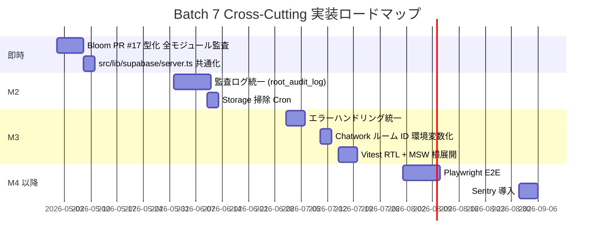

# Batch 7 Garden 横断 spec 全体サマリ

- 発動: 2026-04-24 20:55 / a-auto 就寝前モード
- 完了: 2026-04-24 約 23:00
- ブランチ: `feature/cross-cutting-specs-batch7-auto`（develop 派生、`8331585` = PR #24 マージ後）
- 対象: Garden 全モジュール横断のルール・戦略 spec 6 件

---

## 🎯 成果物

| 優先度 | # | ファイル | 行 | 見積 |
|---|---|---|---|---|
| 🔴 最高 | 1 | [spec-cross-rls-audit.md](../specs/cross-cutting/spec-cross-rls-audit.md) | 356 | 1.5d |
| 🔴 高 | 2 | [spec-cross-audit-log.md](../specs/cross-cutting/spec-cross-audit-log.md) | 429 | 1.0d |
| 🟡 高 | 3 | [spec-cross-storage.md](../specs/cross-cutting/spec-cross-storage.md) | 375 | 0.75d |
| 🟡 中 | 4 | [spec-cross-chatwork.md](../specs/cross-cutting/spec-cross-chatwork.md) | 419 | 0.5d |
| 🟡 中 | 5 | [spec-cross-error-handling.md](../specs/cross-cutting/spec-cross-error-handling.md) | 498 | 0.5d |
| 🟡 中 | 6 | [spec-cross-test-strategy.md](../specs/cross-cutting/spec-cross-test-strategy.md) | 480 | 0.5d |

**合計**: **2,557 行**、実装見積 **4.75d**（+ テスト戦略の段階導入 +2-3d）

---

## 🔑 各 spec の核心

### 1. RLS + サーバ/クライアント境界監査 🔴
- **Bloom PDF 事件（PR #17）の型化**: Route Handler で `client.ts` singleton 使用 → `auth.uid()=NULL` → RLS block
- **3 パターン規格化**: A ブラウザ / B JWT 転送（Bloom A2 標準）/ C Service Role
- **全モジュール監査リスト**: Forest `/api/forest/parse-pdf` / Root Server Action が要確認
- リファレンス: `src/lib/supabase/server.ts` の `createAuthenticatedSupabase(req)` を全モジュール共通化

### 2. 監査ログ統一 🔴
- **`root_audit_log` を Garden 共通ログに昇格**（Forest / Root の個別 audit.ts は re-export に縮小）
- **UPDATE/DELETE 禁止**（改ざん防止、RLS で全拒否）
- `write_audit_log()` SECURITY DEFINER RPC で書込統一
- **必須記録**: Bud 振込状態遷移 / Root garden_role 変更 (critical) / 金銭関連操作

### 3. Storage バケット設計 🟡
- **命名規則**: `<module>-<purpose>[-subset]` kebab-case
- **既存 9 bucket + 将来 5 bucket を一元管理**（本 spec §8 がマスター）
- **RLS 4 パターン**: 社員全員 / 本人のみ / 生成者 / admin 専用
- **signedURL TTL**: ZIP 5 分 / 給与明細 10 分 / 決算書 1 時間 / Chatwork 内 URL 3 日
- 掃除 Cron（forest-downloads 24h TTL）

### 4. Chatwork API 連携 🟡
- **ルーム ID は全て環境変数化**（`CHATWORK_ROOM_*`）、ハードコード禁止
- **DM ルーム検証**（`assertDmRoom()`）で**給与 Public 誤投稿防止**
- **段階リリース**（dry-run → staging → 本番 1 ルーム → 全ルーム）
- レート制限対策（`PQueue` で 300 req / 5 分 を遵守）

### 5. エラーハンドリング 🟡
- **Route Handler / Server Action / Client Component** 別の try-catch 規約
- ユーザー表示: **inline（フォーム）/ toast（操作結果）/ modal（重要確認）/ error.tsx（停止級）**
- **Server Action は throw 禁止、Result 型返却**で統一
- Sentry 導入は Phase C（PII マスキング設計済）

### 6. テスト戦略 🟡
- **3 レイヤ**: Unit（Vitest）/ Integration（RTL+MSW）/ E2E（Playwright）
- §16 7 種テストとの**接続マトリクス**完備
- **モジュール別厳格度**: Tree/Bud/Root = 🔴、Leaf/Forest/Bloom = 🟡、Soil/Rill/Seed = 🟢
- Bud 既存 4 テストを「お手本」として横展開

---

## 🔗 既存 spec / コードへの接続

| Batch 7 spec | 関連既存成果物 |
|---|---|
| #1 RLS 監査 | Bloom PR #17 A2 案、Forest/Root `_lib/audit.ts` |
| #2 監査ログ | Forest / Root の `_lib/audit.ts`、Batch 5 Bud A-03 の `bud_transfer_status_history` |
| #3 Storage | Batch 2/3 Forest T-F6-01 / T-F5-01、Batch 5 Bud A-04 / A-08、Batch 6 B-03、Bloom 既存 |
| #4 Chatwork | Bloom `src/lib/chatwork/` 既存、Batch 6 B-03 `assertDmRoom` 予告 |
| #5 エラー | known-pitfalls.md §7 との接続 |
| #6 テスト | Bud 既存 Vitest 4 本、§16 7 種テスト、§17 3 段階展開 |

---

## 📊 判断保留（計 42 件）

| # | spec | 件数 | 最重要論点 |
|---|---|---|---|
| 1 | RLS 監査 | 6 | `server-only` パッケージ導入時期 / middleware 共通化時期 |
| 2 | 監査ログ | 7 | 保存期間 / SIEM 連携 / Trigger SECURITY DEFINER auth.uid() 問題 |
| 3 | Storage | 7 | Public bucket 可否 / Chatwork URL TTL 3 日は長すぎないか |
| 4 | Chatwork | 7 | Bot アカウント vs 個人 Token / DM ルーム登録時期 |
| 5 | エラー | 7 | Toast ライブラリ（sonner 推奨）/ Sentry 導入時期 |
| 6 | テスト | 8 | Playwright vs Cypress / Storybook 導入時期 |

**最優先合意事項**（a-main 経由で東海林さん判断）:
1. #1 判1 `server-only` 導入時期（Phase B-1 = M3 推奨）
2. #3 判6 Chatwork 通知 URL TTL（現状 3 日 → 1 日短縮検討）
3. #4 判1 Chatwork Bot アカウント作成（個人 Token からの移行）
4. #5 判1 Toast ライブラリ（`sonner` 統一）
5. #6 判1 Vitest 統一（Bud 既存尊重、Jest 見送り）

---

## 🚀 推奨実装順序

---

## ✅ 制約遵守

- ✅ コード変更ゼロ（`src/` 未改変、docs のみ）
- ✅ main / develop 直接作業なし、**develop 派生**
- ✅ ブランチ `feature/cross-cutting-specs-batch7-auto` で作業
- ✅ `[a-auto]` タグ付き commit
- ✅ 判断保留は各 spec §9〜§12 に集約（計 42 件）
- ✅ 実装見込み時間を各 spec に明記（計 4.75d + テスト段階導入 +2-3d）
- ✅ 各 spec 200〜500 行の目安に収まる

---

## 📈 Phase A + B + 横断 累計

| Batch | 対象 | spec 数 | 実装工数 |
|---|---|---|---|
| Batch 1 | 設計・基盤 | 6 | — |
| Batch 2-4 | Forest Phase A | 16 | 8.7d |
| Batch 5 | Bud Phase A-1 | 6 | 3.0d |
| Batch 6 | Bud Phase B 給与 | 6 | 3.0d |
| **Batch 7** | **Garden 横断** | **6** | **4.75d** |
| **累計** | — | **40 spec** | **約 19.45d** |

Garden リリースに必要な仕様書が**40 spec・約 19.45 日分**揃いました。各モジュール担当が自律実行可能な状態。
