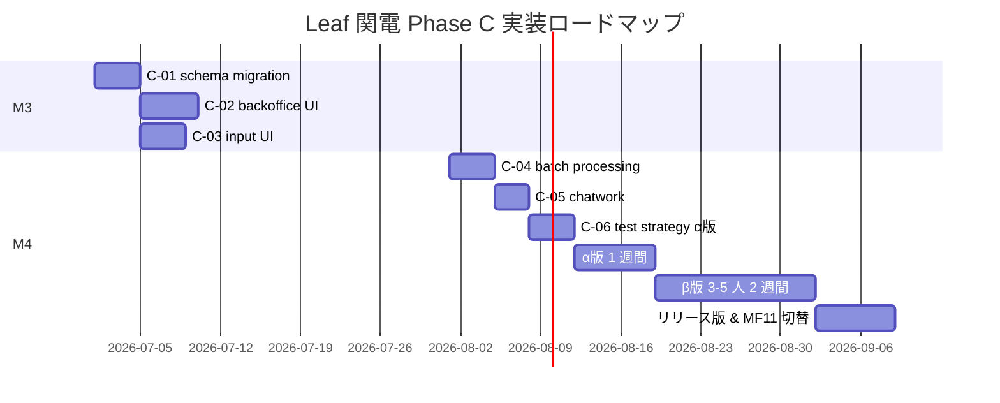

# Batch 8 Leaf 関電 Phase C 全体サマリ

- 発動: 2026-04-24 23:31 / a-auto 就寝前モード継続
- 完了: 2026-04-25 約 02:00
- ブランチ: `feature/leaf-kanden-phase-c-specs-batch8-auto`（develop 派生、`8331585` 基点）
- 対象: Garden-Leaf 001_関西電力業務委託 Phase C（FileMaker 11 切替の要）

---

## 🎯 成果物

| 優先度 | # | ファイル | 行 | 見積 |
|---|---|---|---|---|
| 🔴 最高 | 1 | [C-01 schema-migration](../specs/leaf/spec-leaf-kanden-phase-c-01-schema-migration.md) | 461 | 0.75d |
| 🔴 高 | 2 | [C-02 backoffice-ui](../specs/leaf/spec-leaf-kanden-phase-c-02-backoffice-ui.md) | 407 | 1.0d |
| 🟡 高 | 3 | [C-03 input-ui-enhancement](../specs/leaf/spec-leaf-kanden-phase-c-03-input-ui-enhancement.md) | 371 | 0.75d |
| 🟡 高 | 4 | [C-04 batch-processing](../specs/leaf/spec-leaf-kanden-phase-c-04-batch-processing.md) | 446 | 0.75d |
| 🟡 中 | 5 | [C-05 chatwork-notification](../specs/leaf/spec-leaf-kanden-phase-c-05-chatwork-notification.md) | 391 | 0.5d |
| 🟡 中 | 6 | [C-06 test-strategy](../specs/leaf/spec-leaf-kanden-phase-c-06-test-strategy.md) | 486 | 0.75d |

**合計**: **2,562 行**、実装見積 **4.5d**（テスト含む）

---

## 🔑 各 spec の核心

### C-01 Schema Migration 🔴
- 18 列追加（契約種別・プラン・検針日・手数料・解約等）
- `soil_kanden_plans` 辞書、`soil_kanden_sync_log` バッチ履歴
- **4 階層 RLS**（営業 / 事務 / 管理 / 全権）+ 列制限 Trigger
- 既存データ影響分析・バックアップ手順

### C-02 Backoffice UI 🔴
- 一覧・詳細・編集・解約の 4 画面
- 8 ステータス × ロール別ボタン可視性
- **非技術者向け UX 文言**（対照表 7 項目）
- 一括操作 100 件上限、CSV エクスポート（UTF-8 BOM）

### C-03 Input UI Enhancement 🟡
- 新規登録 2 段階ウィザード（基本情報 + 契約詳細）
- Phase A-1c 添付 / OCR と連動、信頼度別 UI
- Phase A-FMK1 FileMaker ショートカット全画面展開
- 供給地点 22 桁の自動フォーマット

### C-04 Batch Processing 🟡
- Cron 4 本（月次レポート / PD 同期 / 手数料再計算 / 滞留リマインダ）
- Root KoT sync_log パターン踏襲
- Storage `leaf-monthly-reports/` bucket
- PD API レート制限（60 req/min）対策

### C-05 Chatwork Notification 🟡
- **案 D 採用**: 署名 URL 不流通、Garden ログイン誘導
- 「【事務局】システム自動通知」Bot 経由、幹部組ルーム限定
- テンプレ 6 種（月次 / PD 差分 / 滞留 / 解約 / 手数料異常 / 至急 SW）
- 4 段階リリース（dry-run → staging → 本番 1 ルーム → 全ルーム）

### C-06 Test Strategy 🟡
- **Leaf 🟡 通常厳格度**（spec-cross-test-strategy 準拠）
- Unit 70% / Integration 50% / E2E 5 本
- §16 7 種テスト + §17 3 段階展開（α → β 3-5 人 → 全社）
- MF11 との並行運用期間 2 週間

---

## 🔗 既存 / 関連への接続

| C-0X | 依存・参照先 |
|---|---|
| C-01 | spec-cross-rls-audit（RLS パターン）, spec-cross-audit-log（監査）|
| C-02 | C-01, spec-cross-error-handling（toast/modal）|
| C-03 | C-01, C-02, Phase A-1c（OCR）, A-2（1 click）, A-FMK1（ショートカット）|
| C-04 | C-01（sync_log）, Root KoT（PR #15 パターン）, spec-cross-storage |
| C-05 | spec-cross-chatwork, C-04, C-02（cancel）, C-03（OCR 結果）|
| C-06 | spec-cross-test-strategy, 親 §16 / §17 |

---

## 📊 判断保留（計 43 件）

| # | spec | 件数 | 主要論点 |
|---|---|---|---|
| 1 | C-01 | 7 | plan_code NOT NULL 化 / 手数料率案件別 / PD エラー jsonb 構造 |
| 2 | C-02 | 8 | 一覧デフォルト 50 件 / URL 同期 / 監査タブ admin+ 限定 |
| 3 | C-03 | 7 | OCR 自動承認しない / モバイル非対応 / 下書き未実装 |
| 4 | C-04 | 6 | PD API トークン 3 ヶ月ローテ / 滞留閾値 14 日 |
| 5 | C-05 | 6 | 通知頻度上限 / 既読確認 Phase D |
| 6 | C-06 | 6 | α版期間 / ブラウザ Chromium + Mobile Safari |

**最優先合意事項 5 件**（a-main 経由で東海林さん判断）:
1. C-01 判1: `plan_code` 必須化時期（Phase C 後半推奨）
2. C-01 判4: 解約後のデータ保持期間（永続推奨）
3. C-02 判3: 監査ログタブのアクセス（admin+ 限定）
4. C-03 判2: OCR 結果の自動承認（信頼度 90%+ でも手動承認必須）
5. C-05 判1: 月次 PDF の Chatwork 添付可否（**案 D: 添付しない**）

---

## 🚀 推奨実装順序

---

## ✅ 制約遵守

- ✅ コード変更ゼロ（`src/` 未改変、docs のみ）
- ✅ main / develop 直接作業なし、**develop 派生**（派生元ルール遵守）
- ✅ 6 件完走、正常停止
- ✅ `[a-auto]` タグ付き commit
- ✅ 各 spec 371-486 行（200-500 行目安内）
- ✅ 既存コード未改変、spec のみ
- ✅ 判断保留は各 spec §最終章に集約（43 件）

---

## 📈 Phase A + B + 横断 + Leaf Phase C 累計

| Batch | 対象 | spec 数 | 実装工数 |
|---|---|---|---|
| Batch 1-6 | Phase A/B 各モジュール | 34 | 14.7d |
| Batch 7 | Garden 横断 | 6 | 4.75d |
| **Batch 8** | **Leaf 関電 Phase C** | **6** | **4.5d** |
| **累計** | — | **46 spec** | **約 23.95d** |

FileMaker 11 からの切替プロジェクトの仕様書コンプリート。M3-M4 期間の実装 → α版（1 週）→ β版 2 週 → リリース版 の流れで M4 末の全社投入を目標。
