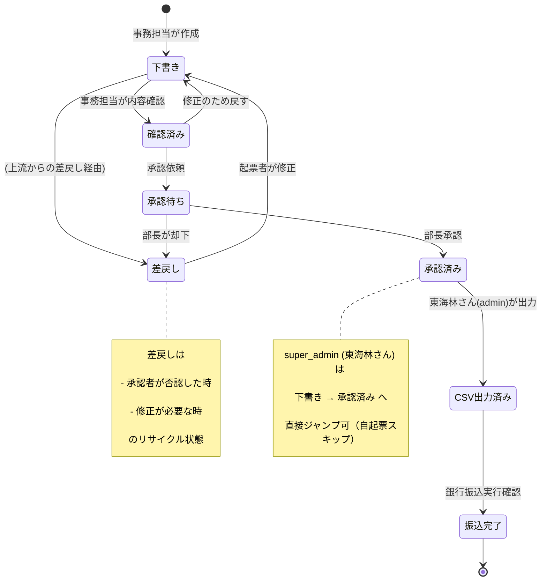

# Bud A-03: 振込 6 段階遷移 仕様書

- 対象: Garden-Bud 振込管理のステータス遷移ルール正式化
- 見積: **0.5d**（約 4 時間）
- 担当セッション: a-bud（本 spec を実装判断の基準にする）
- 作成: 2026-04-24（a-auto / Phase A 先行 batch5 #A-03）
- 元資料: Bud CLAUDE.md「振込管理」章, `src/app/bud/_constants/transfer-status.ts`（Phase 0 実装済）

---

## 1. 目的とスコープ

### 目的
Phase 0 で実装済の `TRANSFER_STATUS_TRANSITIONS` テーブルを**業務ルール仕様書として正式化**し、RLS ポリシー・UI ボタン可視性・監査ログ要件を横串で定義する。M1 末 α版開始時の「承認フローが動いている」根拠ドキュメントとする。

### 含める
- 7 ステータス（下書き / 確認済み / 承認待ち / 承認済み / CSV出力済み / 振込完了 / 差戻し）の業務定義
- 遷移ルール（状態図 + 遷移表）
- 遷移主体（どのロールが何の遷移を実行可能か）
- RLS ポリシーに反映する条件式
- 差戻し運用フロー
- super_admin 自起票時のスキップ
- 監査ログ記録要件

### 含めない
- 振込新規作成フォーム UI（A-04 で別 spec）
- 承認画面 UI（A-05 で別 spec）
- 明細管理との連携（A-06）
- CC 明細の扱い（A-08）

---

## 2. 既存実装との関係

### Phase 0 成果物
| ファイル | 役割 | 本 spec との関係 |
|---|---|---|
| `_constants/transfer-status.ts` | 7 ステータス + 遷移テーブル + canTransition() | 業務ルールの正本、本 spec と DB レベルで一致 |
| `_constants/types.ts` | TransferStatus / TransferCategory / BudRole | 型参照 |
| `_lib/transfer-mutations.ts` | ステータス更新関数 | 本 spec の RLS/監査要件を実装 |
| `transfers/_components/StatusBadge.tsx` | ステータス色分け表示 | UI 側の整合確認 |
| `_lib/__tests__/transfer-status.test.ts` | canTransition テスト | 本 spec の遷移表と同値テスト維持 |

### 重複排除
- 「7 ステータス」定義は `transfer-status.ts` が正、本 spec は「業務的な意味」を補足
- `canTransition()` ロジックは Phase 0 で正しく実装済（レビュー済）、本 spec で変更しない

---

## 3. UI ワイヤ / 状態遷移図

### 3.1 状態遷移図（mermaid）



### 3.2 各ステータスの業務意味

| ステータス | 意味 | 典型的な原因／次のアクション |
|---|---|---|
| 下書き | 事務担当が作成中、未レビュー | 内容を詰めて「確認済み」へ |
| 確認済み | 事務担当自身の内容レビュー完了（Kintone の「二重チェック」相当）| 承認依頼へ進める or 下書きに戻す |
| 承認待ち | 営業部長（上田）へ承認依頼中 | 上田が承認 or 差戻し |
| 承認済み | 上田承認済、振込実行の前段階 | 東海林さんが CSV 出力 |
| CSV出力済み | 楽天銀行 / みずほ銀行向け CSV 生成済 | 銀行ネットバンキングで実行 |
| 振込完了 | 銀行から引落確認済（bud_statements と照合済）| 終端、以後不変 |
| 差戻し | 上流から却下、起票者が修正必要 | 下書きへ戻して再起票 |

---

## 4. データモデル提案

### 4.1 既存テーブル `bud_transfers` の status カラム
```sql
-- 既存（Phase 0）
status text NOT NULL CHECK (status IN (
  '下書き', '確認済み', '承認待ち', '承認済み',
  'CSV出力済み', '振込完了', '差戻し'
))

-- A-03 で追加提案: 遷移ログのための列
status_changed_at timestamptz NOT NULL DEFAULT now(),
status_changed_by uuid REFERENCES auth.users(id)
```

### 4.2 新規テーブル提案: `bud_transfer_status_history`

status 変更のたびに 1 行追加する追記型テーブル：

```sql
CREATE TABLE bud_transfer_status_history (
  id              uuid PRIMARY KEY DEFAULT gen_random_uuid(),
  transfer_id     uuid NOT NULL REFERENCES bud_transfers(id) ON DELETE CASCADE,
  from_status     text,                       -- 初回は NULL
  to_status       text NOT NULL,
  changed_at      timestamptz NOT NULL DEFAULT now(),
  changed_by      uuid NOT NULL REFERENCES auth.users(id),
  changed_by_role text NOT NULL,              -- 'staff' | 'approver' | 'admin' 等（at-time snapshot）
  reason          text,                       -- 差戻し理由等
  created_at      timestamptz NOT NULL DEFAULT now()
);

CREATE INDEX bud_transfer_status_history_transfer_idx
  ON bud_transfer_status_history (transfer_id, changed_at DESC);
```

### 4.3 RLS ポリシー草案

```sql
-- bud_transfers
ALTER TABLE bud_transfers ENABLE ROW LEVEL SECURITY;

-- SELECT: bud_users 登録者全員
CREATE POLICY bt_select ON bud_transfers FOR SELECT USING (bud_is_user());

-- INSERT: 'staff' 以上
CREATE POLICY bt_insert ON bud_transfers FOR INSERT
  WITH CHECK (
    bud_has_role('staff')
    AND status = '下書き'  -- 新規は必ず下書きから
  );

-- UPDATE: ステータス遷移可能な場合のみ
-- PL/pgSQL 関数で遷移判定
CREATE POLICY bt_update_status ON bud_transfers FOR UPDATE
  USING (bud_is_user())
  WITH CHECK (
    -- ここで from/to の組合せをチェック（TRIGGER でも可）
    bud_can_transition(
      old_row_status := (SELECT status FROM bud_transfers WHERE id = id),
      new_status := status,
      user_role := bud_current_role()
    )
  );

-- DELETE: admin のみ、かつ status='下書き' のみ
CREATE POLICY bt_delete ON bud_transfers FOR DELETE
  USING (bud_has_role('admin') AND status = '下書き');
```

### 4.4 遷移判定関数 `bud_can_transition()`

```sql
CREATE OR REPLACE FUNCTION bud_can_transition(
  old_status text,
  new_status text,
  user_role text
) RETURNS boolean LANGUAGE sql IMMUTABLE AS $$
  SELECT CASE
    -- super_admin 自起票スキップ（下書き → 承認済み）
    WHEN user_role = 'super_admin' AND old_status = '下書き' AND new_status = '承認済み'
      THEN true

    -- 通常遷移（transfer-status.ts と完全一致させる）
    WHEN old_status = '下書き'       AND new_status IN ('確認済み', '差戻し')   THEN true
    WHEN old_status = '確認済み'     AND new_status IN ('承認待ち', '下書き')   THEN true
    WHEN old_status = '承認待ち'     AND new_status IN ('承認済み', '差戻し')   THEN true
    WHEN old_status = '承認済み'     AND new_status = 'CSV出力済み'            THEN true
    WHEN old_status = 'CSV出力済み'  AND new_status = '振込完了'                THEN true
    WHEN old_status = '差戻し'       AND new_status = '下書き'                  THEN true

    ELSE false
  END
$$;
```

---

## 5. API / Server Action 契約

### 5.1 Server Action `transitionTransferStatus(params)`

```typescript
// src/app/bud/_lib/transfer-mutations.ts に追加
export async function transitionTransferStatus(params: {
  transferId: string;
  toStatus: TransferStatus;
  reason?: string;             // 差戻し時は必須
}): Promise<
  | { success: true; newStatus: TransferStatus; historyId: string }
  | { success: false; error: string; code: TransitionErrorCode }
>;

export type TransitionErrorCode =
  | 'NOT_FOUND'        // transferId が存在しない
  | 'UNAUTHORIZED'     // ロール不足
  | 'INVALID_TRANSITION'  // 遷移ルール違反
  | 'MISSING_REASON'   // 差戻し時に reason 空
  | 'DB_ERROR';
```

### 5.2 業務要件
- 差戻し（to='差戻し'）時は `reason` 必須（空なら MISSING_REASON）
- 遷移成功時は `bud_transfer_status_history` に 1 行 INSERT（同一トランザクション）
- `bud_transfers.status` UPDATE と history INSERT を**単一トランザクション**で実行

### 5.3 実装例
```typescript
export async function transitionTransferStatus(params: {...}): Promise<...> {
  // 1. バリデーション
  if (params.toStatus === '差戻し' && !params.reason?.trim()) {
    return { success: false, error: '差戻し理由を入力してください', code: 'MISSING_REASON' };
  }

  // 2. RPC 呼出（PL/pgSQL で atomic 処理）
  const { data, error } = await supabase.rpc('bud_transition_transfer_status', {
    p_transfer_id: params.transferId,
    p_to_status: params.toStatus,
    p_reason: params.reason ?? null,
  });
  if (error) return { success: false, error: error.message, code: mapErrorCode(error) };
  return { success: true, newStatus: params.toStatus, historyId: data.history_id };
}
```

### 5.4 PL/pgSQL 関数 `bud_transition_transfer_status()`
```sql
CREATE OR REPLACE FUNCTION bud_transition_transfer_status(
  p_transfer_id uuid, p_to_status text, p_reason text
) RETURNS json LANGUAGE plpgsql SECURITY DEFINER AS $$
DECLARE
  v_old_status text;
  v_user_role text;
  v_history_id uuid;
BEGIN
  -- 遷移元取得 + ロック
  SELECT status INTO v_old_status FROM bud_transfers WHERE id = p_transfer_id FOR UPDATE;
  IF v_old_status IS NULL THEN
    RAISE EXCEPTION 'transfer not found' USING ERRCODE = 'NO_DATA_FOUND';
  END IF;

  -- ロール取得
  SELECT garden_role INTO v_user_role FROM root_employees WHERE user_id = auth.uid();

  -- 遷移可否チェック
  IF NOT bud_can_transition(v_old_status, p_to_status, v_user_role) THEN
    RAISE EXCEPTION 'invalid transition: % -> % by %', v_old_status, p_to_status, v_user_role;
  END IF;

  -- UPDATE
  UPDATE bud_transfers
    SET status = p_to_status,
        status_changed_at = now(),
        status_changed_by = auth.uid()
    WHERE id = p_transfer_id;

  -- history 追加
  INSERT INTO bud_transfer_status_history
    (transfer_id, from_status, to_status, changed_by, changed_by_role, reason)
  VALUES (p_transfer_id, v_old_status, p_to_status, auth.uid(), v_user_role, p_reason)
  RETURNING id INTO v_history_id;

  RETURN json_build_object('history_id', v_history_id);
END;
$$;
```

---

## 6. 状態遷移表（ロール × 遷移）

| from\to | 下書き | 確認済 | 承認待 | 承認済 | CSV | 振込完了 | 差戻 | 可能ロール |
|---|---|---|---|---|---|---|---|---|
| 下書き | - | ✓ | - | ★ | - | - | ✓ | staff+／★super_admin |
| 確認済 | ✓ | - | ✓ | - | - | - | - | staff+ |
| 承認待 | - | - | - | ✓ | - | - | ✓ | approver+ |
| 承認済 | - | - | - | - | ✓ | - | - | admin+ |
| CSV | - | - | - | - | - | ✓ | - | admin+ |
| 振込完了 | - | - | - | - | - | - | - | 終端 |
| 差戻 | ✓ | - | - | - | - | - | - | 起票者本人 |

**★ super_admin 自起票スキップ**: 下書き → 承認済み へ直接遷移可（`bud_can_transition` で特別扱い）

### ロール別許可アクション
| ロール | 許可遷移 |
|---|---|
| staff | 下書き ↔ 確認済 / 確認済 → 承認待 |
| approver | 承認待 → 承認済 / 承認待 → 差戻 |
| admin | 承認済 → CSV / CSV → 振込完了 |
| super_admin | 上記すべて + 下書き → 承認済 直接遷移 |

---

## 7. Chatwork 通知（該当時）

### 7.1 通知トリガ
| 遷移 | 通知先 | 内容 |
|---|---|---|
| 下書き → 確認済み | - | なし（内部レビュー）|
| 確認済み → 承認待ち | 上田（approver） | 「振込 X 件の承認依頼」|
| 承認待ち → 承認済み | 東海林（admin） | 「承認完了、CSV 出力待ち X 件」|
| 承認待ち → 差戻し | 起票者 | 「差戻し: 理由〜」|
| 承認済み → CSV出力済み | - | なし（社内処理完了）|
| CSV出力済み → 振込完了 | - | なし（銀行連携完了）|

### 7.2 通知タイミング
- **即時**: 差戻し時（起票者の作業を止めないため）
- **日次集約**: 承認依頼（日次 09:00 に「承認待ち X 件」としてまとめる）
- **チャンネル**: `bloom_chatwork_config` を流用 or Bud 専用ルーム追加

### 7.3 実装方針
- Server Action 内で成功時に `src/lib/chatwork/` 経由で送信
- 失敗時はメイン処理を止めず console.warn（通知は best-effort）

---

## 8. 監査ログ要件

### 8.1 記録対象
すべてのステータス遷移は `bud_transfer_status_history` に記録（§4.2）。

### 8.2 追加記録（root_audit_log への二重記録、運用判断次第）
- admin 権限での DELETE 操作
- super_admin 自起票スキップの発動
- 外部 API 連携（Chatwork 送信）の成否

### 8.3 保持期間
- `bud_transfer_status_history`: **永続**（振込監査の要請）
- RLS: SELECT は admin+ のみ（staff は自分起票分のみ閲覧可、別ポリシー）

---

## 9. バリデーション規則

| # | ルール | 違反時 |
|---|---|---|
| V1 | 新規 INSERT は `status='下書き'` のみ | INSERT 拒否（RLS WITH CHECK）|
| V2 | 遷移は `TRANSFER_STATUS_TRANSITIONS` に従う | RPC で EXCEPTION、UI で事前ブロック |
| V3 | 差戻し時は reason 必須（50 字以上推奨）| Server Action で MISSING_REASON |
| V4 | super_admin 自起票は reason に「自起票」を自動挿入 | 自動処理 |
| V5 | 振込完了への遷移は `bud_statements` との照合を前提（A-06 で詳細） | 照合未済なら WARN 表示 |
| V6 | 振込完了後の任意更新は禁止 | RLS UPDATE policy で status='振込完了' をブロック |

---

## 10. 受入基準

本 spec が「完了した」と判断する条件：

1. ✅ `TRANSFER_STATUS_TRANSITIONS`（Phase 0 既存）と本 spec §6 の遷移表が完全一致
2. ✅ `bud_transfer_status_history` テーブル + RLS が投入済
3. ✅ `bud_can_transition()` / `bud_transition_transfer_status()` PL/pgSQL 関数が投入済
4. ✅ Server Action `transitionTransferStatus()` が Phase 0 の mutation と整合
5. ✅ 遷移テスト（全 7 ステータス × 全遷移ケース = 約 20 ケース）が Vitest で通る
6. ✅ UI（A-05 で実装）のボタン可視性が遷移表と一致
7. ✅ Chatwork 通知が「承認待ち」「差戻し」で動作確認済み
8. ✅ super_admin 自起票スキップが動作確認済み（東海林さんの実地テスト）

---

## 11. 想定工数（内訳）

| # | 作業 | 工数 |
|---|---|---|
| W1 | `bud_transfer_status_history` テーブル migration | 0.05d |
| W2 | `bud_can_transition` / `bud_transition_transfer_status` 関数 | 0.1d |
| W3 | Server Action `transitionTransferStatus` | 0.1d |
| W4 | 遷移テスト 20 ケース（Vitest）| 0.1d |
| W5 | Chatwork 通知連携（即時 + 日次集約）| 0.1d |
| W6 | UI ボタン可視性の整合（A-05 との接続）| 0.05d |
| **合計** | | **0.5d** |

---

## 12. 判断保留

| # | 論点 | a-auto スタンス |
|---|---|---|
| 判1 | `bud_transfer_status_history` vs `root_audit_log` 二重化 | **両方記録を推奨**（Bud 内参照は history が高速、横断監査は root_audit_log） |
| 判2 | 振込完了後の訂正フロー | **対応なし**（完全不変、訂正は「取消振込」を新規起票）|
| 判3 | super_admin 自起票時の reason 自動挿入 | **「自起票」固定**を推奨、将来の監査で区別可能 |
| 判4 | 承認待ち → 差戻しの reason 最低文字数 | **10 文字**以上を推奨、業務運用で調整 |
| 判5 | Chatwork 日次集約の実装タイミング | **Phase A では即時のみ**、Phase B 以降で集約追加 |
| 判6 | history テーブルの切り出し粒度 | 現状 1 テーブルで十分、月数百件見込みのため |

— end of A-03 spec —
