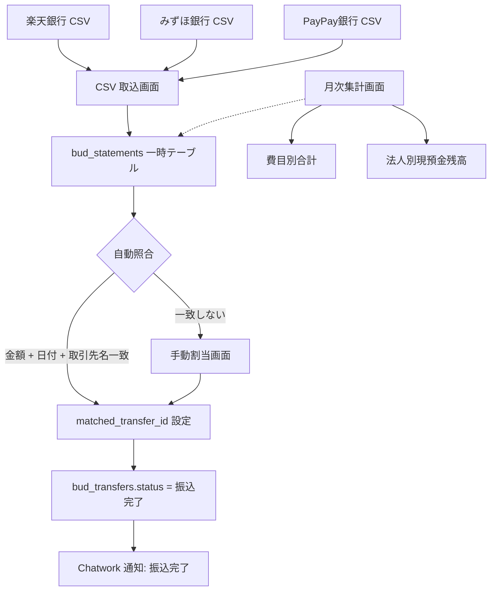

# Bud A-06: 明細管理 要件定義書

- 対象: Garden-Bud 明細管理（入出金記録 / 銀行データ取込 / 振込照合）
- 見積: **0.75d**（約 6 時間）
- 担当セッション: a-bud
- 作成: 2026-04-24（a-auto / Phase A 先行 batch5 #A-06）
- 元資料: Bud CLAUDE.md「2. 明細管理」章

---

## 1. 目的とスコープ

### 目的
銀行入出金明細（銀行 CSV）を Garden-Bud に取り込み、振込実行の照合・経費費目管理・CC 明細との突合を行う。**金融機関正本との整合性を保ち、月次の収支把握を半自動化**する。

### 含める
- 銀行 CSV の取り込み（楽天銀行・みずほ銀行、他任意）
- `bud_statements` テーブル設計
- 入出金の画面一覧・検索
- 振込実行との照合（`bud_transfers` 振込完了の自動検出）
- 未照合明細の手動割当
- 月次合計・費目別合計

### 含めない
- 給与計算（別 Phase B のタスク）
- CC 明細処理（A-08 で別 spec）
- 会計仕訳の生成（Forest 連携、Phase C 以降）

---

## 2. 既存実装との関係

### Phase 0 成果物
| 項目 | 状態 | 本 spec との関係 |
|---|---|---|
| `bud_statements` テーブル | **未作成** | 本 spec で初期設計 |
| `_lib/transfer-queries.ts` | 既存、振込取得のみ | `statement-queries.ts` を新規追加 |
| `_constants/types.ts` | `BudTransfer` 型のみ | `BudStatement` 型を追加 |
| 画面 | なし | `/bud/statements` を新規作成 |

### 振込管理との関係
- `bud_transfers.transfer_id` は `bud_statements.matched_transfer_id` で逆参照（FK）
- 「振込完了マーク」は本モジュールの照合結果を使用（A-05 の判2）

---

## 3. データフロー



---

## 4. データモデル提案

### 4.1 新規テーブル `bud_statements`

```sql
CREATE TABLE bud_statements (
  id                  uuid PRIMARY KEY DEFAULT gen_random_uuid(),
  bank_account_id     uuid NOT NULL REFERENCES root_bank_accounts(account_id),

  -- 明細基本情報（銀行 CSV から）
  transaction_date    date NOT NULL,
  transaction_time    time,                       -- 銀行によっては時刻なし
  amount              bigint NOT NULL,            -- 正=入金、負=出金
  balance_after       bigint,                     -- 残高（銀行が提供する場合）
  description         text NOT NULL,              -- 摘要・相手先名
  transaction_type    text,                       -- 振込/ATM/口座振替/デビット 等（銀行別）
  memo                text,                       -- 手動メモ

  -- 照合
  matched_transfer_id uuid REFERENCES bud_transfers(id),
  matched_at          timestamptz,
  matched_by          uuid REFERENCES auth.users(id),
  match_confidence    text CHECK (match_confidence IN ('exact', 'high', 'manual')),

  -- 費目（経費時）
  category            text,                       -- '会議費' / '接待交際費' / '外注費' 等
  subcategory         text,

  -- CC 明細連携（A-08）
  cc_meisai_id        uuid REFERENCES bud_cc_statements(id),

  -- 取込情報
  source_type         text NOT NULL CHECK (source_type IN ('rakuten_csv', 'mizuho_csv', 'paypay_csv', 'manual')),
  imported_batch_id   uuid REFERENCES bud_statement_import_batches(id),
  raw_row             jsonb,                      -- 元 CSV 1 行（監査用）

  -- timestamps
  created_at          timestamptz NOT NULL DEFAULT now(),
  updated_at          timestamptz NOT NULL DEFAULT now(),

  -- 同一銀行・同一日時・同一金額で UNIQUE（重複取込防止）
  CONSTRAINT uq_statement_dedupe
    UNIQUE NULLS NOT DISTINCT (bank_account_id, transaction_date, transaction_time, amount, description)
);

CREATE INDEX bud_statements_account_date_idx
  ON bud_statements (bank_account_id, transaction_date DESC);

CREATE INDEX bud_statements_matched_idx
  ON bud_statements (matched_transfer_id)
  WHERE matched_transfer_id IS NOT NULL;

CREATE INDEX bud_statements_unmatched_idx
  ON bud_statements (transaction_date DESC)
  WHERE matched_transfer_id IS NULL AND amount < 0;   -- 未照合の出金
```

### 4.2 取込バッチ管理テーブル `bud_statement_import_batches`

```sql
CREATE TABLE bud_statement_import_batches (
  id              uuid PRIMARY KEY DEFAULT gen_random_uuid(),
  bank_account_id uuid NOT NULL REFERENCES root_bank_accounts(account_id),
  source_type     text NOT NULL CHECK (source_type IN ('rakuten_csv', 'mizuho_csv', 'paypay_csv', 'manual')),
  file_name       text NOT NULL,
  file_storage_path text,                     -- Storage 格納先（監査用）
  row_count       int NOT NULL,
  success_count   int NOT NULL,
  error_count     int NOT NULL,
  skipped_count   int NOT NULL,               -- 重複で skip
  imported_at     timestamptz NOT NULL DEFAULT now(),
  imported_by     uuid NOT NULL REFERENCES auth.users(id),
  status          text CHECK (status IN ('completed', 'partial', 'failed')),
  error_summary   text
);
```

### 4.3 RLS
```sql
ALTER TABLE bud_statements ENABLE ROW LEVEL SECURITY;

CREATE POLICY bs_select ON bud_statements FOR SELECT USING (bud_is_user());
CREATE POLICY bs_insert ON bud_statements FOR INSERT WITH CHECK (bud_has_role('staff'));
CREATE POLICY bs_update ON bud_statements FOR UPDATE USING (bud_has_role('staff'))
  WITH CHECK (bud_has_role('staff'));
CREATE POLICY bs_delete ON bud_statements FOR DELETE USING (bud_has_role('admin'));

ALTER TABLE bud_statement_import_batches ENABLE ROW LEVEL SECURITY;
CREATE POLICY bsib_select ON bud_statement_import_batches FOR SELECT USING (bud_is_user());
CREATE POLICY bsib_insert ON bud_statement_import_batches FOR INSERT WITH CHECK (bud_has_role('staff'));
```

---

## 5. API / Server Action 契約

### 5.1 `importBankStatements(params)`

```typescript
export async function importBankStatements(params: {
  bankAccountId: string;
  sourceType: 'rakuten_csv' | 'mizuho_csv' | 'paypay_csv';
  file: File;
  dryRun?: boolean;          // true なら INSERT せず結果だけ返す
}): Promise<{
  success: boolean;
  batchId?: string;
  rowCount: number;
  successCount: number;
  errorCount: number;
  skippedCount: number;      // 重複で UNIQUE 違反→スキップ
  autoMatchedCount: number;  // 同時に自動照合できた件数
  errors?: Array<{ rowIndex: number; message: string; rawRow: any }>;
}>;
```

### 5.2 自動照合ロジック

```typescript
// 入出金 1 件に対して振込候補を探す
export async function findMatchingTransfer(statement: BudStatement): Promise<{
  transferId: string;
  confidence: 'exact' | 'high';
} | null> {
  // 1. 完全一致（金額 AND 日付 AND 取引先名含有）
  const { data: exactMatches } = await supabase
    .from('bud_transfers')
    .select('id, transfer_id, amount, scheduled_date, vendor_name, executed_date')
    .eq('amount', Math.abs(statement.amount))
    .eq('scheduled_date', statement.transaction_date.toISOString().slice(0,10))
    .is('executed_date', null)  // 未実行のもの
    .or(`vendor_name.ilike.%${statement.description}%`);

  if (exactMatches?.length === 1) {
    return { transferId: exactMatches[0].id, confidence: 'exact' };
  }

  // 2. 高信頼マッチ（金額 AND ±3 日）
  const from = addDays(statement.transaction_date, -3);
  const to = addDays(statement.transaction_date, +3);
  const { data: highMatches } = await supabase
    .from('bud_transfers')
    .select('id, transfer_id, amount, scheduled_date, vendor_name')
    .eq('amount', Math.abs(statement.amount))
    .gte('scheduled_date', from.toISOString().slice(0,10))
    .lte('scheduled_date', to.toISOString().slice(0,10))
    .is('executed_date', null);

  if (highMatches?.length === 1) {
    return { transferId: highMatches[0].id, confidence: 'high' };
  }

  // 3. 複数候補 or 0 件 → null（手動割当へ）
  return null;
}
```

### 5.3 手動照合 `assignStatementToTransfer(params)`
```typescript
export async function assignStatementToTransfer(params: {
  statementId: string;
  transferId: string;
}): Promise<{ success: boolean; error?: string }>;
```
成功時: `bud_statements.matched_transfer_id` 設定 + `bud_transfers.status='振込完了'` + `executed_date` 設定（A-03 の `transitionTransferStatus(to='振込完了')` を内部呼出）

### 5.4 `unassignStatement(statementId)`
誤マッチの取消。`bud_transfers.status` を 'CSV出力済み' に戻す（要注意、監査 log 残す）。

---

## 6. 状態遷移

本 spec は明細側の状態は基本的に不変（入出金は事実）。振込側への作用：
- 自動/手動照合成功 → `bud_transfers.status` が 'CSV出力済み' → '振込完了' に遷移

---

## 7. Chatwork 通知

- **自動照合成功率レポート**: 日次 18:00、「本日の照合: 自動 X 件 / 手動 Y 件 / 未照合 Z 件」
- **大量未照合アラート**: 未照合（出金）が 10 件以上溜まったら東海林さん宛に警告
- **取込バッチ完了**: 即時通知、「楽天銀行 CSV 50 件取込 (成功 48 / スキップ 2)」

---

## 8. 監査ログ要件

- `bud_statement_import_batches` が取込のメイン監査レコード
- 照合操作（自動 / 手動 / unassign）は `bud_statements.matched_*` フィールドのタイムスタンプで追跡
- 重要: **raw_row の保存**（`bud_statements.raw_row jsonb`）で、取込結果の再現性確保

---

## 9. バリデーション規則

### 取込時
| # | ルール | 違反時 |
|---|---|---|
| V1 | CSV 拡張子のみ受付 | INVALID_FORMAT |
| V2 | ヘッダー行の自動判定（楽天/みずほ別）| UNKNOWN_FORMAT |
| V3 | 金額が数値変換不可 | skip + errors に列挙 |
| V4 | 日付パースエラー | skip + errors |
| V5 | UNIQUE 違反（重複）| skip + skippedCount++ |
| V6 | file_size > 5MB | FILE_TOO_LARGE（通常の月次明細は数百 KB）|

### 照合時
| # | ルール | 違反時 |
|---|---|---|
| V7 | 対象 transferId の status が '承認済み' 以上 | 「未承認の振込には割当不可」 |
| V8 | 既に他の statement が照合済の transfer | 「既に照合済み」確認モーダル |
| V9 | amount 符号確認（出金 vs 入金）| 警告表示 |

---

## 10. 受入基準

1. ✅ `/bud/statements` 一覧画面が動作、口座別・期間別フィルタ可
2. ✅ 楽天銀行・みずほ銀行 CSV の取込が動作（パース・重複スキップ）
3. ✅ 取込直後に自動照合が走り、成功件数が表示される
4. ✅ 未照合の出金一覧 → 手動割当モーダル → 照合成功で振込完了に遷移
5. ✅ 月次集計（費目別・日別）が表示される
6. ✅ 取込バッチ履歴（`bud_statement_import_batches`）が閲覧可
7. ✅ 誤マッチの unassign が動作、振込は 'CSV出力済み' に戻る
8. ✅ RLS: staff+ で INSERT、admin+ で DELETE のみ、閲覧は全 bud_user
9. ✅ 自動照合成功率が 70% 以上（目標値、ダミーデータ投入後に計測）

---

## 11. 想定工数（内訳）

| # | 作業 | 工数 |
|---|---|---|
| W1 | `bud_statements` + `bud_statement_import_batches` migration | 0.1d |
| W2 | CSV パーサ（楽天・みずほ別、Rakuten BizBank 形式）| 0.15d |
| W3 | 取込 Server Action + 重複検出 | 0.1d |
| W4 | 自動照合ロジック（金額 + 日付 + 取引先名）| 0.15d |
| W5 | `/bud/statements` 一覧 UI | 0.1d |
| W6 | 手動割当モーダル | 0.05d |
| W7 | 月次集計画面 | 0.05d |
| W8 | 取込バッチ履歴画面 | 0.05d |
| **合計** | | **0.75d** |

---

## 12. 判断保留

| # | 論点 | a-auto スタンス |
|---|---|---|
| 判1 | CSV 形式別のパーサ実装 | **楽天・みずほ 2 種を Phase A**、他銀行は順次追加 |
| 判2 | 自動照合の信頼度レベル | **exact + high の 2 段階**、low（金額一致のみ）は必ず手動 |
| 判3 | 費目自動判定（AI 連携）| **Phase A 未対応**、Phase C で検討（取引先履歴から推定）|
| 判4 | 取込時の file 保管 | Storage `bud-statement-imports/` bucket 新設（T-F6-01 パターン）|
| 判5 | 振込以外の明細（口座振替、デビット等）の扱い | 費目分類のみ実施、振込との照合対象外 |
| 判6 | 月次集計の会計期間基準 | **法人の決算期**で区切る（`root_companies.kessan_month`、要確認）|
| 判7 | 既存の Forest 月次決算との重複 | Forest は期末確定値、Bud は日々の入出金、**役割分離**で重複なし |
| 判8 | 統計的異常検出（普段 10 万円の振込が 100 万円になった等）| Phase A 対応外、Phase C |

— end of A-06 spec —
