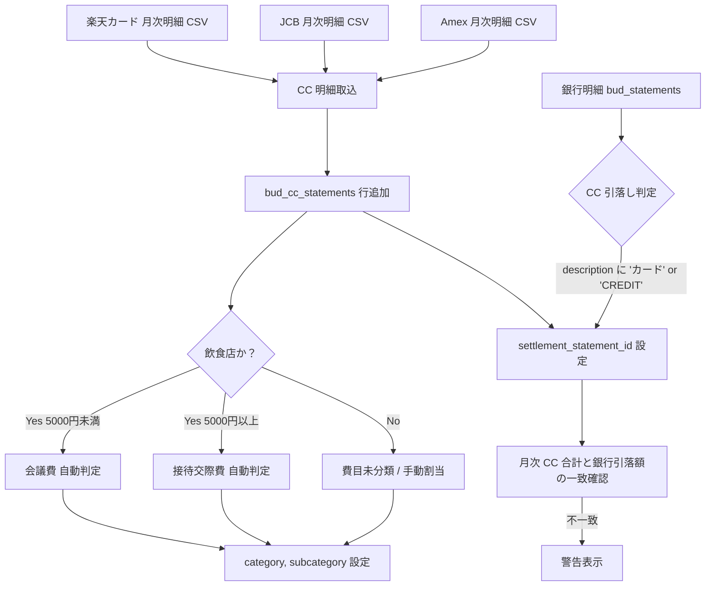

# Bud A-08: CC（クレジットカード）明細処理ルール 仕様書

- 対象: Garden-Bud のクレジットカード明細処理・費目自動判定・インボイス管理
- 見積: **0.5d**（約 4 時間）
- 担当セッション: a-bud
- 作成: 2026-04-24（a-auto / Phase A 先行 batch5 #A-08）
- 元資料: Bud CLAUDE.md「CC明細処理ルール」, MEMORY `project_cc_processing`

---

## 1. 目的とスコープ

### 目的
各法人のクレジットカード月次明細を Garden-Bud に取り込み、**5,000 円区切りでの会議費/接待交際費の自動判定**と**インボイス取得管理**を行う。経費精算の手作業を半自動化。

### 含める
- `bud_cc_statements` テーブル設計（銀行明細 `bud_statements` とは別）
- カード明細 CSV の取込（個別カード別）
- 飲食店 5,000 円区切りの費目自動判定（会議費 / 接待交際費）
- インボイス管理（全 CC = インボイスありの前提）
- 月次カード引落しとの紐付け（`bud_statements` との照合）

### 含めない
- インボイス画像 OCR（Phase B 以降）
- 費目手動修正 UI（別タスク）
- 会計仕訳への変換（Forest 連携、Phase C）

---

## 2. 既存実装との関係

### Phase 0 既存
- `bud_statements`（本 batch A-06 で新規設計）— カード引落しの入出金明細はこちらに入る
- `root_employees`（カード利用者の紐付け元）
- カード自体のマスタはまだなし

### 本 spec の位置づけ
- カード明細 **1 行 = `bud_cc_statements` 1 行**（カード会社の明細 CSV の 1 レコード）
- カード月次引落し **合計 = `bud_statements` 1 行の出金**（銀行 CSV の方）
- 両者を `cc_meisai_id` / `settlement_statement_id` で相互リンク

---

## 3. データフロー



---

## 4. データモデル提案

### 4.1 `bud_cc_cards` マスタ（新規）
```sql
CREATE TABLE bud_cc_cards (
  id              uuid PRIMARY KEY DEFAULT gen_random_uuid(),
  card_name       text NOT NULL,              -- '楽天ビジネスカード', 'JCB ザ・クラス' 等
  card_company    text NOT NULL CHECK (card_company IN ('rakuten', 'jcb', 'amex', 'other')),
  company_id      text NOT NULL REFERENCES root_companies(company_id),
  last_four_digits text NOT NULL,             -- 識別子の一部
  holder_name     text,                        -- 名義人（個人カード時）
  holder_employee_id text REFERENCES root_employees(employee_id),
  settlement_day  int NOT NULL CHECK (settlement_day BETWEEN 1 AND 31),   -- 引落し日
  settlement_account_id uuid REFERENCES root_bank_accounts(account_id),
  is_active       boolean NOT NULL DEFAULT true,
  created_at      timestamptz NOT NULL DEFAULT now(),
  updated_at      timestamptz NOT NULL DEFAULT now()
);
```

### 4.2 `bud_cc_statements`（新規、CC 明細 1 行）
```sql
CREATE TABLE bud_cc_statements (
  id                      uuid PRIMARY KEY DEFAULT gen_random_uuid(),
  card_id                 uuid NOT NULL REFERENCES bud_cc_cards(id),

  -- カード明細の基本情報
  use_date                date NOT NULL,
  use_place               text NOT NULL,          -- 利用店舗名（明細そのまま）
  amount_jpy              bigint NOT NULL,        -- JPY、為替換算後
  amount_original         bigint,                 -- 海外利用時の原通貨額
  currency_original       text,                   -- 'USD', 'EUR' 等
  use_category_raw        text,                   -- カード会社の分類（参考）

  -- 自動判定結果
  category                text NOT NULL,          -- '会議費', '接待交際費', '旅費交通費' 等
  subcategory             text,
  auto_classified         boolean NOT NULL DEFAULT false,
  classification_reason   text,                   -- 自動判定の根拠メモ

  -- インボイス管理
  invoice_status          text NOT NULL DEFAULT 'pending'
    CHECK (invoice_status IN ('pending', 'collected', 'missing', 'na')),
  invoice_storage_path    text,                   -- スキャン格納先
  invoice_received_at     timestamptz,

  -- 関連情報
  memo                    text,
  participants            text,                   -- 接待交際費時の参加者メモ

  -- 月次引落しとの紐付け
  settlement_statement_id uuid REFERENCES bud_statements(id),
  settlement_month        date,                   -- 月の 1 日（例: 2026-05-01）

  -- 取込情報
  import_batch_id         uuid REFERENCES bud_cc_import_batches(id),
  raw_row                 jsonb,

  created_at              timestamptz NOT NULL DEFAULT now(),
  updated_at              timestamptz NOT NULL DEFAULT now(),

  -- 重複排除
  CONSTRAINT uq_cc_statement UNIQUE NULLS NOT DISTINCT
    (card_id, use_date, amount_jpy, use_place)
);

CREATE INDEX bud_cc_statements_card_date_idx
  ON bud_cc_statements (card_id, use_date DESC);
CREATE INDEX bud_cc_statements_settlement_idx
  ON bud_cc_statements (settlement_month DESC, card_id);
CREATE INDEX bud_cc_statements_invoice_missing_idx
  ON bud_cc_statements (invoice_status)
  WHERE invoice_status IN ('pending', 'missing');
```

### 4.3 `bud_cc_import_batches`（取込履歴、A-06 パターン踏襲）
```sql
CREATE TABLE bud_cc_import_batches (
  id              uuid PRIMARY KEY DEFAULT gen_random_uuid(),
  card_id         uuid NOT NULL REFERENCES bud_cc_cards(id),
  source_type     text NOT NULL,
  file_name       text NOT NULL,
  row_count       int NOT NULL,
  success_count   int NOT NULL,
  error_count     int NOT NULL,
  skipped_count   int NOT NULL,
  imported_at     timestamptz NOT NULL DEFAULT now(),
  imported_by     uuid NOT NULL REFERENCES auth.users(id),
  status          text CHECK (status IN ('completed', 'partial', 'failed'))
);
```

### 4.4 飲食店判定マスタ（費目自動判定の補助）
```sql
CREATE TABLE bud_restaurant_keywords (
  id        uuid PRIMARY KEY DEFAULT gen_random_uuid(),
  keyword   text NOT NULL UNIQUE,     -- '居酒屋', 'すし', 'レストラン', 'カフェ' 等
  match_type text DEFAULT 'contains' CHECK (match_type IN ('contains', 'exact', 'prefix')),
  confidence text DEFAULT 'medium' CHECK (confidence IN ('high', 'medium', 'low'))
);

-- 初期データ
INSERT INTO bud_restaurant_keywords (keyword, confidence) VALUES
  ('居酒屋', 'high'), ('すし', 'high'), ('寿司', 'high'),
  ('イタリアン', 'high'), ('フレンチ', 'high'), ('中華', 'high'),
  ('レストラン', 'medium'), ('ダイニング', 'medium'), ('バー', 'medium'),
  ('カフェ', 'medium'), ('スターバックス', 'medium'), ('ドトール', 'medium'),
  ('ホテル', 'low'),    -- 宿泊か会食か要確認
  ('焼肉', 'high'), ('ラーメン', 'high');
```

### 4.5 RLS
```sql
ALTER TABLE bud_cc_cards ENABLE ROW LEVEL SECURITY;
CREATE POLICY bcc_cards_select ON bud_cc_cards FOR SELECT USING (bud_is_user());
CREATE POLICY bcc_cards_write ON bud_cc_cards FOR ALL
  USING (bud_has_role('admin')) WITH CHECK (bud_has_role('admin'));

ALTER TABLE bud_cc_statements ENABLE ROW LEVEL SECURITY;
CREATE POLICY bcc_stmt_select ON bud_cc_statements FOR SELECT USING (bud_is_user());
CREATE POLICY bcc_stmt_insert ON bud_cc_statements FOR INSERT WITH CHECK (bud_has_role('staff'));
CREATE POLICY bcc_stmt_update ON bud_cc_statements FOR UPDATE USING (bud_has_role('staff'))
  WITH CHECK (bud_has_role('staff'));
CREATE POLICY bcc_stmt_delete ON bud_cc_statements FOR DELETE USING (bud_has_role('admin'));
```

---

## 5. API / Server Action 契約

### 5.1 取込
```typescript
export async function importCcStatements(params: {
  cardId: string;
  sourceType: string;
  file: File;
  dryRun?: boolean;
}): Promise<{
  success: boolean;
  batchId?: string;
  rowCount: number;
  successCount: number;
  errorCount: number;
  skippedCount: number;
  autoClassifiedCount: number;      // 自動分類できた件数
  errors?: Array<{ rowIndex: number; message: string }>;
}>;
```

### 5.2 自動分類ロジック

```typescript
function classifyUseCategory(useplace: string, amount: number): {
  category: string;
  subcategory?: string;
  auto_classified: boolean;
  reason: string;
} {
  // 1. 飲食店判定
  const isRestaurant = RESTAURANT_KEYWORDS.some(k => useplace.includes(k));
  if (isRestaurant) {
    // 5,000 円区切り（Bud CLAUDE.md ルール）
    if (amount < 5000) {
      return {
        category: '会議費',
        subcategory: '少額飲食',
        auto_classified: true,
        reason: '飲食店かつ 5,000 円未満（会議費扱い）'
      };
    } else {
      return {
        category: '接待交際費',
        subcategory: '飲食',
        auto_classified: true,
        reason: '飲食店かつ 5,000 円以上（接待交際費扱い）'
      };
    }
  }

  // 2. 交通系（Suica, PASMO, JR, 航空券）
  if (/(JR|私鉄|タクシー|電車|バス|航空券|Suica|PASMO)/.test(useplace)) {
    return { category: '旅費交通費', auto_classified: true, reason: '交通キーワード' };
  }

  // 3. 宿泊（ホテル系）
  if (/(ホテル|旅館|宿|inn)/i.test(useplace)) {
    return { category: '旅費交通費', subcategory: '宿泊', auto_classified: true, reason: '宿泊キーワード' };
  }

  // 4. EC/文具等（Amazon, Askul, Monotaro）
  if (/(amazon|askul|monotaro|askulpro|yodobashi)/i.test(useplace)) {
    return { category: '消耗品費', auto_classified: true, reason: 'EC キーワード' };
  }

  // 5. 通信（携帯キャリア・プロバイダ）
  if (/(ドコモ|softbank|au|biglobe|nifty)/i.test(useplace)) {
    return { category: '通信費', auto_classified: true, reason: '通信キャリア' };
  }

  // 分類できず → 要手動
  return { category: '雑費', auto_classified: false, reason: '自動判定不可、要手動' };
}
```

### 5.3 インボイス管理
```typescript
// インボイス登録
export async function registerInvoice(params: {
  ccStatementId: string;
  file: File;
}): Promise<{ success: boolean; storagePath?: string; error?: string }>;

// 一括「インボイス不要」マーク（Amazon 等の明細連動のため）
export async function markInvoiceNa(params: {
  ccStatementIds: string[];
  reason: string;
}): Promise<{ success: number; failed: number }>;
```

### 5.4 月次引落し紐付け
```typescript
// bud_statements の CC 引落し行を特定 → bud_cc_statements と月次で紐付け
export async function linkSettlementToCcStatements(params: {
  settlementStatementId: string;
  cardId: string;
  settlementMonth: string;  // 'YYYY-MM-01'
}): Promise<{ linked: number }>;
```

---

## 6. 状態遷移

本 spec は主に INSERT + UPDATE 中心で明確なステート遷移なし。例外:

### インボイス状態
```
pending（取込直後）
  ├─ collected（スキャン登録）
  ├─ missing（店舗忘れ、Chatwork で催促）
  └─ na（インボイス不要、明細連動で可）
```

---

## 7. Chatwork 通知

- **取込完了**: 即時、「楽天カード 50 件取込（自動分類 45 / 要手動 5）」
- **自動分類要確認**: 日次 17:00、「自動分類できなかった CC 明細 X 件」
- **インボイス未収集リマインダ**: 月初 09:00、前月分で `invoice_status='pending'` が 7 日超のものを一覧化
- **引落し金額不一致**: 即時警告、「楽天カード 5月引落 ¥XXX ≠ 明細合計 ¥YYY」

---

## 8. 監査ログ要件

- 取込バッチは `bud_cc_import_batches` が正本
- `bud_cc_statements.raw_row` で CSV 元データ保持
- 費目手動変更は将来 `bud_cc_statements_history` 子テーブルで履歴化（Phase B）

---

## 9. バリデーション規則

### 取込時
| # | ルール | 違反時 |
|---|---|---|
| V1 | amount_jpy が数値変換不可 | skip + error |
| V2 | use_date パースエラー | skip + error |
| V3 | UNIQUE 違反 | skip + skippedCount++ |
| V4 | amount_jpy = 0（キャンセル行）| skip（警告なし）|
| V5 | 金額負値（返金）| 許可（`amount_jpy < 0` で識別）|

### インボイス登録時
| # | ルール | 違反時 |
|---|---|---|
| V6 | file が PDF/JPG/PNG のみ | INVALID_MIME |
| V7 | file_size > 10MB | FILE_TOO_LARGE |
| V8 | 既に collected な ccStatementId への再登録 | 上書き確認モーダル |

### 引落し紐付け時
| # | ルール | 違反時 |
|---|---|---|
| V9 | bud_statements.amount < 0（出金）のみ | 入金は紐付け不可 |
| V10 | settlement_month が未来日 | 警告 |
| V11 | 明細合計 ≠ 引落し額（±1 円許容）| 警告表示（継続可）|

---

## 10. 受入基準

1. ✅ `bud_cc_cards` マスタが admin で登録可
2. ✅ 楽天ビジネスカード月次 CSV の取込が動作、重複スキップ
3. ✅ 飲食店判定（5,000 円区切り）が動作、自動分類率 60% 以上
4. ✅ インボイスファイルを CC 明細に紐付け可（Storage `bud-cc-invoices/`）
5. ✅ インボイス未収集の一覧画面 + Chatwork リマインダ
6. ✅ 月次引落し（bud_statements）と CC 明細合計の自動紐付け
7. ✅ 不一致時に警告表示（±1 円許容）
8. ✅ RLS: staff+ で INSERT、admin+ で DELETE
9. ✅ `bud_restaurant_keywords` で判定補助（初期 15 キーワード以上）

---

## 11. 想定工数（内訳）

| # | 作業 | 工数 |
|---|---|---|
| W1 | `bud_cc_cards` / `bud_cc_statements` / `bud_cc_import_batches` / `bud_restaurant_keywords` migration | 0.1d |
| W2 | CSV パーサ（楽天ビジネスカード 1 種）| 0.1d |
| W3 | 自動分類ロジック（飲食店判定 + 交通・EC等）| 0.1d |
| W4 | 取込 Server Action | 0.05d |
| W5 | CC 明細一覧画面（ `/bud/cc-statements`）| 0.1d |
| W6 | インボイス登録モーダル + Storage bucket | 0.05d |
| W7 | 月次引落し紐付け機能 + 不一致検出 | 0.05d |
| W8 | リマインダ通知（Chatwork）| 0.05d |
| **合計** | | **0.5d** |

---

## 12. 判断保留

| # | 論点 | a-auto スタンス |
|---|---|---|
| 判1 | 対応カード種類 | **Phase A は楽天ビジネス 1 種**、JCB・Amex は順次追加 |
| 判2 | 5,000 円区切りの税抜/税込 | **税込（明細額）**で判定、Bud CLAUDE.md に従う |
| 判3 | 飲食店判定の誤判定対策 | 自動分類後、admin が月次レビューで手動修正可 |
| 判4 | インボイス必須化時期 | 現状は optional、税務ルール変更時に必須化（U2: 要確認）|
| 判5 | 参加者メモ（接待交際費時）| **任意フィールド**、社内規程で必須化されたら UI で必須に |
| 判6 | 引落し紐付けの自動判定 | 明細 description の 'カード' 'VISA' 等で識別、確度低ければ手動 |
| 判7 | 為替換算レートの出典 | カード会社明細の換算後額を信頼（原通貨は参考保持のみ）|
| 判8 | 費目変更履歴テーブル化 | **Phase B で追加**（現状 updated_at のみ）|
| 判9 | Amazon 等のインボイス自動紐付け | Phase C で API 連携検討、Phase A 手動運用 |

### 未確認事項（東海林さんに要ヒアリング）

| # | 未確認 |
|---|---|
| U1 | 現在利用している法人カードの一覧（楽天以外に何社分）|
| U2 | インボイス未収集時の運用（都度もらう or 月次でまとめる）|
| U3 | 5,000 円区切りのルールは税法固定値 or 社内規程独自？ |
| U4 | 飲食店以外で会議費/接待交際費の区別ルール |
| U5 | CC 明細の月次集計を誰がレビューするか |

— end of A-08 spec —
