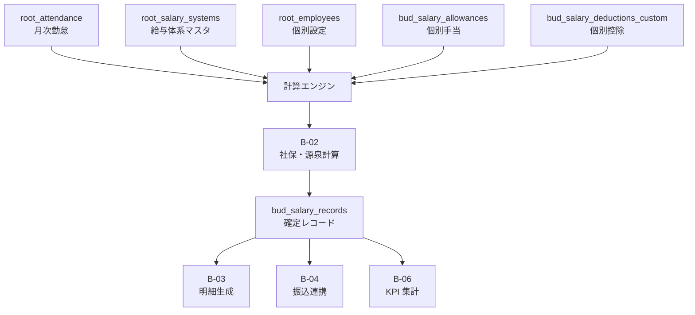
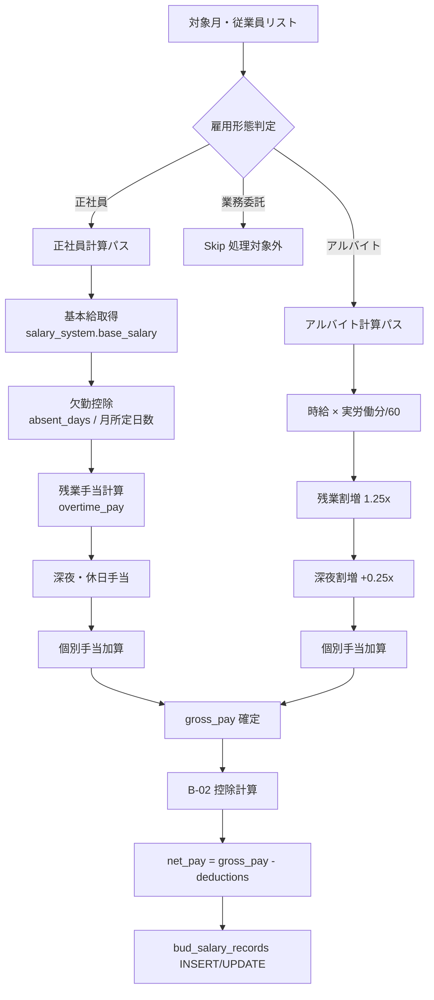

# Bud B-01: 給与計算エンジン 設計書

- 対象: Garden-Bud 給与処理のコア計算ロジック
- 見積: **0.75d**（約 6 時間）
- 担当セッション: a-bud
- 作成: 2026-04-24（a-auto / Phase A 先行 batch6 #B-01）
- 元資料: Bud CLAUDE.md「3. 給与処理」, Root KoT 連携（PR #15）, A-06 明細管理

---

## 1. 目的とスコープ

### 目的
`root_attendance`（KoT 取込済）と給与体系マスタ（`root_salary_systems`）を入力として、**月次支給額（支給 - 控除）**を算出するエンジンを定義する。計算結果は `bud_salary_records` に保存、後続の振込（B-04）・明細発行（B-03）の基礎データとなる。

### 含める
- 入力（勤怠 + 給与体系 + 個別手当 + 個別控除）→ 出力（総支給額 / 控除合計 / 差引支給額）の関数契約
- `bud_salary_records` テーブル設計（給与 1 人 × 1 月 = 1 行）
- 雇用形態別（正社員 / アルバイト）の計算分岐
- 時間外労働手当の割増計算（法定割増率）
- 欠勤控除・遅刻早退控除
- 計算の冪等性（同一入力 → 同一出力）
- 試算モード（DB 書込なし）と本計算モード

### 含めない（Phase B 内の別 spec）
- 社保・源泉徴収・住民税の個別ロジック → **B-02**
- 給与明細 PDF 生成 → **B-03**
- 振込への連携 → **B-04**
- 賞与計算 → **B-05**
- KPI 集計 → **B-06**
- 年末調整（Phase C 以降、判断保留）
- 給与改定フロー（手動運用、UI は Phase C）

---

## 2. 既存実装との関係

### Root KoT 連携（PR #15）
| 項目 | 提供内容 | B-01 での利用 |
|---|---|---|
| `src/app/root/_types/kot.ts` | `KotMonthlyWorking`（workingdayCount / overtime / night / late 等 分単位）| 入力データの型ソース |
| `src/app/root/_actions/kot-sync.ts` | KoT → `root_attendance` 取込 | 本 spec の入力は取込済前提 |
| `root_attendance` | target_month / working_days / 各種時間（分）| 計算エンジンの入力 1/3 |

### Bud Phase A-1（Batch 5）
| Spec | B-01 との接続 |
|---|---|
| A-03 6 段階遷移 | 給与振込の status 遷移は本 spec では扱わず、B-04 で扱う |
| A-06 明細管理 | 給与振込の実行確認は `bud_statements` 側（B-04 経由）|

### Root マスタ
| テーブル | 利用 |
|---|---|
| `root_employees` | payment_method / garden_role / company_id |
| `root_salary_systems` | 雇用形態別計算ルール（基本給・時給・支給項目テンプレ）|
| `root_insurance` | 社保料率（B-02 で利用）|
| `root_attendance` | 月次勤怠（本 spec の入力）|

---

## 3. 依存関係



**外部依存**:
- KoT API の安定取込（Root 側、B-01 の前提）
- 税制・社保料率の年次更新（B-02 の前提、B-01 は間接依存）
- MF クラウド給与との突合（Phase A 移行期、B-06 で比較画面）

---

## 4. データモデル提案

### 4.1 `bud_salary_records` — 給与 1 人 × 1 月の計算結果

```sql
CREATE TABLE bud_salary_records (
  id                      uuid PRIMARY KEY DEFAULT gen_random_uuid(),

  -- 対象と期間
  employee_id             text NOT NULL REFERENCES root_employees(employee_id),
  target_month            date NOT NULL,            -- 月の 1 日（例: 2026-05-01）
  company_id              text NOT NULL REFERENCES root_companies(company_id),

  -- 雇用形態（スナップショット、将来の体系変更に耐える）
  employment_type         text NOT NULL,            -- '正社員' | 'アルバイト'
  salary_system_id        uuid REFERENCES root_salary_systems(id),
  salary_system_snapshot  jsonb NOT NULL,           -- 計算時点の体系をそのまま保存

  -- 勤怠サマリ（root_attendance から転記、計算再現性のため）
  working_days            int NOT NULL DEFAULT 0,
  total_working_minutes   int NOT NULL DEFAULT 0,   -- 所定時間
  overtime_minutes        int NOT NULL DEFAULT 0,   -- 法定外残業
  late_night_minutes      int NOT NULL DEFAULT 0,   -- 深夜（22-5 時）
  holiday_work_minutes    int NOT NULL DEFAULT 0,   -- 休日労働
  late_minutes            int NOT NULL DEFAULT 0,
  early_leave_minutes     int NOT NULL DEFAULT 0,
  absent_days             int NOT NULL DEFAULT 0,
  paid_leave_days         numeric(5,2) DEFAULT 0,   -- 有休（0.5 日単位）

  -- 支給項目（税引前）
  base_salary             bigint NOT NULL DEFAULT 0,   -- 基本給
  overtime_pay            bigint NOT NULL DEFAULT 0,   -- 時間外手当
  late_night_pay          bigint NOT NULL DEFAULT 0,   -- 深夜手当
  holiday_work_pay        bigint NOT NULL DEFAULT 0,   -- 休日手当
  commuting_allowance     bigint NOT NULL DEFAULT 0,   -- 通勤手当
  position_allowance      bigint NOT NULL DEFAULT 0,   -- 役職手当
  other_allowances        jsonb NOT NULL DEFAULT '[]'::jsonb,  -- [{name, amount, taxable}]
  allowances_total        bigint NOT NULL DEFAULT 0,

  -- 控除項目（B-02 で詳細計算、本 spec では入れ物のみ）
  health_insurance        bigint NOT NULL DEFAULT 0,
  welfare_pension         bigint NOT NULL DEFAULT 0,
  employment_insurance    bigint NOT NULL DEFAULT 0,
  income_tax              bigint NOT NULL DEFAULT 0,
  resident_tax            bigint NOT NULL DEFAULT 0,
  other_deductions        jsonb NOT NULL DEFAULT '[]'::jsonb,  -- [{name, amount}]
  deductions_total        bigint NOT NULL DEFAULT 0,

  -- 結果
  gross_pay               bigint NOT NULL DEFAULT 0,   -- 総支給額
  net_pay                 bigint NOT NULL DEFAULT 0,   -- 差引支給額（振込額）

  -- ステータス（B-03 で明細確定、B-04 で振込発行）
  status                  text NOT NULL DEFAULT 'draft'
    CHECK (status IN ('draft', 'calculated', 'confirmed', 'paid', 'canceled')),

  -- 計算メタ
  calculated_at           timestamptz NOT NULL DEFAULT now(),
  calculated_by           uuid REFERENCES auth.users(id),
  calc_version            text NOT NULL,          -- 計算エンジンのバージョン（例: 'v1.0.0'）
  calc_params_hash        text,                   -- 入力ハッシュ（冪等性チェック用）
  notes                   text,

  created_at              timestamptz NOT NULL DEFAULT now(),
  updated_at              timestamptz NOT NULL DEFAULT now(),

  CONSTRAINT uq_salary_employee_month UNIQUE (employee_id, target_month)
);

CREATE INDEX bud_salary_records_month_company_idx
  ON bud_salary_records (target_month DESC, company_id);
CREATE INDEX bud_salary_records_status_idx
  ON bud_salary_records (status) WHERE status != 'paid';
```

### 4.2 個別手当・控除テーブル

```sql
-- 従業員ごとに毎月継続する個別手当（家族手当・住宅手当等）
CREATE TABLE bud_salary_allowances (
  id                 uuid PRIMARY KEY DEFAULT gen_random_uuid(),
  employee_id        text NOT NULL REFERENCES root_employees(employee_id),
  allowance_name     text NOT NULL,
  amount_monthly     bigint NOT NULL,
  is_taxable         boolean NOT NULL DEFAULT true,
  valid_from         date NOT NULL,
  valid_to           date,                       -- NULL=継続中
  notes              text,
  created_at         timestamptz NOT NULL DEFAULT now(),
  updated_at         timestamptz NOT NULL DEFAULT now(),
  created_by         uuid REFERENCES auth.users(id)
);

CREATE INDEX bud_salary_allowances_employee_idx
  ON bud_salary_allowances (employee_id, valid_from DESC);

-- 社保・源泉以外の個別控除（社宅費・貸付返済等）
CREATE TABLE bud_salary_deductions_custom (
  id                 uuid PRIMARY KEY DEFAULT gen_random_uuid(),
  employee_id        text NOT NULL REFERENCES root_employees(employee_id),
  deduction_name     text NOT NULL,
  amount_monthly     bigint NOT NULL,
  valid_from         date NOT NULL,
  valid_to           date,
  notes              text,
  created_at         timestamptz NOT NULL DEFAULT now(),
  updated_at         timestamptz NOT NULL DEFAULT now(),
  created_by         uuid REFERENCES auth.users(id)
);
```

### 4.3 RLS 草案（最重要：給与は機密）

```sql
ALTER TABLE bud_salary_records ENABLE ROW LEVEL SECURITY;

-- 本人 read（自分の給与明細参照用、Tree 側）
CREATE POLICY bsr_select_self ON bud_salary_records FOR SELECT
  USING (
    employee_id = (
      SELECT employee_id FROM root_employees WHERE user_id = auth.uid()
    )
  );

-- super_admin + admin（経理）read/write
CREATE POLICY bsr_rw_admin ON bud_salary_records FOR ALL
  USING (
    (SELECT garden_role FROM root_employees WHERE user_id = auth.uid())
    IN ('admin', 'super_admin')
  )
  WITH CHECK (
    (SELECT garden_role FROM root_employees WHERE user_id = auth.uid())
    IN ('admin', 'super_admin')
  );

-- manager は自チーム分のみ read（将来、チーム定義後に追加）
-- Phase B では super_admin + 本人のみ → manager 対応は Phase C

-- allowances / deductions_custom も同等ポリシー
ALTER TABLE bud_salary_allowances ENABLE ROW LEVEL SECURITY;
CREATE POLICY bsa_select_self ON bud_salary_allowances FOR SELECT
  USING (
    employee_id = (SELECT employee_id FROM root_employees WHERE user_id = auth.uid())
    OR (SELECT garden_role FROM root_employees WHERE user_id = auth.uid())
       IN ('admin', 'super_admin')
  );
CREATE POLICY bsa_rw_admin ON bud_salary_allowances FOR ALL
  USING ((SELECT garden_role FROM root_employees WHERE user_id = auth.uid()) IN ('admin','super_admin'))
  WITH CHECK ((SELECT garden_role FROM root_employees WHERE user_id = auth.uid()) IN ('admin','super_admin'));

-- bud_salary_deductions_custom も同等
```

---

## 5. 計算ロジック

### 5.1 全体フロー（mermaid）



### 5.2 正社員の計算

**基本給**: `salary_system.base_salary`（月額固定）

**欠勤控除**（日給月給制）:
```
欠勤控除額 = 基本給 × 欠勤日数 / 月所定日数
```
※ 月所定日数は `salary_system.monthly_working_days`（通常 20 or 22）

**残業手当**（時間単価 × 係数）:
```
時間単価 = 基本給 / 月所定労働時間（通常 160h）
残業手当 = 時間単価 × (overtime_minutes / 60) × 1.25

深夜残業 = 時間単価 × (late_night_overtime_minutes / 60) × 1.50   -- 1.25 + 0.25
休日労働 = 時間単価 × (holiday_work_minutes / 60) × 1.35             -- 法定休日
```

**遅刻早退控除**:
```
遅刻早退控除 = 時間単価 × ((late_minutes + early_leave_minutes) / 60)
```

### 5.3 アルバイトの計算

**総支給額**:
```
基本給 = 時給 × (total_working_minutes / 60)
残業手当 = 時給 × (overtime_minutes / 60) × 0.25   -- 割増分のみ
深夜割増 = 時給 × (late_night_minutes / 60) × 0.25
休日手当 = 時給 × (holiday_work_minutes / 60) × 0.35
```

**欠勤控除**: アルバイトは時間給のため、欠勤=就業しなかった=給与発生なし（別途控除項目不要）

### 5.4 法定割増率（2026 年時点、日本労基）

| 種別 | 割増率 | 本 spec の扱い |
|---|---|---|
| 時間外労働（法定外） | 1.25 | overtime_pay に反映 |
| 深夜労働（22:00-5:00） | 0.25 加算 | late_night_pay 単独 |
| 法定休日労働 | 1.35 | holiday_work_pay に反映 |
| 月 60 時間超の時間外 | 1.50（中小企業も適用、2023-04-01〜）| 判断保留 判4 |

### 5.5 TypeScript 関数契約（擬似コード）

```typescript
// src/app/bud/_lib/salary-calc/engine.ts
export type SalaryCalcInput = {
  employeeId: string;
  targetMonth: string;          // YYYY-MM-DD（月初）
  dryRun?: boolean;             // DB 書込なし
};

export type SalaryCalcResult = {
  salaryRecordId?: string;      // dryRun 時は undefined
  grossPay: number;
  deductionsTotal: number;      // B-02 の出力
  netPay: number;
  breakdown: {
    baseSalary: number;
    overtimePay: number;
    lateNightPay: number;
    holidayWorkPay: number;
    commutingAllowance: number;
    positionAllowance: number;
    otherAllowances: Array<{ name: string; amount: number; taxable: boolean }>;
    absenceDeduction: number;     // 欠勤控除（マイナス扱い or 別項目）
    lateEarlyDeduction: number;
  };
  warnings: string[];           // 「勤怠データ欠損」「体系未設定」等
};

export async function calculateSalary(input: SalaryCalcInput): Promise<SalaryCalcResult>;

// 一括計算（月末締め時に全従業員処理）
export async function calculateSalariesForMonth(params: {
  targetMonth: string;
  companyIds?: string[];        // 省略時は全法人
  dryRun?: boolean;
}): Promise<{
  processed: number;
  succeeded: number;
  failed: Array<{ employeeId: string; error: string }>;
  warnings: Array<{ employeeId: string; warning: string }>;
}>;
```

### 5.6 バージョン管理と冪等性

- **calc_version**: 計算エンジンのバージョン文字列（例: `'v1.0.0'`）を `bud_salary_records.calc_version` に保存
- **calc_params_hash**: 入力（勤怠・体系・手当・控除）の SHA-256 ハッシュを保存、同一ハッシュで再計算すれば同一結果
- 体系変更時は `salary_system_snapshot` に計算時点の体系を保存 → 後日の体系変更に影響されない

---

## 6. API / Server Action 契約

### 6.1 単発計算
```typescript
export async function calculateOneSalary(input: {
  employeeId: string;
  targetMonth: string;
  dryRun?: boolean;
}): Promise<SalaryCalcResult & { success: boolean; error?: string }>;
```

### 6.2 月次一括計算
```typescript
export async function calculateMonthlyBatch(input: {
  targetMonth: string;
  companyIds?: string[];
  dryRun?: boolean;
}): Promise<{
  batchId: string;             // 履歴参照用
  processed: number;
  succeeded: number;
  failed: number;
  startedAt: string;
  finishedAt: string;
}>;
```

### 6.3 再計算
```typescript
export async function recalculateSalary(params: {
  salaryRecordId: string;
  reason: string;              // 再計算理由（監査対応）
}): Promise<{ success: boolean; error?: string; newNetPay?: number }>;
```

---

## 7. 状態遷移

`bud_salary_records.status` の遷移：

```
draft（初期）
  └─→ calculated（計算完了、DB 書込済）
         └─→ confirmed（B-03 で明細確定）
                └─→ paid（B-04 で振込完了）

任意:
  calculated / confirmed → canceled（取消、理由必須）
  canceled → calculated（再開、別レコード作成推奨）
```

**遷移主体**:
- draft → calculated: Server Action（admin トリガ）
- calculated → confirmed: B-03 明細確定ボタン（admin）
- confirmed → paid: B-04 振込完了マーク（admin、bud_statements 照合時）
- * → canceled: admin（理由必須、history に記録）

---

## 8. Chatwork 通知

### 8.1 月次一括計算完了
- **通知先**: 東海林さん + 経理担当（管理者 DM）
- **内容**: `[Garden-Bud] 2026-05 給与計算完了: 処理 X 名 / 成功 Y / 失敗 Z / 警告 N 件`
- **タイミング**: 一括計算成功直後、即時

### 8.2 計算失敗アラート
- **通知先**: 東海林さん DM（失敗件数 > 0 時）
- **内容**: 失敗従業員名 + エラー要約 + 詳細画面リンク
- **タイミング**: 即時

### 8.3 本人への給与明細通知は B-03 で扱う
本 spec は計算のみのため、本人通知は対象外。

---

## 9. 監査ログ要件

### 9.1 計算履歴専用テーブル
```sql
CREATE TABLE bud_salary_calc_history (
  id                      uuid PRIMARY KEY DEFAULT gen_random_uuid(),
  salary_record_id        uuid NOT NULL REFERENCES bud_salary_records(id) ON DELETE CASCADE,
  action                  text NOT NULL CHECK (action IN ('calculate', 'recalculate', 'cancel')),
  calc_version            text NOT NULL,
  calc_params_hash        text,
  previous_values         jsonb,              -- 変更前（gross_pay / net_pay / 主要項目）
  new_values              jsonb,              -- 変更後
  reason                  text,
  executed_at             timestamptz NOT NULL DEFAULT now(),
  executed_by             uuid REFERENCES auth.users(id)
);

CREATE INDEX bud_salary_calc_history_record_idx
  ON bud_salary_calc_history (salary_record_id, executed_at DESC);
```

### 9.2 root_audit_log への併記
- 再計算・取消は必ず `root_audit_log` にも記録（横断監査のため）
- INSERT/UPDATE の raw は `bud_salary_records` の updated_at で追跡可、高頻度ではないため triggered audit は不要

---

## 10. バリデーション規則（計算前のチェック）

| # | ルール | 違反時 |
|---|---|---|
| V1 | 対象月の `root_attendance` が存在 | 計算スキップ、warnings に列挙 |
| V2 | `root_employees.salary_system_id` が null でない | 計算不可、failed |
| V3 | 雇用形態が '正社員' or 'アルバイト' | 業務委託等は skip |
| V4 | `target_month` が未来月ではない | エラー |
| V5 | 再計算時、status が 'draft' or 'calculated' | confirmed/paid なら取消が先 |
| V6 | 一括計算は同一 (employee_id, target_month) の重複実行防止（冪等キー） | skip（成功扱い）|
| V7 | 総支給額 > 0（負値防止、深夜手当等のマイナス計算対策） | エラー、手動確認要 |
| V8 | net_pay > 0（控除が総支給を超過しないか） | 警告、手動確認（異常値）|

---

## 11. 受入基準

1. ✅ `bud_salary_records` + `bud_salary_allowances` + `bud_salary_deductions_custom` + `bud_salary_calc_history` migration 投入
2. ✅ 正社員 3 名（基本給・残業・深夜・休日あり）のダミーデータで計算が期待値通り
3. ✅ アルバイト 2 名（時給・深夜）の計算が期待値通り
4. ✅ 欠勤控除・遅刻早退控除が正しく引かれる
5. ✅ 個別手当（家族手当・住宅手当）が加算される
6. ✅ dryRun モードで DB 書込なし、結果のみ返却
7. ✅ 一括計算で処理件数・成功/失敗が正確に集計
8. ✅ RLS: 本人が自分の給与のみ SELECT 可、他人の給与は 403
9. ✅ 計算履歴（`bud_salary_calc_history`）が記録される
10. ✅ Chatwork 通知が一括計算完了時に動作

---

## 12. 想定工数（内訳）

| # | 作業 | 工数 |
|---|---|---|
| W1 | migration（4 テーブル + RLS）| 0.1d |
| W2 | 型定義（TypeScript）| 0.05d |
| W3 | 正社員計算ロジック | 0.15d |
| W4 | アルバイト計算ロジック | 0.1d |
| W5 | 個別手当・控除の適用 | 0.1d |
| W6 | 一括計算バッチ + エラー集計 | 0.1d |
| W7 | ユニットテスト（Vitest、正社員 5 ケース・アルバイト 3 ケース）| 0.1d |
| W8 | Chatwork 通知連携 | 0.05d |
| **合計** | | **0.75d** |

---

## 13. 判断保留

| # | 論点 | a-auto スタンス |
|---|---|---|
| 判1 | 月所定日数・月所定労働時間のマスタ保持 | `root_salary_systems.monthly_working_days` / `monthly_working_hours` 追加を推奨 |
| 判2 | 有休取得日の給与計上 | **満額支給**（欠勤控除対象外、normal operation）|
| 判3 | 業務委託の扱い | Bud CLAUDE.md 明記通り**対象外**、個別 Excel で処理継続 |
| 判4 | 月 60 時間超の時間外 1.50 倍 | 現在の組織規模なら該当頻度低、**Phase B v1 では 1.25 固定**、年末調整時に差額調整 |
| 判5 | 通勤手当の非課税限度額計算 | 往復 55km 以上は非課税限度あり、Phase B v1 では**全額非課税扱い**、厳密化は Phase C |
| 判6 | 遅刻早退控除の 1 分単位 vs 15 分単位 | **1 分単位**（KoT が分単位、四捨五入の方が不利益になるケースあり）|
| 判7 | 計算エラー時の処理 | 失敗レコードは DB に残さず（dryRun 的に）、ログのみ。担当者が原因修正後に再実行 |
| 判8 | 給与計算バージョニング | `calc_version` 文字列で管理、メジャーバージョン変更時は全員再計算（判断保留：自動 vs 手動）|
| 判9 | 休日労働と深夜の重複 | 休日 × 深夜 = 1.35 + 0.25 = 1.60 で加算（厳密には労基通達で個別整理要）|
| 判10 | 試算結果の一時保存 | dryRun 結果を 1 時間 cache（再試算の重複計算を避ける）→ Phase B v2 |

---

## 14. Phase C 以降への繰越事項

- 年末調整（源泉徴収票出力、B-02 源泉徴収との統合で Phase C）
- 給与改定フロー UI（現状はマスタ直接変更）
- 扶養控除申告書の電子化（Tree マイページ連携）
- 退職時精算（最終給与の日割・源泉年額調整）
- 外国人従業員の租税条約適用

— end of B-01 spec —
