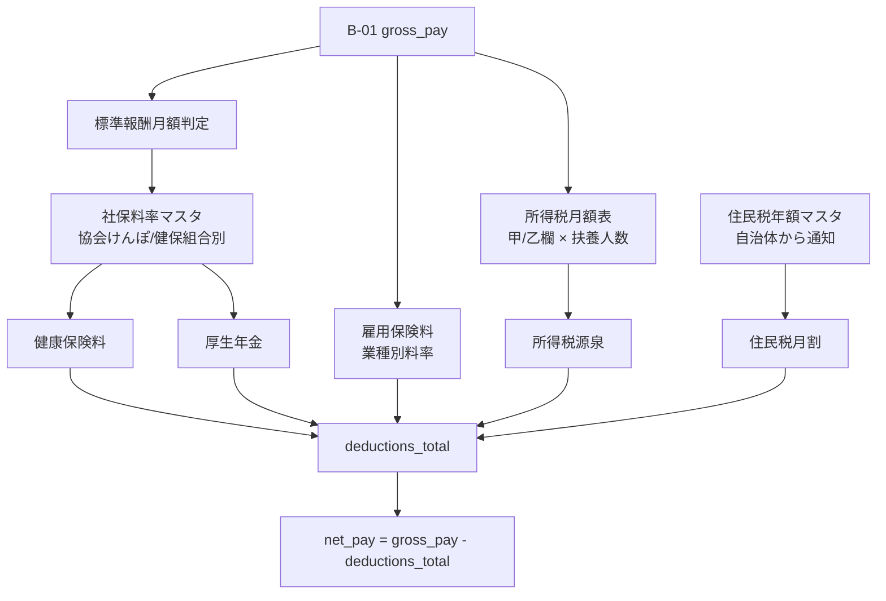

# Bud B-02: 社会保険・源泉徴収・住民税 計算ルール 仕様書

- 対象: Garden-Bud 給与控除項目（社保・所得税源泉・住民税）の計算エンジン
- 見積: **0.5d**（約 4 時間）
- 担当セッション: a-bud
- 作成: 2026-04-24（a-auto / Phase A 先行 batch6 #B-02）
- 前提 spec: Bud B-01（給与計算エンジン）
- **注意**: 2026 年時点の日本の税制・社保制度を前提。料率表の年次更新が必須（§12 判6）

---

## 1. 目的とスコープ

### 目的
B-01 で計算された総支給額（gross_pay）から、**法令に基づく 5 種の控除額**を算出し、`bud_salary_records` の該当カラムに格納する。Phase A-1 での手計算を置き換え、MF クラウド給与との並行運用期を短縮する。

### 含める
- 健康保険料（協会けんぽ / 健康保険組合の切替対応）
- 厚生年金保険料
- 雇用保険料
- 所得税（源泉徴収、月額表の甲/乙欄）
- 住民税（特別徴収、各自治体から通知される年額の月割）

### 含めない
- 個別控除（社宅費・貸付返済等）→ B-01 の `bud_salary_deductions_custom` で管理済
- 年末調整（Phase C 繰越）
- 住民税の年次通知入力 UI（admin 手動入力、Phase B 内）
- 所得税の確定申告連携（対象外）

---

## 2. 既存実装との関係

### Root マスタ
| テーブル | 利用 |
|---|---|
| `root_insurance` | 保険料率・等級テーブル（**本 spec で構造を詳細化**）|
| `root_employees` | 扶養人数 / 住所（住民税徴収自治体）/ 年齢（介護保険判定）|

### Bud B-01 との連携
- 入力: `bud_salary_records` の `gross_pay` + 各手当の `taxable` フラグ
- 出力: 同レコードの `health_insurance` / `welfare_pension` / `employment_insurance` / `income_tax` / `resident_tax` を UPDATE

---

## 3. 依存関係



---

## 4. データモデル提案

### 4.1 `root_insurance` テーブル拡張案

```sql
-- 既存 root_insurance の拡張 or 新規正規化（Root マスタ側と連携要）
-- 本 spec は構造案の提示、実投入は a-root と連携

CREATE TABLE root_insurance_rates (
  id                  uuid PRIMARY KEY DEFAULT gen_random_uuid(),
  insurance_type      text NOT NULL CHECK (insurance_type IN (
    'health_association',    -- 協会けんぽ
    'health_union',          -- 健康保険組合
    'welfare_pension',       -- 厚生年金
    'employment_general',    -- 雇用保険（一般事業）
    'employment_construction' -- 雇用保険（建設業、該当時）
  )),
  prefecture          text,                 -- 都道府県（協会けんぽのみ必要）
  union_id            text,                 -- 健保組合ID（該当時）
  valid_from          date NOT NULL,        -- 適用開始
  valid_to            date,
  -- 料率（折半前の合計 = 労使合計）
  rate_total          numeric(6,4) NOT NULL, -- 例: 0.0998（9.98%）
  rate_employee       numeric(6,4) NOT NULL, -- 従業員負担分
  -- 介護保険料率（40 歳以上に加算、健保のみ）
  rate_care_addon     numeric(6,4),
  notes               text,
  created_at          timestamptz NOT NULL DEFAULT now()
);

CREATE TABLE root_insurance_standard_monthly (
  -- 標準報酬月額等級テーブル（健保・厚年）
  id                  uuid PRIMARY KEY DEFAULT gen_random_uuid(),
  insurance_type      text NOT NULL CHECK (insurance_type IN ('health', 'welfare_pension')),
  grade               int NOT NULL,        -- 等級（1-50 等）
  lower_bound         int NOT NULL,        -- 報酬月額の下限（円）
  upper_bound         int,                 -- 上限（最高等級は null）
  standard_amount     int NOT NULL,        -- 標準報酬月額
  valid_from          date NOT NULL,
  valid_to            date
);
```

### 4.2 所得税月額表

```sql
CREATE TABLE root_income_tax_monthly (
  id                  uuid PRIMARY KEY DEFAULT gen_random_uuid(),
  -- 月額給与 - 社保控除後の金額レンジ
  lower_bound         int NOT NULL,
  upper_bound         int,
  -- 扶養人数別の源泉税額（甲欄）
  dependents_0        int NOT NULL,
  dependents_1        int NOT NULL,
  dependents_2        int NOT NULL,
  dependents_3        int NOT NULL,
  dependents_4        int NOT NULL,
  dependents_5        int NOT NULL,
  dependents_6        int NOT NULL,
  dependents_7_plus   int NOT NULL,
  -- 乙欄（扶養控除申告書未提出者）
  otsu_amount         int NOT NULL,
  valid_from          date NOT NULL,
  valid_to            date
);

CREATE INDEX root_income_tax_monthly_lookup_idx
  ON root_income_tax_monthly (valid_from, lower_bound);
```

### 4.3 住民税マスタ

```sql
CREATE TABLE bud_resident_tax (
  id                  uuid PRIMARY KEY DEFAULT gen_random_uuid(),
  employee_id         text NOT NULL REFERENCES root_employees(employee_id),
  fiscal_year         int NOT NULL,          -- 税額通知の年度（例: 2026 = 2026/6〜2027/5）
  annual_amount       bigint NOT NULL,       -- 年税額
  first_month_amount  bigint NOT NULL,       -- 6 月分（端数調整）
  regular_month_amount bigint NOT NULL,      -- 7〜5 月分（通常月）
  municipality        text NOT NULL,         -- 徴収自治体名
  notes               text,
  notified_at         date NOT NULL,         -- 通知書受領日
  created_at          timestamptz NOT NULL DEFAULT now(),
  updated_at          timestamptz NOT NULL DEFAULT now(),

  CONSTRAINT uq_bud_resident_tax_employee_year UNIQUE (employee_id, fiscal_year)
);

ALTER TABLE bud_resident_tax ENABLE ROW LEVEL SECURITY;
-- 本人 read + admin 全権（B-01 と同パターン）
```

### 4.4 RLS

**超機密のため**:
- `root_insurance_rates`: admin+ read/write、staff は料率 LOOKUP 用に SELECT 可（列制限推奨）
- `root_income_tax_monthly`: 同上
- `bud_resident_tax`: **本人 read + admin 全権**、super_admin でも他人閲覧は監査ログ残す

---

## 5. 計算ロジック

### 5.1 健康保険料

```typescript
function calculateHealthInsurance(input: {
  grossPay: number;           // 通勤手当含む標準報酬月額計算用
  age: number;                // 40-64 歳は介護保険加算
  prefecture: string;         // 協会けんぽの場合
  unionId?: string;           // 健保組合の場合
}): number {
  // 1. 標準報酬月額を決定
  const standardAmount = findStandardMonthly(input.grossPay, 'health');

  // 2. 料率取得（都道府県 or 組合別）
  const rate = input.unionId
    ? getUnionRate(input.unionId, 'health_union')
    : getAssociationRate(input.prefecture, 'health_association');

  // 3. 従業員負担額 = 標準報酬月額 × 従業員負担料率
  let employeeShare = Math.floor(standardAmount * rate.rate_employee);

  // 4. 介護保険料（40-64 歳）
  if (input.age >= 40 && input.age <= 64) {
    const careRate = rate.rate_care_addon ?? 0;
    employeeShare += Math.floor(standardAmount * careRate / 2);  // 折半
  }

  return employeeShare;
}
```

### 5.2 厚生年金保険料
```typescript
function calculateWelfarePension(input: {
  grossPay: number;
}): number {
  const standardAmount = findStandardMonthly(input.grossPay, 'welfare_pension');
  // 2026 年時点の料率: 18.3%（労使折半、従業員 9.15%）
  const rate = 0.0915;
  return Math.floor(standardAmount * rate);
}
```

### 5.3 雇用保険料
```typescript
function calculateEmploymentInsurance(input: {
  grossPay: number;
  industryType: 'general' | 'construction' | 'agriculture';
}): number {
  // 一般事業 2026 年度想定: 従業員負担 6/1000 = 0.006
  const rate = {
    general: 0.006,
    construction: 0.007,
    agriculture: 0.007,
  }[input.industryType];
  return Math.floor(input.grossPay * rate);
}
```

### 5.4 所得税（源泉徴収）
```typescript
function calculateIncomeTax(input: {
  grossPay: number;
  socialInsuranceTotal: number;   // 社保控除後の金額で計算
  dependentsCount: number;         // 扶養親族数（0-7+）
  hasTaxExemptionForm: boolean;    // 扶養控除申告書提出=甲欄
}): number {
  const taxableIncome = input.grossPay - input.socialInsuranceTotal;
  const row = findIncomeTaxRow(taxableIncome);

  if (!input.hasTaxExemptionForm) {
    return row.otsu_amount;       // 乙欄
  }

  const column = {
    0: 'dependents_0',
    1: 'dependents_1',
    2: 'dependents_2',
    3: 'dependents_3',
    4: 'dependents_4',
    5: 'dependents_5',
    6: 'dependents_6',
  }[Math.min(input.dependentsCount, 6)] ?? 'dependents_7_plus';

  return row[column];
}
```

### 5.5 住民税
```typescript
function calculateResidentTax(input: {
  employeeId: string;
  targetMonth: Date;              // 月の 1 日
}): number {
  const fiscalYear = targetMonth.getMonth() >= 5  // 6 月以降
    ? targetMonth.getFullYear()
    : targetMonth.getFullYear() - 1;

  const record = findResidentTax(input.employeeId, fiscalYear);
  if (!record) return 0;          // 未通知 or 非該当

  // 6 月のみ first_month_amount、他月は regular
  if (targetMonth.getMonth() === 5) return record.first_month_amount;
  return record.regular_month_amount;
}
```

---

## 6. API / Server Action 契約

```typescript
// メイン関数（B-01 の engine から呼出）
export async function calculateDeductions(input: {
  grossPay: number;
  employeeId: string;
  targetMonth: string;             // YYYY-MM-DD
  commutingAllowance: number;      // 通勤手当（社保計算には含む、所得税には含めない）
}): Promise<{
  healthInsurance: number;
  welfarePension: number;
  employmentInsurance: number;
  incomeTax: number;
  residentTax: number;
  total: number;
  breakdown: { detail: string; amount: number }[];  // 監査用
  warnings: string[];              // 料率表未整備・扶養情報欠損等
}>;

// 住民税年額通知の登録（admin 経由）
export async function registerResidentTax(input: {
  employeeId: string;
  fiscalYear: number;
  annualAmount: number;
  firstMonthAmount: number;
  regularMonthAmount: number;
  municipality: string;
  notifiedAt: string;
}): Promise<{ success: boolean; error?: string }>;

// 料率表の取込（年次、admin）
export async function importInsuranceRatesCsv(params: {
  file: File;                      // 協会けんぽ料率表 PDF → CSV 変換済
  validFrom: string;
}): Promise<{ imported: number; error?: string }>;
```

---

## 7. 状態遷移

本 spec は主に純計算関数のため、専用ステートなし。B-01 の `bud_salary_records.status` に従う。

---

## 8. Chatwork 通知

- **料率表期限切れアラート**: 毎月 1 日 09:00、適用中の料率表の `valid_to` が 3 ヶ月以内に切れる場合、admin DM
- **住民税未通知アラート**: 毎月計算前、6 月の年度切替え時に住民税未登録の従業員リストを admin に通知
- **計算異常アラート**: 社保が gross_pay の 20% を超える等の異常値を検出したら admin に DM

---

## 9. 監査ログ要件

- 料率表更新は `root_audit_log` に必ず記録（税務調査対応）
- 住民税登録・変更は同上
- `bud_salary_calc_history`（B-01 §9.1）に控除内訳を含む計算結果スナップショット保存

---

## 10. バリデーション規則

| # | ルール | 違反時 |
|---|---|---|
| V1 | 計算時点で有効な料率表（valid_from ≤ target ≤ valid_to）が存在 | 計算不可、admin アラート |
| V2 | `root_employees.dependents_count` が 0-20 の整数 | V3 にフォールバック |
| V3 | 扶養情報欠損時 | 0 扶養で計算、warnings に列挙 |
| V4 | 住民税 fiscalYear が未登録 | 0 円で計算、warnings（非該当 or 未通知）|
| V5 | 雇用形態がアルバイト＆週 20 時間未満 | 社保加入なし、本関数は skip |
| V6 | 介護保険（40-64 歳）の年齢判定は給与計算月の 1 日時点 | - |
| V7 | 計算結果が負値 | エラー、強制 0 円 |

---

## 11. 受入基準

1. ✅ `root_insurance_rates` + `root_insurance_standard_monthly` + `root_income_tax_monthly` migration 投入
2. ✅ `bud_resident_tax` migration 投入
3. ✅ 協会けんぽ料率（東京都 2026 年度）ダミーデータ投入
4. ✅ 厚生年金料率（18.3% / 9.15%）で計算が正確
5. ✅ 雇用保険料（一般 0.6%）で計算が正確
6. ✅ 所得税月額表（2026 年版）ダミー投入、甲欄・乙欄両方で検算
7. ✅ 介護保険料（40 歳以上）加算が動作
8. ✅ 住民税の 6 月特別月・7-5 月通常月の振分が正しい
9. ✅ 料率表期限切れアラートが動作（dry-run で日付操作してテスト）
10. ✅ MF クラウド給与との突合で**全従業員の控除額 ±10 円以内**（端数処理差異の許容範囲）

---

## 12. 想定工数（内訳）

| # | 作業 | 工数 |
|---|---|---|
| W1 | migration 4 本（料率 / 標準報酬 / 所得税月額 / 住民税）| 0.1d |
| W2 | 料率取得ヘルパー関数 | 0.05d |
| W3 | 社保計算（3 種）| 0.1d |
| W4 | 所得税計算（甲欄・乙欄）| 0.1d |
| W5 | 住民税計算 | 0.05d |
| W6 | `calculateDeductions` 統合関数 | 0.05d |
| W7 | MF クラウド突合テスト + 料率表期限アラート | 0.05d |
| **合計** | | **0.5d** |

---

## 13. 判断保留

| # | 論点 | a-auto スタンス |
|---|---|---|
| 判1 | 社保加入基準（週 20 時間・月 8.8 万円等）の判定自動化 | **Phase B v1 では手動判定**（加入済従業員のみ計算対象）、自動化は Phase C |
| 判2 | 育休・産休の保険料免除 | `root_employees.on_leave_type` 等のマスタ拡張が必要、Phase B v2 |
| 判3 | 健保組合の多様な料率 | Phase B v1 は協会けんぽのみ、組合対応は切替発生時 |
| 判4 | 雇用保険の離職票発行時期 | 対象外（人事領域）|
| 判5 | 所得税の年末調整精算額 | 12 月分給与で一括精算、別 spec（Phase C）|
| 判6 | **料率表の年次更新運用** | **4 月 / 10 月に admin が手動更新**、忘れ防止のため Chatwork アラート（§8）|
| 判7 | 標準報酬月額の定時決定（4-6 月平均）| **Phase B v2 で対応**、v1 は手動更新 |
| 判8 | 随時改定（昇給で等級 2 階級以上変動）| 同上、Phase B v2 |
| 判9 | 賞与の社保計算 | B-05 で別途扱う（標準賞与額上限あり）|
| 判10 | 扶養家族情報のソース | `root_employees.dependents_count` を admin 手動更新、Tree マイページからの本人更新は Phase D |

---

## 14. 年次更新カレンダー（運用）

| 時期 | 作業 | 担当 |
|---|---|---|
| 3 月末 | 協会けんぽ料率通知チェック → 4 月分から適用 | admin |
| 4 月 1 日 | 新年度雇用保険料率確認 → 4 月分から適用 | admin |
| 6 月 | 住民税年額通知（各自治体）→ 6-5 月分で月割 | admin（全従業員分）|
| 7 月 | 算定基礎届（7/1-7/10 提出）→ 9 月分から標準報酬月額更新 | admin |
| 9 月 | 厚生年金保険料率（毎年 9 月改定、2017 年以降は 18.3% 固定）| 監視のみ |
| 年末 | 年末調整（Phase C 繰越）| admin |

— end of B-02 spec —
