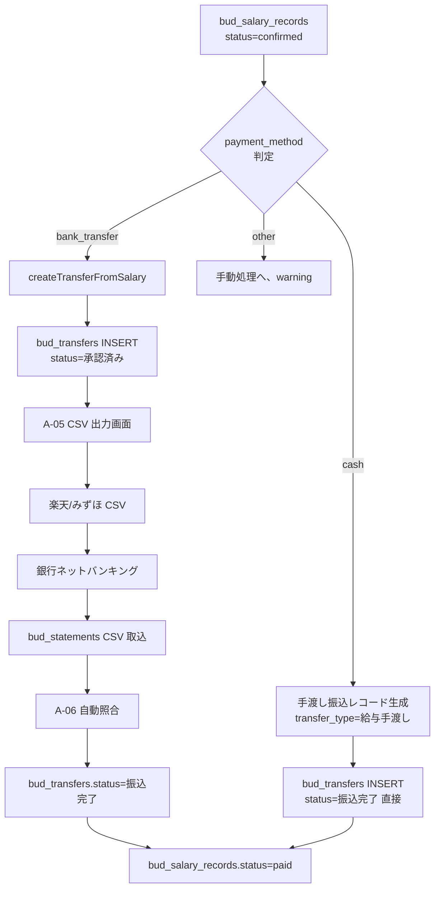
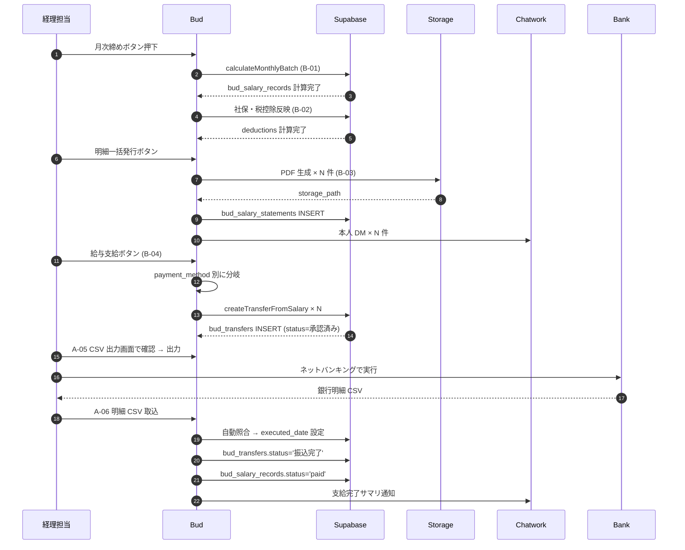

# Bud B-04: 給与支給フロー（振込連携）仕様書

- 対象: Garden-Bud 給与支給と Phase A-1 振込機能の統合
- 見積: **0.5d**（約 4 時間）
- 担当セッション: a-bud
- 作成: 2026-04-24（a-auto / Phase A 先行 batch6 #B-04）
- 前提 spec: B-01（計算）, B-02（控除）, B-03（明細）, A-03（振込 6 段階）, A-04（振込作成）

---

## 1. 目的とスコープ

### 目的
`bud_salary_records.status='confirmed'` のレコードから、**対応する `bud_transfers` を自動生成**し、Phase A-1 の振込ワークフロー（6 段階遷移）に乗せる。給与支給を 1 本の UI 操作で完結させる。

### 含める
- 給与レコード → 振込レコード変換ロジック
- 一括支給ボタン（選択済みの `bud_salary_records` から一気に `bud_transfers` を作成）
- 手渡し現金受給者の別ルート（A-07 判2=B 案準拠、`transfer_type='給与(手渡し)'`）
- 振込実行後の `bud_salary_records.status='paid'` 更新
- 明細との照合（B-03 の明細発行が先か振込が先かの順序制御）

### 含めない
- 振込 CSV 生成（A-05 の CSV 出力画面に委譲）
- 振込の個別承認画面（A-05）
- 明細 PDF 生成（B-03）
- 銀行明細取込（A-06）

---

## 2. 既存実装との関係

### Phase A-1 Bud
| Spec | B-04 との連携 |
|---|---|
| A-03 6 段階遷移 | 生成される振込は `status='承認済み'` から開始（給与は既に内部承認済扱い）|
| A-04 新規作成 | 本 spec は API 内部で **createTransferFromSalary** を呼出、UI 経由 INSERT とは別ルート |
| A-05 承認フロー | 承認は internal、一括で CSV 出力 → 振込完了へ |
| A-06 明細管理 | `bud_statements` と `bud_transfers.executed_date` の照合で paid 遷移 |

### Root マスタ
- `root_employees.payment_method`（A-07 判1=A 案）: 'bank_transfer' / 'cash' / 'other'
- `root_employees.salary_bank_account` or 同等: 給与振込先口座（MF 連携 or マスタ直接管理）

---

## 3. 依存関係



---

## 4. データモデル提案

### 4.1 `bud_transfers` への列追加

```sql
ALTER TABLE bud_transfers
  ADD COLUMN IF NOT EXISTS source_type text
    CHECK (source_type IN ('manual', 'salary', 'cashback_leaf', 'external'))
    DEFAULT 'manual',
  ADD COLUMN IF NOT EXISTS source_ref_id uuid;     -- salary の場合 bud_salary_records.id

CREATE INDEX bud_transfers_source_idx
  ON bud_transfers (source_type, source_ref_id)
  WHERE source_type != 'manual';
```

**意図**: 振込が**給与起票**であるか**手動起票**（通常の取引先支払）であるかを区別。
- `source_type='salary'` の振込は A-05 の承認 UI では「給与振込」バッジ表示
- 一括ルールで「給与振込は自動承認済」扱い（下記 4.3 参照）

### 4.2 `bud_salary_records` への transfer_id 追加

```sql
ALTER TABLE bud_salary_records
  ADD COLUMN IF NOT EXISTS transfer_id uuid REFERENCES bud_transfers(id),
  ADD COLUMN IF NOT EXISTS paid_at timestamptz;

-- paid 状態のときのみ設定される
```

### 4.3 給与振込は「自動承認済扱い」

A-03 の TRANSFER_STATUS_TRANSITIONS は維持したまま、**給与起票時は初期ステータスを `'承認済み'` にする特別ロジック**を `createTransferFromSalary` に内包：

```typescript
// 通常の createTransfer（A-04）は status='下書き' で開始
// createTransferFromSalary は status='承認済み' で開始
// 理由: 給与は B-01/B-02 の計算ロジック + B-03 明細確定で「既に承認済み」とみなす
```

監査観点で `bud_transfer_status_history` には from_status=NULL / to_status='承認済み' + reason='給与自動起票' を記録。

---

## 5. 業務フロー

### 5.1 月次給与支給の全体フロー



### 5.2 ボタンと UI 配置

給与支給画面 `/bud/salary/pay/[month]`:
- タブ 1: 支給前確認（bud_salary_records status=confirmed の一覧）
- タブ 2: 支給処理中（status=confirmed + transfer_id 設定済み = 振込作成済）
- タブ 3: 支給完了（status=paid）

各タブで選択 → 一括処理ボタン。

---

## 6. API / Server Action 契約

### 6.1 単発振込起票
```typescript
export async function createTransferFromSalary(input: {
  salaryRecordId: string;
  scheduledDate: string;       // YYYY-MM-DD
  forceRecreate?: boolean;     // 既に transfer_id ある場合の上書き
}): Promise<{
  success: boolean;
  transferId?: string;
  error?: string;
  code?: 'NOT_CONFIRMED' | 'ALREADY_HAS_TRANSFER' | 'NO_BANK_ACCOUNT' | 'DB_ERROR';
}>;
```

### 6.2 一括振込起票
```typescript
export async function batchCreateSalaryTransfers(input: {
  salaryRecordIds: string[];
  scheduledDate: string;
}): Promise<{
  bankTransfers: number;        // payment_method='bank_transfer' 件数
  cashPayments: number;         // 'cash' 件数
  skipped: number;
  failed: Array<{ salaryRecordId: string; error: string }>;
}>;
```

### 6.3 振込完了 → 給与完了の連携

A-06 の自動照合で `bud_transfers.status='振込完了'` に遷移したら、**データベーストリガー**で `bud_salary_records.status='paid'` を自動更新：

```sql
CREATE OR REPLACE FUNCTION bud_sync_salary_status_on_transfer_completion()
RETURNS trigger LANGUAGE plpgsql AS $$
BEGIN
  IF NEW.status = '振込完了' AND NEW.source_type = 'salary' AND NEW.source_ref_id IS NOT NULL THEN
    UPDATE bud_salary_records
      SET status = 'paid',
          paid_at = now(),
          updated_at = now()
      WHERE id = NEW.source_ref_id AND status = 'confirmed';
  END IF;
  RETURN NEW;
END;
$$;

CREATE TRIGGER bud_transfers_on_completion
  AFTER UPDATE OF status ON bud_transfers
  FOR EACH ROW
  WHEN (NEW.status = '振込完了' AND OLD.status != '振込完了')
  EXECUTE FUNCTION bud_sync_salary_status_on_transfer_completion();
```

---

## 7. 状態遷移

### 7.1 `bud_salary_records.status` 遷移
```
confirmed（B-03 明細発行完了）
  ↓ createTransferFromSalary（本 spec）
  ↓ （status は confirmed のまま、transfer_id セット）
confirmed（transfer 紐付き）
  ↓ bud_transfers.status='振込完了' → トリガで自動
paid（支給完了）
```

### 7.2 生成される `bud_transfers.status` 初期値
- 銀行振込: `'承認済み'` スタート（通常振込の承認待ちフローを省略）
- 手渡し現金: `'振込完了'` スタート（銀行振込は発生しない、即完了マーク）

---

## 8. Chatwork 通知

### 8.1 一括起票完了
- **通知先**: 東海林さん + 経理担当 DM
- **内容**:
  ```
  [Garden-Bud] 2026-05 給与振込起票完了
  ・銀行振込: X 件（A-05 CSV 出力画面で確認してください）
  ・手渡し現金: Y 件（自動で完了扱い）
  ・スキップ: Z 件（要確認）
  ```
- **タイミング**: `batchCreateSalaryTransfers` 成功時

### 8.2 支給完了サマリ
- **通知先**: 東海林さん + 経理担当 DM
- **内容**: `[Garden-Bud] 2026-05 給与支給完了: 全 X 名 / 合計 ¥Y,YYY,YYY`
- **タイミング**: 最後の `bud_salary_records.status='paid'` 遷移の直後（日次バッチで集約）

---

## 9. 監査ログ要件

- 給与振込起票は `bud_transfer_status_history` に from_status=NULL / reason='給与自動起票' で記録
- 自動トリガでの paid 遷移は `bud_salary_calc_history`（B-01 §9.1）に action='auto_marked_paid' で記録
- 手動 unassign（A-06）で振込完了取消時、給与も status 戻しが必要 → 手動で admin が実行

---

## 10. バリデーション規則

| # | ルール | 違反時 |
|---|---|---|
| V1 | `bud_salary_records.status = 'confirmed'` | エラー NOT_CONFIRMED |
| V2 | `root_employees.salary_bank_account` が設定（payment_method='bank_transfer' 時）| エラー NO_BANK_ACCOUNT |
| V3 | 既に transfer_id 紐付きあり＆forceRecreate=false | ALREADY_HAS_TRANSFER |
| V4 | scheduledDate が過去日ではない | 警告（admin 強制実行可）|
| V5 | B-03 明細発行が完了している | 警告表示（発行前でも振込可、運用判断）|
| V6 | net_pay > 0 | エラー、負値はあり得ない |
| V7 | 手渡し現金支給額の現金原資が不足 | 警告のみ（A-07 判4 準拠）|

---

## 11. 受入基準

1. ✅ `bud_transfers.source_type / source_ref_id` 列追加 migration
2. ✅ `bud_salary_records.transfer_id / paid_at` 列追加
3. ✅ トリガ `bud_transfers_on_completion` が投入済
4. ✅ `createTransferFromSalary` 単発起票が動作
5. ✅ 銀行振込は status='承認済み'、手渡し現金は status='振込完了' で起票される
6. ✅ 一括起票 `batchCreateSalaryTransfers` が動作、payment_method 別に分岐
7. ✅ A-05 CSV 出力画面で「給与振込」バッジが表示される
8. ✅ A-06 で自動照合成功時、給与の status が 'paid' に自動遷移
9. ✅ RLS: 本人が自分の振込の source_ref_id から給与レコードを読めない（直接参照不可、両方とも admin read）
10. ✅ `/bud/salary/pay/[month]` 3 タブ画面が動作

---

## 12. 想定工数（内訳）

| # | 作業 | 工数 |
|---|---|---|
| W1 | migration（列追加 + トリガ）| 0.05d |
| W2 | `createTransferFromSalary` Server Action | 0.1d |
| W3 | `batchCreateSalaryTransfers` + 分岐ロジック | 0.1d |
| W4 | 給与支給画面 `/bud/salary/pay/[month]` UI | 0.15d |
| W5 | A-05 CSV 出力画面での「給与」バッジ追加 | 0.05d |
| W6 | トリガ動作確認テスト（整合性） | 0.05d |
| **合計** | | **0.5d** |

---

## 13. 判断保留

| # | 論点 | a-auto スタンス |
|---|---|---|
| 判1 | 給与振込を A-03 6 段階フルフローに乗せるか vs 承認済みスキップ | **スキップ推奨**（既に内部承認済、二重承認は業務オーバーヘッド）|
| 判2 | 手渡し現金の status 開始位置 | **'振込完了' 直接スタート**（銀行振込フローが存在しないため）|
| 判3 | scheduledDate の自動決定ルール | **末日締め翌月 25 日**を初期値、UI で編集可 |
| 判4 | 複数法人従業員の支給元口座 | **最新所属法人の default_bank_account** を自動選択、変更可 |
| 判5 | 給与振込の CSV を通常振込と分けるか | **同 CSV にまとめて出力**（銀行側でまとめて実行可）|
| 判6 | `root_employees.salary_bank_account` の正規化 | `root_employee_bank_accounts` 子テーブル化を推奨（将来の複数口座対応）|
| 判7 | 誤起票時の取消フロー | 振込起票を取消 → `bud_transfers.status='差戻し'` → `bud_salary_records.transfer_id=NULL` |
| 判8 | 手渡し現金の status=振込完了 直接スタートの監査性 | `source_type='salary'` + `transfer_type='給与(手渡し)'` で明示、history に理由記録 |

---

## 14. Phase C 以降への繰越事項

- 業務委託の支払い（別ルート、個別 Excel 既存）
- 中途入社・退職月の日割支給
- 返還金（過払い控除）の扱い
- 退職金の支給フロー
- 従業員別の支給日カスタマイズ（現状は法人一律）

— end of B-04 spec —
