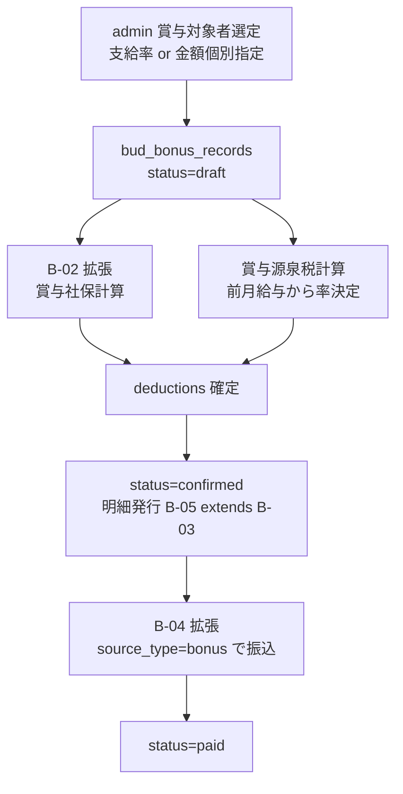

# Bud B-05: 賞与処理 仕様書

- 対象: Garden-Bud 賞与（夏冬ボーナス等）の計算・支給・明細・振込
- 見積: **0.5d**（約 4 時間）
- 担当セッション: a-bud
- 作成: 2026-04-24（a-auto / Phase A 先行 batch6 #B-05）
- 前提 spec: B-01, B-02, B-03, B-04

---

## 1. 目的とスコープ

### 目的
給与（月次）と別系統の**賞与（Bonus）**の計算・明細・支給フローを定義。給与計算エンジンと**ロジックを分離**し、賞与固有ルール（標準賞与額上限・支給前決議等）に対応。

### 含める
- `bud_bonus_records` テーブル設計（賞与 1 人 × 1 回 = 1 行）
- 賞与計算ロジック（支給率ベース or 個別指定額）
- 賞与の社保計算（標準賞与額上限 150 万円 / 573 万円ルール）
- 賞与の源泉徴収（前月給与ベースの税率適用）
- 賞与明細 PDF（給与明細と別テンプレ）
- 賞与振込（B-04 の給与振込フローを踏襲、`source_type='bonus'`）

### 含めない
- 退職金（別扱い、Phase C）
- 成果給の計算ロジック（賞与算定式の業務判断、admin 手動入力で開始）
- 個別インセンティブ（営業手当等、月次給与に含む or 別 spec）

---

## 2. 既存実装との関係

### B-01〜B-04 との違い
| 項目 | 給与（B-01）| 賞与（B-05）|
|---|---|---|
| 対象テーブル | `bud_salary_records` | `bud_bonus_records` |
| 期間単位 | 月（target_month）| 支給回（target_date + label）|
| 社保計算 | 標準報酬月額ベース | 標準賞与額ベース（別表）|
| 源泉徴収 | 月額表（甲/乙欄）| 算出率表（前月給与基準）|
| 年末調整との関係 | 月給控除合算 | 賞与控除合算、両方合わせて精算 |
| 頻度 | 毎月 | 年 1-2 回（夏・冬）+ 決算賞与等 |

### 共通化される部分（B-01〜B-04 から流用）
- Chatwork 通知パターン
- PDF 生成基盤（B-03）
- `source_type='bonus'` で振込連携（B-04 の拡張）
- RLS ポリシー（本人 + admin read）

---

## 3. 依存関係



---

## 4. データモデル提案

### 4.1 `bud_bonus_records`

```sql
CREATE TABLE bud_bonus_records (
  id                      uuid PRIMARY KEY DEFAULT gen_random_uuid(),

  -- 対象
  employee_id             text NOT NULL REFERENCES root_employees(employee_id),
  company_id              text NOT NULL REFERENCES root_companies(company_id),
  bonus_event_id          uuid REFERENCES bud_bonus_events(id),

  -- 期間・種別
  target_date             date NOT NULL,           -- 支給予定日
  bonus_type              text NOT NULL CHECK (bonus_type IN (
    'summer',        -- 夏季賞与
    'winter',        -- 冬季賞与
    'year_end',      -- 決算賞与
    'special',       -- 特別賞与
    'incentive'      -- インセンティブ
  )),
  label                   text NOT NULL,           -- '2026 年夏季賞与' 等

  -- 計算方式
  calculation_method      text NOT NULL CHECK (calculation_method IN (
    'multiplier',    -- 基本給 × 支給率
    'fixed_amount',  -- 固定額
    'performance',   -- 業績連動（admin 手動入力）
    'hybrid'         -- 基本 + 業績加算
  )),
  base_salary_snapshot    bigint,                  -- 計算時点の基本給
  multiplier              numeric(4,2),            -- 例: 2.00 = 2 ヶ月
  fixed_amount            bigint,
  performance_amount      bigint,                  -- 業績加算

  -- 支給
  gross_amount            bigint NOT NULL DEFAULT 0,

  -- 控除（賞与固有の別計算）
  health_insurance_bonus  bigint NOT NULL DEFAULT 0,
  welfare_pension_bonus   bigint NOT NULL DEFAULT 0,
  employment_insurance_bonus bigint NOT NULL DEFAULT 0,
  income_tax_bonus        bigint NOT NULL DEFAULT 0,     -- 賞与算出率表適用
  other_deductions        jsonb NOT NULL DEFAULT '[]'::jsonb,
  deductions_total        bigint NOT NULL DEFAULT 0,

  -- 結果
  net_amount              bigint NOT NULL DEFAULT 0,

  -- status（B-01 と同じフロー）
  status                  text NOT NULL DEFAULT 'draft'
    CHECK (status IN ('draft', 'calculated', 'confirmed', 'paid', 'canceled')),

  -- 源泉税率計算の基礎（前月給与）
  previous_month_salary   bigint,                  -- 前月の社保控除後金額
  withholding_rate        numeric(6,4),            -- 適用税率（例: 0.0831）

  -- 連携
  transfer_id             uuid REFERENCES bud_transfers(id),
  statement_id            uuid REFERENCES bud_salary_statements(id),
  paid_at                 timestamptz,

  -- メタ
  calc_version            text NOT NULL,
  calculated_at           timestamptz,
  calculated_by           uuid REFERENCES auth.users(id),
  notes                   text,
  created_at              timestamptz NOT NULL DEFAULT now(),
  updated_at              timestamptz NOT NULL DEFAULT now(),

  CONSTRAINT uq_bonus_employee_event UNIQUE (employee_id, bonus_event_id)
);

CREATE INDEX bud_bonus_records_target_idx
  ON bud_bonus_records (target_date DESC, company_id);
```

### 4.2 `bud_bonus_events` — 賞与イベント（全社対象）

```sql
CREATE TABLE bud_bonus_events (
  id                  uuid PRIMARY KEY DEFAULT gen_random_uuid(),
  label               text NOT NULL UNIQUE,     -- '2026 年夏季賞与'
  bonus_type          text NOT NULL,
  target_date         date NOT NULL,
  target_companies    text[] NOT NULL,          -- ['hyuaran', 'centerrise', ...]
  status              text NOT NULL DEFAULT 'planning'
    CHECK (status IN ('planning', 'calculating', 'confirmed', 'paying', 'completed')),
  default_multiplier  numeric(4,2),             -- デフォルト支給率
  created_at          timestamptz NOT NULL DEFAULT now(),
  created_by          uuid REFERENCES auth.users(id),
  notes               text
);
```

### 4.3 賞与算出率マスタ（源泉徴収率）

```sql
-- 前月給与の社保控除後 + 扶養人数 → 賞与の源泉税率
CREATE TABLE root_bonus_withholding_rates (
  id                  uuid PRIMARY KEY DEFAULT gen_random_uuid(),
  lower_bound         int NOT NULL,         -- 前月給与の下限
  upper_bound         int,
  dependents_0        numeric(6,4) NOT NULL,  -- 税率（例: 0.0231）
  dependents_1        numeric(6,4) NOT NULL,
  dependents_2        numeric(6,4) NOT NULL,
  dependents_3        numeric(6,4) NOT NULL,
  dependents_4        numeric(6,4) NOT NULL,
  dependents_5        numeric(6,4) NOT NULL,
  dependents_6        numeric(6,4) NOT NULL,
  dependents_7_plus   numeric(6,4) NOT NULL,
  otsu_rate           numeric(6,4) NOT NULL,  -- 乙欄（0.4084 等）
  valid_from          date NOT NULL,
  valid_to            date
);
```

### 4.4 RLS

B-01〜B-04 と同パターン（本人 read + admin 全権、super_admin が最終権限）。

---

## 5. 計算ロジック

### 5.1 賞与総額計算
```typescript
function calculateGrossBonus(input: {
  method: 'multiplier' | 'fixed_amount' | 'performance' | 'hybrid';
  baseSalary?: number;       // multiplier/hybrid の場合
  multiplier?: number;
  fixedAmount?: number;
  performanceAmount?: number;
}): number {
  switch (input.method) {
    case 'multiplier':
      return Math.floor((input.baseSalary ?? 0) * (input.multiplier ?? 0));
    case 'fixed_amount':
      return input.fixedAmount ?? 0;
    case 'performance':
      return input.performanceAmount ?? 0;
    case 'hybrid':
      return Math.floor((input.baseSalary ?? 0) * (input.multiplier ?? 0))
           + (input.performanceAmount ?? 0);
  }
}
```

### 5.2 賞与社保計算（標準賞与額ベース）

**2026 年ルール**:
- 健康保険: 年度累計上限 **573 万円**
- 厚生年金: 1 回あたり上限 **150 万円**
- 雇用保険: 給与と同率（賞与総額 × 0.006）

```typescript
async function calculateBonusSocialInsurance(input: {
  employeeId: string;
  grossAmount: number;
  fiscalYear: number;    // 健保の年度累計判定用
}): Promise<{ health: number; pension: number; employment: number }> {
  const standardBonus = Math.floor(input.grossAmount / 1000) * 1000;  // 1000 円単位切捨

  // 健康保険: 累計判定
  const cumulative = await getAnnualBonusCumulative(input.employeeId, input.fiscalYear);
  const healthBase = Math.min(
    standardBonus,
    Math.max(0, 5_730_000 - cumulative)  // 累計上限残
  );

  // 厚生年金: 回別上限
  const pensionBase = Math.min(standardBonus, 1_500_000);

  const rates = await getInsuranceRates();
  return {
    health: Math.floor(healthBase * rates.health_employee),
    pension: Math.floor(pensionBase * 0.0915),
    employment: Math.floor(input.grossAmount * 0.006),
  };
}
```

### 5.3 賞与源泉税（前月給与基準）

```typescript
async function calculateBonusIncomeTax(input: {
  employeeId: string;
  grossAmount: number;
  socialInsurance: number;
  dependentsCount: number;
  hasTaxExemptionForm: boolean;
}): Promise<{ tax: number; rate: number; previousSalary: number }> {
  // 前月の給与（社保控除後）を取得
  const prevMonth = await getPreviousMonthSalary(input.employeeId);
  const base = prevMonth.gross_pay - prevMonth.social_insurance_total;

  // 税率表から該当行を取得
  const rateRow = await findBonusWithholdingRate(base);

  const rate = input.hasTaxExemptionForm
    ? rateRow[`dependents_${Math.min(input.dependentsCount, 6)}`] ?? rateRow.dependents_7_plus
    : rateRow.otsu_rate;

  // 賞与 - 社保 を基準に税率適用
  const taxableBase = input.grossAmount - input.socialInsurance;
  return {
    tax: Math.floor(taxableBase * rate),
    rate,
    previousSalary: base,
  };
}
```

---

## 6. API / Server Action 契約

```typescript
// 賞与イベント作成（admin）
export async function createBonusEvent(input: {
  label: string;
  bonusType: 'summer' | 'winter' | 'year_end' | 'special' | 'incentive';
  targetDate: string;
  targetCompanies: string[];
  defaultMultiplier?: number;
}): Promise<{ success: boolean; eventId?: string }>;

// 対象者を追加（支給率 or 個別額指定）
export async function addBonusRecipients(input: {
  eventId: string;
  recipients: Array<{
    employeeId: string;
    method: 'multiplier' | 'fixed_amount' | 'performance' | 'hybrid';
    multiplier?: number;
    fixedAmount?: number;
    performanceAmount?: number;
    notes?: string;
  }>;
}): Promise<{ added: number; failed: number }>;

// 計算実行
export async function calculateBonusForEvent(input: {
  eventId: string;
  dryRun?: boolean;
}): Promise<{
  processed: number;
  succeeded: number;
  failed: Array<{ employeeId: string; error: string }>;
  totalGross: number;
  totalDeductions: number;
  totalNet: number;
}>;

// 明細発行
export async function issueBonusStatements(input: {
  eventId: string;
  notifyChatwork?: boolean;
}): Promise<{ issued: number; failed: number }>;

// 振込起票（B-04 と同等、source_type='bonus'）
export async function batchCreateBonusTransfers(input: {
  eventId: string;
  scheduledDate: string;
}): Promise<{ bankTransfers: number; cashPayments: number; skipped: number }>;
```

---

## 7. 状態遷移

### 7.1 `bud_bonus_events.status`
```
planning（対象者追加中）
  → calculating（計算実行中）
  → confirmed（全員計算確定、明細発行前）
  → paying（振込起票済、支給中）
  → completed（全員 paid）
```

### 7.2 `bud_bonus_records.status`
B-01 と同じ: draft → calculated → confirmed → paid（トリガで自動）

---

## 8. Chatwork 通知

- **賞与イベント作成**: admin 通知（「2026 夏季賞与 計画開始、対象 X 社」）
- **計算完了**: 全体集計通知（失敗あれば警告）
- **明細発行時**: 本人 DM（B-03 と同パターン、「賞与明細が発行されました」）
- **支給完了サマリ**: 全社合計・件数

---

## 9. 監査ログ要件

- `bud_bonus_calc_history`（B-01 の salary_calc_history と同パターン）
- 個別指定額変更は `root_audit_log` へも記録（社長・経営層の関与があるため）
- multiplier 一括変更（例: 全員 2.0 → 2.2）は必ず記録

---

## 10. バリデーション規則

| # | ルール | 違反時 |
|---|---|---|
| V1 | `previous_month_salary` が取得可能（前月給与があること）| 警告、admin が前月給与を手動入力可 |
| V2 | multiplier が 0-10.0 の範囲 | エラー（通常 1.0-3.0、異常値防止）|
| V3 | bonus_type と event の整合（summer が 7 月頃等）| 警告のみ |
| V4 | 業務委託は対象外 | skip |
| V5 | 退職済従業員 | 警告、退職月までの支給対象なら admin 判断 |
| V6 | 健保累計 573 万円超 | 超過分は健保 0 円で計算、warnings に列挙 |
| V7 | 同一 employee_id + event_id の重複 | UNIQUE で防止、エラー |

---

## 11. 受入基準

1. ✅ `bud_bonus_events` + `bud_bonus_records` + `root_bonus_withholding_rates` migration
2. ✅ 賞与イベント作成 UI `/bud/bonus/events/new`
3. ✅ 対象者追加 UI（全社一覧から選択・支給率一括設定・個別上書き）
4. ✅ 計算実行 → 結果プレビュー → 確定
5. ✅ 健保累計ルール（573 万円）が動作
6. ✅ 厚生年金の 150 万円上限が動作
7. ✅ 源泉税が前月給与ベースで正しく計算
8. ✅ 明細 PDF が発行され、本人に DM 通知
9. ✅ 振込起票（B-04 経由）で `bud_transfers.source_type='bonus'` が生成
10. ✅ 支給完了で `bud_bonus_records.status='paid'`

---

## 12. 想定工数（内訳）

| # | 作業 | 工数 |
|---|---|---|
| W1 | migration（3 テーブル + 賞与源泉率マスタ）| 0.1d |
| W2 | 賞与イベント作成 + 対象者追加 UI | 0.1d |
| W3 | 計算ロジック（社保・源泉別立て）| 0.15d |
| W4 | 明細 PDF（給与明細テンプレ流用）| 0.05d |
| W5 | 振込連携（B-04 拡張）| 0.05d |
| W6 | Chatwork 通知 | 0.05d |
| **合計** | | **0.5d** |

---

## 13. 判断保留

| # | 論点 | a-auto スタンス |
|---|---|---|
| 判1 | 業績評価の数値化 | **Phase B v1 は個別入力**、評価システム連携は Phase C |
| 判2 | 中途入社の按分 | **在籍期間に応じて multiplier 調整**、手動計算 |
| 判3 | アルバイト賞与 | 原則なし、特別支給時は fixed_amount で個別対応 |
| 判4 | 賞与明細テンプレ | B-03 の PDF コンポーネント流用、項目名のみ変更 |
| 判5 | 健保累計の年度リセット時期 | **4 月始まり**（日本の健保制度準拠）|
| 判6 | イベント取消フロー | 計画中のみ DELETE 可、calculated 以降は cancel フラグ |
| 判7 | 退職金 | 別 spec、Phase C |
| 判8 | 賞与の所得税源泉が賞与固有税率 vs 月額表流用 | **賞与固有税率表を使用**（法令準拠）|

— end of B-05 spec —
