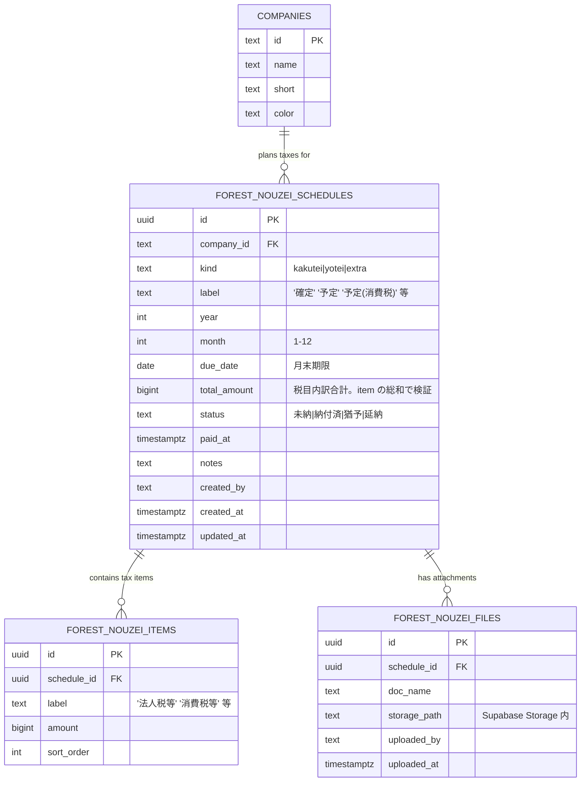

# Garden-Forest 納税カレンダー テーブル設計

- 作成: 2026-04-24（a-auto / Phase A 先行 batch1 #P09）
- 作業ブランチ: `feature/phase-a-prep-batch1-20260424-auto`
- 判断依拠: **判2：B 案（3テーブル分割）採用** — v9 HTML の `kakutei` / `yotei` / `extra` 構造を忠実に DB へ移す
- 対象機能: v9 HTML の **Tax Calendar（F4）** + **Tax Detail Modal（F11）**（詳細は forest-v9-to-tsx-migration-plan.md §3.1 / §3.4）

---

## 1. 設計方針

### 1.1 なぜ 3 テーブル分割か
v9 の `NOUZEI` 定数は `{ kakutei: {...}, yotei: {...}, extra: [{...}] }` の**複合構造**：
- 確定納税は**法人×年度に 1 件**（期末から 2 ヶ月後）
- 予定納税は**法人×年度に 0〜1 件**（中間期）
- extra は**任意多数**（消費税中間申告 等）

単一テーブルの jsonb（判2 A 案）でも表現可だが、以下の理由で B 案（3 テーブル分割）を採用：
1. **RLS ポリシーと監査が明瞭**（jsonb 内の値変更追跡は煩雑）
2. **税目内訳（detail）も子テーブル化**して検索・集計しやすい
3. **年次更新の業務フロー**が kakutei / yotei / extra で異なるため、操作画面も分離しやすい

### 1.2 3 テーブルの関係
```
forest_nouzei_schedules  (1 行 = 1 件の納付スケジュール)
  ├── forest_nouzei_items  (1:N、税目内訳：法人税等・消費税等 等)
  └── forest_nouzei_files  (1:N、任意、添付書類：申告書 PDF 等)
```

---

## 2. ER 図（Mermaid）



---

## 3. テーブル定義

```sql
BEGIN;

-- ---------------------------------------------------------------------
-- 3.1 forest_nouzei_schedules：納付スケジュール本体
-- ---------------------------------------------------------------------
CREATE TYPE forest_nouzei_kind AS ENUM ('kakutei', 'yotei', 'extra');
CREATE TYPE forest_nouzei_status AS ENUM ('pending', 'paid', 'postponed', 'deferred');
-- pending=未納 / paid=納付済 / postponed=猶予 / deferred=延納

CREATE TABLE forest_nouzei_schedules (
  id              uuid PRIMARY KEY DEFAULT gen_random_uuid(),
  company_id      text NOT NULL REFERENCES companies(id),
  kind            forest_nouzei_kind NOT NULL,
  label           text NOT NULL,                        -- '確定' / '予定' / '予定（消費税）' 等
  year            int  NOT NULL CHECK (year BETWEEN 2020 AND 2099),
  month           int  NOT NULL CHECK (month BETWEEN 1 AND 12),
  due_date        date NOT NULL,                        -- 月末期限（YYYY-MM-末日）
  total_amount    bigint,                               -- 合計金額（税目内訳の総和、TRIGGER で検証）
  status          forest_nouzei_status NOT NULL DEFAULT 'pending',
  paid_at         timestamptz,
  notes           text,
  created_at      timestamptz NOT NULL DEFAULT now(),
  created_by      uuid REFERENCES auth.users(id),
  updated_at      timestamptz NOT NULL DEFAULT now(),
  updated_by      uuid REFERENCES auth.users(id),

  -- 同一法人×年月×kind は 1 件のみ（extra は別扱いのため kind で分離）
  CONSTRAINT uq_nouzei_schedules_kakutei_yotei
    UNIQUE NULLS NOT DISTINCT (company_id, year, month, kind)
);

COMMENT ON TABLE forest_nouzei_schedules IS
  'Forest 納税カレンダー：法人×年月×kind（確定/予定/追加）ごとの納付スケジュール';

-- ---------------------------------------------------------------------
-- 3.2 forest_nouzei_items：税目内訳
-- ---------------------------------------------------------------------
CREATE TABLE forest_nouzei_items (
  id              uuid PRIMARY KEY DEFAULT gen_random_uuid(),
  schedule_id     uuid NOT NULL REFERENCES forest_nouzei_schedules(id) ON DELETE CASCADE,
  label           text NOT NULL,                        -- '法人税等' / '消費税等' / '地方法人税' 等
  amount          bigint NOT NULL CHECK (amount >= 0),
  sort_order      int NOT NULL DEFAULT 0,
  created_at      timestamptz NOT NULL DEFAULT now()
);

CREATE INDEX forest_nouzei_items_schedule_idx
  ON forest_nouzei_items (schedule_id, sort_order);

COMMENT ON TABLE forest_nouzei_items IS
  'Forest 納税：税目内訳（確定/予定/extra それぞれに対し 1..n 行）';

-- ---------------------------------------------------------------------
-- 3.3 forest_nouzei_files：添付書類（任意）
-- ---------------------------------------------------------------------
CREATE TABLE forest_nouzei_files (
  id              uuid PRIMARY KEY DEFAULT gen_random_uuid(),
  schedule_id     uuid NOT NULL REFERENCES forest_nouzei_schedules(id) ON DELETE CASCADE,
  doc_name        text NOT NULL,                        -- '法人税申告書'  等
  storage_path    text NOT NULL,                        -- Supabase Storage 上のパス
  uploaded_by     uuid REFERENCES auth.users(id),
  uploaded_at     timestamptz NOT NULL DEFAULT now()
);

CREATE INDEX forest_nouzei_files_schedule_idx
  ON forest_nouzei_files (schedule_id, uploaded_at DESC);

COMMIT;
```

---

## 4. 原子性保証のための PL/pgSQL 関数

スケジュール本体＋税目内訳をまとめて INSERT する際の整合性を、単一トランザクションで保証する関数。

```sql
-- ---------------------------------------------------------------------
-- 4.1 create_nouzei_schedule(): スケジュール + items を一括作成
--   total_amount は items の総和で自動計算（または指定値と検証）
-- ---------------------------------------------------------------------
CREATE OR REPLACE FUNCTION create_nouzei_schedule(
  p_company_id   text,
  p_kind         forest_nouzei_kind,
  p_label        text,
  p_year         int,
  p_month        int,
  p_due_date     date,
  p_items        jsonb,                -- [{"label":"法人税等","amount":891600}, ...]
  p_status       forest_nouzei_status DEFAULT 'pending',
  p_notes        text DEFAULT NULL,
  p_total_amount bigint DEFAULT NULL   -- 省略時は items 合計を使用
)
RETURNS uuid                          -- 作成された schedule の id
LANGUAGE plpgsql
SECURITY DEFINER
AS $$
DECLARE
  v_schedule_id uuid;
  v_total       bigint := 0;
  v_item        jsonb;
  v_i           int := 0;
BEGIN
  -- items が空配列なら total=0 許容（null 合計の schedule 用途想定外、要監査）
  IF jsonb_typeof(p_items) IS DISTINCT FROM 'array' THEN
    RAISE EXCEPTION 'p_items must be a jsonb array';
  END IF;

  -- items 合計を計算
  FOR v_item IN SELECT * FROM jsonb_array_elements(p_items) LOOP
    v_total := v_total + COALESCE((v_item->>'amount')::bigint, 0);
  END LOOP;

  -- p_total_amount と不一致なら拒否
  IF p_total_amount IS NOT NULL AND p_total_amount <> v_total THEN
    RAISE EXCEPTION 'total_amount mismatch: specified=%, calculated=%',
      p_total_amount, v_total;
  END IF;

  -- 1) schedule 作成
  INSERT INTO forest_nouzei_schedules
    (company_id, kind, label, year, month, due_date, total_amount, status, notes, created_by, updated_by)
  VALUES
    (p_company_id, p_kind, p_label, p_year, p_month, p_due_date,
     COALESCE(p_total_amount, v_total), p_status, p_notes, auth.uid(), auth.uid())
  RETURNING id INTO v_schedule_id;

  -- 2) items 作成（sort_order は配列インデックスに従う）
  FOR v_item IN SELECT * FROM jsonb_array_elements(p_items) LOOP
    v_i := v_i + 1;
    INSERT INTO forest_nouzei_items
      (schedule_id, label, amount, sort_order)
    VALUES
      (v_schedule_id, v_item->>'label', (v_item->>'amount')::bigint, v_i);
  END LOOP;

  RETURN v_schedule_id;
END;
$$;

COMMENT ON FUNCTION create_nouzei_schedule IS
  'スケジュール本体＋税目内訳をまとめて作成。total_amount は items 総和で自動検証。
   失敗時は全ロールバック。';
```

```sql
-- ---------------------------------------------------------------------
-- 4.2 mark_nouzei_paid(): 納付済マーク
-- ---------------------------------------------------------------------
CREATE OR REPLACE FUNCTION mark_nouzei_paid(
  p_schedule_id uuid,
  p_paid_at     timestamptz DEFAULT now()
)
RETURNS void
LANGUAGE sql
SECURITY DEFINER
AS $$
  UPDATE forest_nouzei_schedules
    SET status = 'paid',
        paid_at = p_paid_at,
        updated_at = now(),
        updated_by = auth.uid()
    WHERE id = p_schedule_id;
$$;
```

---

## 5. RLS ポリシー

```sql
BEGIN;

ALTER TABLE forest_nouzei_schedules ENABLE ROW LEVEL SECURITY;
ALTER TABLE forest_nouzei_items     ENABLE ROW LEVEL SECURITY;
ALTER TABLE forest_nouzei_files     ENABLE ROW LEVEL SECURITY;

-- 読取：Forest ユーザー全員（forest_users 登録済）
CREATE POLICY fns_read ON forest_nouzei_schedules FOR SELECT USING (forest_is_user());
CREATE POLICY fni_read ON forest_nouzei_items     FOR SELECT USING (forest_is_user());
CREATE POLICY fnf_read ON forest_nouzei_files     FOR SELECT USING (forest_is_user());

-- 書込：admin / super_admin のみ
CREATE POLICY fns_write ON forest_nouzei_schedules
  FOR ALL USING (forest_is_admin()) WITH CHECK (forest_is_admin());
CREATE POLICY fni_write ON forest_nouzei_items
  FOR ALL USING (forest_is_admin()) WITH CHECK (forest_is_admin());
CREATE POLICY fnf_write ON forest_nouzei_files
  FOR ALL USING (forest_is_admin()) WITH CHECK (forest_is_admin());

COMMIT;
```

---

## 6. インデックス戦略

```sql
-- カレンダー描画はローリング 12 ヶ月の（year, month, company_id）クエリ
CREATE INDEX forest_nouzei_schedules_year_month_idx
  ON forest_nouzei_schedules (year, month, company_id);

-- 法人別の履歴遡及
CREATE INDEX forest_nouzei_schedules_company_idx
  ON forest_nouzei_schedules (company_id, due_date DESC);

-- 期限超過の未納抽出（月次通知に利用）
CREATE INDEX forest_nouzei_schedules_due_status_idx
  ON forest_nouzei_schedules (status, due_date)
  WHERE status = 'pending';
```

---

## 7. 投入クエリ（テストデータ：v9 NOUZEI 定数から）

```sql
BEGIN;

-- ヒュアラン（5月確定=金額不明, 11月予定=2324000）
SELECT create_nouzei_schedule(
  'hyuaran', 'yotei', '予定',
  2026, 11, '2026-11-30',
  '[{"label":"法人税等","amount":891600},
    {"label":"消費税等","amount":1432400}]'::jsonb
);

SELECT create_nouzei_schedule(
  'hyuaran', 'kakutei', '確定',
  2026, 5, '2026-05-31',
  '[]'::jsonb,          -- 金額未確定
  'pending', '当期末〜2ヶ月後期限、税理士から金額連絡待ち'
);

-- センターライズ（10月確定, 4月予定=2875400）
SELECT create_nouzei_schedule(
  'centerrise', 'yotei', '予定',
  2026, 4, '2026-04-30',
  '[{"label":"法人税等","amount":793800},
    {"label":"消費税等","amount":2081600}]'::jsonb
);

-- リンクサポート（7月確定, 1月予定=2165400 + 4月 extra=1366500）
SELECT create_nouzei_schedule(
  'linksupport', 'yotei', '予定',
  2026, 1, '2026-01-31',
  '[{"label":"法人税等","amount":798900},
    {"label":"消費税等","amount":1366500}]'::jsonb
);
SELECT create_nouzei_schedule(
  'linksupport', 'extra', '予定（消費税）',
  2026, 4, '2026-04-30',
  '[{"label":"消費税等","amount":1366500}]'::jsonb
);

-- ARATA（1月確定=810900, 7月予定=不明）
SELECT create_nouzei_schedule(
  'arata', 'kakutei', '確定',
  2026, 1, '2026-01-31',
  '[{"label":"法人税等","amount":368900},
    {"label":"消費税等","amount":442000}]'::jsonb
);

-- たいよう（2月確定=758800, 8月予定=不明）
SELECT create_nouzei_schedule(
  'taiyou', 'kakutei', '確定',
  2026, 2, '2026-02-28',
  '[{"label":"法人税等","amount":153600},
    {"label":"消費税等","amount":605200}]'::jsonb
);

-- 壱（7月確定=不明）
SELECT create_nouzei_schedule(
  'ichi', 'kakutei', '確定',
  2026, 7, '2026-07-31',
  '[]'::jsonb,
  'pending', '初決算、金額未確定'
);

COMMIT;
```

---

## 8. TSX 側の期待クエリパターン

### 8.1 カレンダー描画用（ローリング 12 ヶ月）
```typescript
export async function fetchNouzeiCalendar(fromYm: {year: number; month: number},
                                          toYm:   {year: number; month: number}) {
  const { data, error } = await supabase
    .from('forest_nouzei_schedules')
    .select(`
      id, company_id, kind, label, year, month, due_date, total_amount, status,
      items:forest_nouzei_items(label, amount, sort_order)
    `)
    .gte('year', fromYm.year).lte('year', toYm.year)
    .order('year').order('month').order('company_id');
  if (error) throw new Error(`fetchNouzeiCalendar: ${error.message}`);
  return data;
}
```

### 8.2 詳細 Modal 用（1 件の schedule + items + files）
```typescript
export async function fetchNouzeiDetail(scheduleId: string) {
  const { data, error } = await supabase
    .from('forest_nouzei_schedules')
    .select(`
      *,
      items:forest_nouzei_items(*),
      files:forest_nouzei_files(*)
    `)
    .eq('id', scheduleId)
    .maybeSingle();
  if (error) throw new Error(`fetchNouzeiDetail: ${error.message}`);
  return data;
}
```

---

## 9. 運用想定

| シナリオ | 操作 |
|---|---|
| 年次更新（税理士から連絡） | admin が UI で schedule 作成（`create_nouzei_schedule` 呼出） |
| 金額未確定の確定納税 | schedule は先に作成、items は空配列、後日金額確定時に UPDATE |
| 納付済マーク | admin が UI で `mark_nouzei_paid(id)` 呼出 |
| 添付書類 | `forest_nouzei_files` へ INSERT、Supabase Storage `forest-tax/` に格納 |
| 過去分の補正 | schedule UPDATE（items は DELETE→INSERT で全置換を推奨） |
| 期限超過アラート | `status='pending' AND due_date < now()` の SELECT を Cron で監視 |

---

## 10. 判断保留

| # | 論点 | a-auto スタンス |
|---|---|---|
| 判1 | 税目 label のマスタ化 | 現状フリー文字列で運用、利用が固まったら `forest_nouzei_item_labels` マスタ化 |
| 判2 | due_date の月末自動計算 | 現状は INSERT 時に明示指定。月末日計算の関数は後で追加可 |
| 判3 | paid_at の自動集計（実振込との突合） | Bud 側の `bud_transfers` と将来連携、当面は手動マーク |
| 判4 | extra の頻度制御 | 現状は `uq_nouzei_schedules_kakutei_yotei` で kind 別に UNIQUE、extra の複数重複は制約なし |
| 判5 | `total_amount` を計算カラム化 | PostgreSQL 12+ の generated column 化を検討、現状は TRIGGER で整合性担保 |

---

## 11. 参考

- `docs/forest-v9-to-tsx-migration-plan.md` §3.1 / §3.4
- v9 HTML `NOUZEI` 定数（L1286-1292）
- Forest 既存 `forest_users` / `forest_is_admin()` / `forest_is_user()` ポリシー
- Supabase Storage bucket 設計（`forest-tax/` は本設計書 §3.3 で初出、P3 Tax Files と共通化予定）

— end of nouzei tables design v1 —
