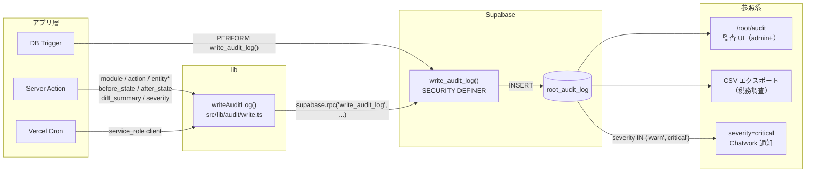

# Root Phase B-2: 監査ログ拡張（root_audit_log 横断統一）

- 対象: Garden-Root の `root_audit_log` テーブルを全9モジュール正本に拡張
- 見積: **1.75d**（内訳は §11）
- 担当セッション: a-root
- 作成: 2026-04-25（a-root-002 / Phase B-2 spec 起草）
- 依存: `scripts/root-auth-schema.sql` §2 の既存 `root_audit_log`、`cross-cutting/spec-cross-audit-log.md`

---

## 1. 目的とスコープ

### 1.1 目的

Garden-Root Phase 1 で整備した `root_audit_log` は、Root モジュール内の認証・ロール変更を記録するシンプルなテーブルである。本 spec では同テーブルを **9 モジュール（soil/root/tree/leaf/bud/bloom/forest/rill/seed）の横断正本**に格上げし、金銭・人事操作の必須記録、CI チェック、BI/SIEM 連携に対応したスキーマへ拡張する。

### 1.2 cross-cutting spec との位置関係

`docs/specs/cross-cutting/spec-cross-audit-log.md`（以下 *横断 spec*）は Garden シリーズ全体の監査ログ戦略を定義した **方針書**である。本 spec は横断 spec を Root 観点で**具体化・実装化**するもの。

| 記載内容 | 所在 |
|---|---|
| テーブル設計の全体方針 / 推奨スキーマ | 横断 spec §2 |
| RPC 関数 `write_audit_log()` の SQL | 横断 spec §3.1 |
| TypeScript 共通クライアント `src/lib/audit/write.ts` | 横断 spec §3.2 |
| **既存テーブルへの ALTER SQL**（Root 担当） | **本 spec §3** |
| **モジュール別書込規約・必須一覧**（Root 観点） | **本 spec §6, §7** |
| **CI チェック仕様** | **本 spec §9** |
| **受入基準** | **本 spec §10** |

横断 spec が定義した設計判断（UPDATE/DELETE 全拒否、SECURITY DEFINER 関数一本化、severity 4 段階）はすべて踏襲する。差異・追補がある場合のみ本 spec で明記する。

### 1.3 スコープ境界

**含める**
- 既存 `root_audit_log` への ALTER（新カラム追加 SQL）
- 既存 `payload` jsonb との互換性維持方針
- 全モジュールからの書込規約統一（呼出パターン・型）
- 金銭・人事操作の必須記録定義
- CI チェック仕様（Server Action 内 `writeAuditLog()` 漏れ検出）
- RLS ポリシー（読取制限・書込制限）
- 監査 UI `/root/audit` の要件定義
- a-bud / a-leaf / a-tree / a-bloom との連携ポイント

**含めない**
- `root_audit_log` の DROP・再作成（ALTER のみ）
- `audit_id` bigserial → uuid 移行（別タスク、互換性のため）
- `forest_audit_log` テーブルの廃止・データ移行（Phase C 以降）
- SIEM（Splunk 等）連携（Phase D 以降）
- リアルタイム Alert UI（Phase B）

---

## 2. 既存実装との関係

### 2.1 Phase 1 root_audit_log 現状スキーマ

`scripts/root-auth-schema.sql` §2 より：

```sql
CREATE TABLE IF NOT EXISTS root_audit_log (
  audit_id       bigserial PRIMARY KEY,
  actor_user_id  uuid REFERENCES auth.users(id) ON DELETE SET NULL,
  actor_emp_num  text,            -- 操作者の社員番号
  action         text NOT NULL,   -- login_success / login_failed / role_changed / data_view 等
  target_type    text,            -- 操作対象種別（root_employees 等）
  target_id      text,            -- 操作対象ID（employee_id 等）
  payload        jsonb,           -- 詳細データ（変更前後値など）
  ip_address     text,
  user_agent     text,
  created_at     timestamptz NOT NULL DEFAULT now()
);
```

**互換性メモ**
- `audit_id` は bigserial のまま維持（UUID 移行は別タスク §12 判1）
- `actor_emp_num`、`action`、`target_type`、`target_id`、`payload` は既存カラム名を保持
- 既存コード（`src/app/root/_lib/audit.ts` の `writeAudit()`）は移行完了まで並走

### 2.2 既存 _lib/audit.ts ヘルパー

| モジュール | ファイル | 現状 | 移行方針 |
|---|---|---|---|
| **Root** | `src/app/root/_lib/audit.ts` | `writeAudit(AuditParams)` — bigserial テーブルに直 INSERT | 横断 spec §6.2 に従い re-export ラッパーに置換 |
| **Forest** | `src/app/forest/_lib/audit.ts` | `writeAuditLog(AuditAction, target?)` — `forest_audit_log` に INSERT | `src/lib/audit/write.ts` に移行後、forest_audit_log から root_audit_log に統合（別タスク） |

**Phase B-2 での対応**
- Root `_lib/audit.ts` は本 spec 完了後に re-export ラッパー化（§5 で新シグネチャ定義）
- Forest `_lib/audit.ts` は Phase C 以降で統合（本 spec のスコープ外）

---

## 3. データモデル提案（ALTER SQL）

### 3.1 新カラム追加

```sql
-- ============================================================
-- root_audit_log Phase B-2 拡張 ALTER
-- ============================================================

-- いつ（より正確な発生時刻）
ALTER TABLE root_audit_log
  ADD COLUMN IF NOT EXISTS occurred_at timestamptz NOT NULL DEFAULT now();

-- 誰が（ロール・社員ID スナップショット）
ALTER TABLE root_audit_log
  ADD COLUMN IF NOT EXISTS actor_role text,           -- 操作時点の garden_role スナップショット
  ADD COLUMN IF NOT EXISTS actor_employee_id text;    -- root_employees.employee_id（actor_emp_num と別管理）

-- 何を（モジュール・エンティティ）
ALTER TABLE root_audit_log
  ADD COLUMN IF NOT EXISTS module text
    CHECK (module IN (
      'soil','root','tree','leaf','bud','bloom','forest','rill','seed','auth','system'
    )),
  ADD COLUMN IF NOT EXISTS entity_type text,          -- 'bud_transfer' / 'root_employee' 等
  ADD COLUMN IF NOT EXISTS entity_id   text,          -- 対象 PK（text 型で UUID も bigint も対応）
  ADD COLUMN IF NOT EXISTS entity_label text;         -- 人間可読ラベル（'従業員 0009 萩尾' 等）

-- どこで（コンテキスト）
ALTER TABLE root_audit_log
  ADD COLUMN IF NOT EXISTS route       text,          -- '/api/root/employees/update' 等
  ADD COLUMN IF NOT EXISTS http_method text;          -- 'POST', 'PATCH' 等

-- 何が変わった（差分）
ALTER TABLE root_audit_log
  ADD COLUMN IF NOT EXISTS before_state  jsonb,       -- 変更前の主要フィールド（サブセット）
  ADD COLUMN IF NOT EXISTS after_state   jsonb,       -- 変更後
  ADD COLUMN IF NOT EXISTS diff_summary  text;        -- 人間可読要約（'金額 ¥10000 → ¥15000' 等）

-- メタ
ALTER TABLE root_audit_log
  ADD COLUMN IF NOT EXISTS severity   text NOT NULL DEFAULT 'info'
    CHECK (severity IN ('debug', 'info', 'warn', 'critical')),
  ADD COLUMN IF NOT EXISTS request_id uuid,           -- 同一リクエスト内の複数ログを紐付け
  ADD COLUMN IF NOT EXISTS source     text;           -- 'ui' / 'api' / 'cron' / 'trigger' / 'manual'
```

### 3.2 追加インデックス

```sql
-- 既存インデックス（Phase 1）は保持
-- CREATE INDEX IF NOT EXISTS idx_root_audit_log_actor_user ...
-- CREATE INDEX IF NOT EXISTS idx_root_audit_log_action ...
-- CREATE INDEX IF NOT EXISTS idx_root_audit_log_created_at ...

-- 新規インデックス
CREATE INDEX IF NOT EXISTS idx_ral_module_occurred
  ON root_audit_log (module, occurred_at DESC);

CREATE INDEX IF NOT EXISTS idx_ral_entity
  ON root_audit_log (entity_type, entity_id, occurred_at DESC);

CREATE INDEX IF NOT EXISTS idx_ral_severity_critical
  ON root_audit_log (severity, occurred_at DESC)
  WHERE severity IN ('warn', 'critical');

CREATE INDEX IF NOT EXISTS idx_ral_actor_occurred
  ON root_audit_log (actor_user_id, occurred_at DESC);

CREATE INDEX IF NOT EXISTS idx_ral_request_id
  ON root_audit_log (request_id)
  WHERE request_id IS NOT NULL;
```

### 3.3 設計判断メモ

| 項目 | 方針 |
|---|---|
| `before_state` / `after_state` | jsonb でフィールドサブセットのみ保存（主要 10 フィールド目安）。巨大化防止のため全行スナップショットは禁止 |
| `diff_summary` | 人間可読テキスト（"金額 ¥10,000 → ¥15,000"、"garden_role: staff → manager" など） |
| `severity` 4 段階 | debug=開発時トレース / info=通常記録 / warn=手動修正・削除・エラー / critical=権限変更・金銭異常 |
| `request_id` | Server Action 起動時に `crypto.randomUUID()` で生成。同一リクエスト内の複数 `writeAuditLog()` 呼出を紐付け |
| `payload` jsonb | 既存カラムを当面残す（互換性）。新コードは `before_state` / `after_state` / `diff_summary` を優先使用 |
| `audit_id` bigserial | UUID 移行は別タスク（§12 判1）。既存 FK・アプリコードへの影響が大きいため分離 |

---

## 4. データフロー



**補足**
- Server Action はすべて `src/lib/audit/write.ts` の `writeAuditLog()` を経由
- DB Trigger は横断 spec §5.1 の `write_audit_log()` SECURITY DEFINER 関数を `PERFORM` で直接呼出
- Vercel Cron（KoT 同期など）は `service_role` クライアントで `writeAuditLog()` を呼出
- `created_at` は DB default（行の追記時刻）、`occurred_at` は業務上の発生時刻（Server Action でセット可）

---

## 5. API / Server Action 契約

### 5.1 writeAuditLog() 新シグネチャ

横断 spec §3.2 の `AuditLogInput` を踏襲しつつ、Root セッションが使用する型定義を明示する。

```typescript
// src/lib/audit/write.ts（横断 spec §3.2 で新設、Root が主導して実装）

export type AuditModule =
  | 'soil' | 'root' | 'tree' | 'leaf' | 'bud'
  | 'bloom' | 'forest' | 'rill' | 'seed'
  | 'auth' | 'system';

export type AuditAction =
  | 'create' | 'update' | 'delete'
  | 'login' | 'logout' | 'export' | 'import'
  | 'approve' | 'reject' | 'confirm'
  | 'view' | 'download';

export type AuditSeverity = 'debug' | 'info' | 'warn' | 'critical';

export interface AuditLogInput {
  module: AuditModule;
  action: AuditAction | string;   // string も許容（モジュール固有アクション）
  entityType: string;
  entityId?: string;
  entityLabel?: string;
  before?: Record<string, unknown>;   // サブセット（最大 10 フィールド目安）
  after?: Record<string, unknown>;
  diff?: string;                      // "garden_role: staff → manager" 等
  severity?: AuditSeverity;
  route?: string;
  httpMethod?: string;
  source?: 'ui' | 'api' | 'cron' | 'trigger' | 'manual';
  requestId?: string;                 // crypto.randomUUID() で Server Action 起動時に生成
  occurredAt?: Date;
  notes?: string;
}

export async function writeAuditLog(
  client: SupabaseClient,
  input: AuditLogInput,
): Promise<{ success: true; auditId: string } | { success: false; error: string }>;
```

### 5.2 Root モジュールからの呼出パターン

#### ロール変更（critical）
```typescript
// src/app/root/_actions/employees.ts
import { writeAuditLog } from '@/lib/audit/write';

export async function updateGardenRole(
  employeeId: string,
  newRole: GardenRole,
) {
  const requestId = crypto.randomUUID();
  // 変更前を取得
  const before = await fetchEmployee(employeeId);
  // 本体操作
  const { error } = await supabase
    .from('root_employees')
    .update({ garden_role: newRole })
    .eq('employee_id', employeeId);

  if (!error) {
    await writeAuditLog(supabase, {
      module: 'root',
      action: 'update',
      entityType: 'root_employees',
      entityId: employeeId,
      entityLabel: `従業員 ${employeeId} ${before.full_name}`,
      before: { garden_role: before.garden_role },
      after: { garden_role: newRole },
      diff: `garden_role: ${before.garden_role} → ${newRole}`,
      severity: 'critical',
      route: '/api/root/employees/role',
      httpMethod: 'PATCH',
      source: 'ui',
      requestId,
    });
  }
}
```

#### 入退社（warn）
```typescript
await writeAuditLog(supabase, {
  module: 'root',
  action: 'update',
  entityType: 'root_employees',
  entityId: employeeId,
  entityLabel: `従業員 ${employeeId} ${name}`,
  before: { is_active: true },
  after: { is_active: false, retired_at: retiredAt },
  diff: `退社処理: ${retiredAt}`,
  severity: 'warn',
  source: 'ui',
  requestId,
});
```

#### 給与体系変更（warn）
```typescript
await writeAuditLog(supabase, {
  module: 'root',
  action: 'update',
  entityType: 'root_employees',
  entityId: employeeId,
  entityLabel: `従業員 ${employeeId} ${name}`,
  before: { kou_otsu: prev.kou_otsu, base_salary: prev.base_salary },
  after:  { kou_otsu: next.kou_otsu, base_salary: next.base_salary },
  diff: `base_salary: ¥${prev.base_salary?.toLocaleString()} → ¥${next.base_salary?.toLocaleString()}`,
  severity: 'warn',
  source: 'ui',
  requestId,
});
```

#### KoT 自動同期（info、cron 発行）
```typescript
await writeAuditLog(serviceRoleClient, {
  module: 'root',
  action: 'import',
  entityType: 'root_daily_workings',
  entityLabel: `KoT 自動同期 ${syncDate}`,
  after: { synced_count: count, failed_count: failed },
  diff: `${count} 件取込`,
  severity: 'info',
  source: 'cron',
  requestId,
});
```

### 5.3 既存 writeAudit() との移行方針

```typescript
// src/app/root/_lib/audit.ts（Phase B-2 完了後の形）
// ↓ re-export ラッパーに簡略化

export { writeAuditLog } from '@/lib/audit/write';

// 後方互換のため旧インターフェース writeAudit() を一時的に維持
// DeprecationWarning を付与し、次フェーズで完全移行
/** @deprecated writeAuditLog() に移行してください */
export async function writeAudit(params: LegacyAuditParams): Promise<void> {
  // レガシーパラメータを新インターフェースにマッピング
  await writeAuditLog(supabase, {
    module: 'root',
    action: params.action,
    entityType: params.targetType ?? 'unknown',
    entityId: params.targetId ?? undefined,
    before: undefined,
    after: params.payload,
  });
}
```

---

## 6. 必須記録対象の定義

### 6.1 🔴 金銭操作（必須・CI チェック対象）

| モジュール | 操作 | entity_type | severity | 記録タイミング |
|---|---|---|---|---|
| **Bud** | 振込実行（最終承認） | `bud_transfer` | critical | Server Action 成功後 |
| **Bud** | 振込状態遷移（全ステップ） | `bud_transfer` | info | DB Trigger |
| **Bud** | 給与計算実行 / 再計算 | `bud_salary_result` | info | Server Action 成功後 |
| **Bud** | 給与計算取消 | `bud_salary_result` | warn | Server Action 成功後 |
| **Bud** | 手動金額修正（CC 明細含む） | `bud_cc_statements` | warn | Server Action 成功後 |
| **Bud** | 料率表更新（社会保険・所得税） | `bud_tax_rates` | warn | Server Action 成功後 |
| **Bud** | CSV 出力（給与・振込） | `bud_transfer` / `bud_salary_result` | info | Server Action 成功後 |
| **Bud** | 源泉徴収票 PDF 生成 | `bud_gensen` | info | Server Action 成功後 |

### 6.2 🔴 人事操作（必須・CI チェック対象）

| モジュール | 操作 | entity_type | severity | 記録タイミング |
|---|---|---|---|---|
| **Root** | `garden_role` 変更 | `root_employees` | **critical** | Server Action 成功後（Trigger でも二重） |
| **Root** | 入社処理（is_active=true 新規） | `root_employees` | info | Server Action 成功後 |
| **Root** | 退社処理（is_active=false） | `root_employees` | warn | Server Action 成功後 |
| **Root** | 雇用形態・契約変更 | `root_employees` | warn | Server Action 成功後 |
| **Root** | 給与体系変更（kou_otsu / base_salary） | `root_employees` | warn | Server Action 成功後 |
| **Root** | KoT 取込実行 | `root_daily_workings` | info | Vercel Cron 完了後 |
| **Root** | 従業員マスタ論理削除（deleted_at） | `root_employees` | warn | DB Trigger |

### 6.3 🟡 推奨記録

| モジュール | 操作 | severity |
|---|---|---|
| **Leaf** | 案件ステータス遷移 | info |
| **Tree** | ログイン成功 / 失敗 | info / warn |
| **Tree** | 前確・後確登録 | info |
| **Bloom** | 月次ダイジェスト発行 / PDF エクスポート | info |
| **Forest** | 決算書 ZIP ダウンロード | info |
| **Forest** | 進行期・販管費編集 | info |
| **auth** | パスワードリセット | warn |

### 6.4 🟢 オプション（容量削減優先）

- 閲覧（view）ログは給与・権限・決算書のみ
- 検索クエリは記録しない
- debug は開発環境のみ

---

## 7. a-bud / a-leaf / a-tree / a-bloom との連携ポイント

### 7.1 a-bud（経理）

**振込承認フロー（spec-bud-a-05 連携）**
- `bud_transfers.status` 遷移は DB Trigger で自動記録（横断 spec §5.1 の trigger 実装）
- 最終承認（→ `approved`）は Trigger に加えて Server Action でも二重記録（業務コンテキスト保存目的）
- `diff_summary` に承認者名・承認金額・振込先を含める

**CC 明細変更**
- 費目手動修正は `bud_cc_statements` の `AFTER UPDATE` Trigger で記録
- `diff_summary`: "費目: 接待交際費 → 会議費（手動修正）"

**料率表更新（warn）**
- `bud_tax_rates` / `bud_social_insurance_rates` の INSERT / UPDATE は Server Action 側で記録
- `before_state`・`after_state` に更新されたレート値のサブセットを含める

### 7.2 a-leaf（商材データ）

**案件ステータス遷移**
- Leaf 各テーブル（例: `leaf_kanden_cases`）の `status` 変更は Trigger で記録
- `module: 'leaf'`、`entity_type: 'leaf_kanden_cases'`（テーブル名）

**注意点**: Leaf は商材×商流ごとに独立テーブルのため、Trigger は各テーブル個別に定義が必要（共通 Trigger 関数を使い回すことで記述量を削減）。

```sql
-- 例: 汎用 status 変更 Trigger 関数
CREATE OR REPLACE FUNCTION leaf_status_change_audit()
RETURNS trigger LANGUAGE plpgsql AS $$
BEGIN
  IF OLD.status IS DISTINCT FROM NEW.status THEN
    PERFORM write_audit_log(
      'leaf', 'update', TG_TABLE_NAME,
      NEW.id::text, NULL,
      jsonb_build_object('status', OLD.status),
      jsonb_build_object('status', NEW.status),
      format('status: %s → %s', OLD.status, NEW.status),
      'info'
    );
  END IF;
  RETURN NEW;
END;
$$;
```

### 7.3 a-tree（架電アプリ）

**ログイン・認証系**
- `auth.login_success` / `auth.login_failed` は Root の認証 Server Action で記録（既存 `writeAudit()` を移行）
- 連続 3 回失敗は severity: `warn`

**前確・後確登録**
- `tree_call_records` への INSERT / UPDATE 完了後、Server Action で記録
- `source: 'ui'`、`entity_type: 'tree_call_records'`

**注意点**: Tree は FileMaker 並行稼働中のため、現時点では Tree 側の Server Action 実装が未確定。Trigger で自動記録することでアプリ側の負荷を下げる方針を推奨（判断保留 §12 判5）。

### 7.4 a-bloom（ダッシュボード）

**月次ダイジェスト / PDF エクスポート**
- エクスポート Server Action 完了時に記録
- `action: 'export'`、`entity_label` にエクスポート対象期間・ファイル名

**権限変更後の反映確認**
- Bloom の RLS は `root_employees.garden_role` を参照。`garden_role` 変更が critical で記録されることで、Bloom の閲覧権限変更の証跡が担保される（追加実装不要）。

---

## 8. RLS ポリシー

```sql
-- ============================================================
-- root_audit_log RLS（Phase B-2）
-- ============================================================

ALTER TABLE root_audit_log ENABLE ROW LEVEL SECURITY;

-- SELECT: admin + super_admin のみ閲覧可
CREATE POLICY ral_select ON root_audit_log FOR SELECT
  USING (
    (SELECT garden_role FROM root_employees WHERE user_id = auth.uid() AND is_active = true)
    IN ('admin', 'super_admin')
  );

-- INSERT: 認証済みユーザー全員（実質は SECURITY DEFINER 関数経由のため直接 INSERT は原則禁止）
CREATE POLICY ral_insert ON root_audit_log FOR INSERT
  WITH CHECK (auth.uid() IS NOT NULL);

-- UPDATE: 全拒否（ポリシー未定義 = RLS により全拒否）
-- DELETE: 全拒否（ポリシー未定義 = RLS により全拒否）
-- 改ざん防止: 監査ログは追記専用。修正は新規 INSERT で補正記録を追加すること。
```

**設計補足**

| 操作 | 権限 | 理由 |
|---|---|---|
| SELECT | admin + super_admin のみ | 税務調査・内部監査担当者に限定 |
| INSERT | 認証済み全員（SECURITY DEFINER 経由） | 全モジュールのアプリコードから書込が必要 |
| UPDATE | **全拒否** | 改ざん絶対不可。補正は新規レコード追加 |
| DELETE | **全拒否** | 同上 |

**service_role（Vercel Cron / Edge Function）**
- service_role は RLS をバイパスするため `ral_insert` ポリシーの対象外
- Cron での書込は `write_audit_log()` SECURITY DEFINER 関数を使用（Cron から直 INSERT は避ける）

---

## 9. CI チェック仕様

### 9.1 目的

金銭・人事操作に対応する Server Action ファイル内で `writeAuditLog()` の呼出が存在しない場合、CI を失敗させて記録漏れを防止する。

### 9.2 対象ファイルパターン

```
src/app/bud/_actions/transfers.ts         -- 振込操作
src/app/bud/_actions/salary.ts            -- 給与計算
src/app/bud/_actions/salary-calc.ts       -- 給与計算エンジン呼出
src/app/bud/_actions/gensen.ts            -- 源泉徴収
src/app/root/_actions/employees.ts        -- 従業員マスタ変更
src/app/root/_actions/role.ts             -- ロール変更（単独ファイル化推奨）
```

追加対象は `docs/audit-required-actions.json`（別途管理）で宣言。

### 9.3 チェックスクリプト（案）

```typescript
// scripts/check-audit-coverage.ts
import { readFileSync } from 'fs';
import { globSync } from 'glob';

const REQUIRED_PATTERNS: string[] = [
  'src/app/bud/_actions/transfers.ts',
  'src/app/bud/_actions/salary*.ts',
  'src/app/root/_actions/employees.ts',
  'src/app/root/_actions/role.ts',
];

const AUDIT_CALL = /writeAuditLog\s*\(/;

let failed = false;
for (const pattern of REQUIRED_PATTERNS) {
  for (const file of globSync(pattern)) {
    const content = readFileSync(file, 'utf-8');
    if (!AUDIT_CALL.test(content)) {
      console.error(`[audit-ci] MISSING writeAuditLog() in ${file}`);
      failed = true;
    }
  }
}

if (failed) process.exit(1);
console.log('[audit-ci] All required audit calls present.');
```

### 9.4 CI 組み込み方法

```yaml
# .github/workflows/ci.yml（抜粋）
- name: Audit coverage check
  run: npx ts-node scripts/check-audit-coverage.ts
```

### 9.5 除外ルール

- `// audit-ok: <reason>` コメントが Server Action ファイル冒頭に存在する場合はスキップ
- 例: `// audit-ok: Trigger が代わりに記録するため不要`
- 除外を追加する場合は PR に理由を必ず記載

---

## 10. 受入基準

| # | 基準 | 確認方法 |
|---|---|---|
| AC1 | `root_audit_log` に §3 の新カラムが全て追加されている | Supabase Dashboard / `information_schema.columns` |
| AC2 | 既存カラム（`audit_id`, `actor_user_id`, `actor_emp_num`, `action`, `payload`）が保持されている | `\d root_audit_log` |
| AC3 | `write_audit_log()` SECURITY DEFINER 関数が Supabase に投入されている | `pg_proc` で確認 |
| AC4 | `src/lib/audit/write.ts` が新設され、全型定義が揃っている | TypeScript ビルド通過 |
| AC5 | `src/app/root/_lib/audit.ts` が re-export ラッパーに置換されている | ファイル差分確認 |
| AC6 | `garden_role` 変更時に severity=critical のログが `root_audit_log` に記録される | ローカル E2E 確認 |
| AC7 | 入退社処理時に severity=warn のログが記録される | ローカル E2E 確認 |
| AC8 | KoT 自動同期（Cron）後に `source: 'cron'` のログが記録される | Cron ログ確認 |
| AC9 | RLS: admin ユーザーで SELECT 可、staff 以下で SELECT 不可 | Supabase Auth 切替テスト |
| AC10 | RLS: UPDATE / DELETE が全ロールで拒否される | `UPDATE` 試行 → 403 / エラー |
| AC11 | CI スクリプト `check-audit-coverage.ts` が対象 Server Action ファイルを検出し、`writeAuditLog()` 不在時に exit 1 | ローカル `ts-node` 実行 |
| AC12 | `/root/audit` 画面で admin ログイン時にログ一覧が表示される（UI は Phase B で実装） | 画面確認 |

---

## 11. 想定工数（内訳）

| # | 作業 | 工数 |
|---|---|---|
| W1 | 既存 `root_audit_log` スキーマ確認 + ALTER SQL 作成・適用 | 0.25d |
| W2 | `write_audit_log()` SECURITY DEFINER 関数投入（横断 spec §3.1）| 0.25d |
| W3 | RLS ポリシー設定（SELECT/INSERT/UPDATE/DELETE）| 0.10d |
| W4 | `src/lib/audit/write.ts` 新設（TypeScript 共通クライアント）| 0.25d |
| W5 | Root `_lib/audit.ts` を re-export ラッパーに置換、既存呼出箇所移行 | 0.25d |
| W6 | DB Trigger 整備（garden_role 変更 / 退社 / bud_transfers ステータス遷移）| 0.25d |
| W7 | Root 人事 Server Action への `writeAuditLog()` 埋込（入退社・給与体系変更・KoT 取込）| 0.25d |
| W8 | CI スクリプト `check-audit-coverage.ts` 作成・CI 組み込み | 0.10d |
| W9 | `/root/audit` 監査 UI 画面（一覧・フィルタ・CSV エクスポート）| 0.25d |
| **合計** | | **1.75d** |

**備考**
- W6（Trigger）は Bud a-bud チームとの調整が必要。Root 担当は `root_employees` 系 Trigger のみ担当し、`bud_transfers` Trigger は a-bud 担当（横断 spec §3.1 の SQL を共有して実装）
- W9 の監査 UI は Phase B の最後に配置。他 W が完了後に着手

---

## 12. 判断保留

| # | 論点 | 現時点のスタンス |
|---|---|---|
| 判1 | `audit_id` bigserial → uuid 移行 | **別タスク**。既存 FK・アプリコードへの影響が大きい。Phase C 以降で分離して実施 |
| 判2 | `actor_emp_num` vs `actor_employee_id` の使い分け | `actor_emp_num` は Phase 1 互換で残す。新コードは `actor_employee_id` を使用。双方が揃うまで `actor_emp_num` は NULLABLE で維持 |
| 判3 | Trigger 内での `auth.uid()` 取得不可問題 | Trigger は `current_setting('request.jwt.claims', true)` から取得 or `session_user` にフォールバック（横断 spec 判7 と同じ。実装時に動作確認必須） |
| 判4 | `before_state` / `after_state` のフィールド数制限 | 主要 10 フィールドを基準とするが、具体的なフィールドリストはモジュール別 spec で定義 |
| 判5 | Tree の Trigger vs Server Action | Tree は FileMaker 並行稼働中のため Server Action が未定。DB Trigger で先行実装を推奨するが、Tree 実装 spec（Phase D）確定後に再確認 |
| 判6 | Forest `forest_audit_log` の廃止タイミング | Phase C 以降。Forest `_lib/audit.ts` の移行と合わせて実施。本 spec では `root_audit_log` への追記のみ整備 |
| 判7 | `source: 'trigger'` の扱い | DB Trigger からの INSERT は `source='trigger'` をハードコード。SECURITY DEFINER 関数の引数に追加 |
| 判8 | 保存期間・パーティション | **永続**（税法 7 年 + 余裕）。3 年超分を cold storage へのパーティション切替は Phase D 以降で検討 |
| 判9 | critical アラート通知の実装 | Chatwork DM（管理者宛）を想定。Rill モジュール連携で実装。本 spec では要件定義のみ、実装は Rill spec で |

---

## 13. 未確認事項

| # | 未確認事項 | 確認先 |
|---|---|---|
| U1 | `write_audit_log()` SECURITY DEFINER 関数を Supabase dev に投入する権限は誰が持つか（service_role のみ可能か） | 東海林さん / Supabase Dashboard 確認 |
| U2 | 既存 `root_audit_log` の実際の行数・データ量（ALTER 前のバックアップが必要か） | `SELECT count(*) FROM root_audit_log;` で確認 |
| U3 | `forest_audit_log` テーブルが別途存在するか、構造確認 | Forest セッション(a-forest)に確認依頼 |
| U4 | CI/CD は GitHub Actions か Vercel の何らかの Hook か | プロジェクト設定確認 |
| U5 | `/root/audit` の監査 UI アクセス権限を super_admin のみに絞るか、admin も含めるか | 東海林さんに確認（現状は admin + super_admin で設計） |
| U6 | Leaf の各テーブルに汎用 Trigger を一括適用する際、テーブル一覧の正本をどこで管理するか | a-leaf セッションに確認 |

— end of Root Phase B-2 spec —
