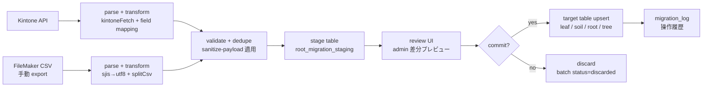

# Root B-7: 移行ツール（Kintone / FileMaker → Garden）仕様書

- 対象: 既存 Kintone・FileMaker データの Garden への一括取り込みヘルパー
- 見積: **5.0d**（内訳は §13 参照）
- 担当セッション: a-root
- 作成: 2026-04-25（a-root / Phase B-7）
- 前提 spec:
  - `2026-04-25-kintone-kanden-integration-analysis.md`（Kintone アプリ構造分析）
  - `2026-04-25-root-phase-b-01-permissions-matrix.md`（権限基盤）
  - `2026-04-25-soil-04-import-strategy.md`（Soil 大量データ取込戦略）
  - Phase B-6 通知基盤 spec（pgcrypto トークン管理パターン、起草予定）

---

## 1. 目的とスコープ

### 目的

FileMaker・Kintone で稼働中の業務データを Garden へ安全に移行するための
**ステージングベースの取り込みフレームワーク**を整備する。
一括取り込み・差分レポート・commit / rollback の一連フローを共通基盤として提供し、
モジュール別（Leaf / Soil / Root / Tree）の取り込みスクリプトがこの基盤を利用する設計にする。

### 含める

- 共通移行基盤テーブル（`root_migration_batches` / `root_migration_staging` / `root_migration_log`）
- Kintone API コネクタ（関電業務委託 App 55 / SIM 在庫 App 104 / 取引先 App 38）
- FileMaker CSV コネクタ（手動 export → Garden admin アップロード）
- 大量データ対応（chunk 処理、10,000 行/chunk）
- 取込結果の検証・差分レポート UI
- admin 専用の移行管理画面

### 含めない

- 実際の移行先テーブルの設計（Leaf / Soil / Root 各モジュール spec に委任）
- Kintone API トークンのローテ自動化（運用手順書で対応）
- FileMaker からの ODBC 直接接続（手動 CSV export を前提とする）
- 移行完了後の Kintone / FileMaker 廃止作業

### 対象データと移行先

| ソース | アプリ / データ種別 | Garden 移行先 | 規模感 |
|---|---|---|---|
| Kintone App 55 | 関電業務委託リスト | `leaf_kanden_cases` | ~数千件 |
| Kintone App 104 | SIM 在庫管理 | `leaf_kanden_sim_devices` | ~数十件 |
| Kintone App 38 | 取引先・外注営業 | `root_partners` / `root_employees` | ~数百件 |
| FileMaker | 営業リスト | `soil_lists`（Soil モジュール） | 253 万件 |
| FileMaker | コール履歴 | `soil_call_history`（Soil モジュール） | 335 万件 |
| FileMaker | Tree 架電データ | `tree_calls`（Tree モジュール） | 未確認 |
| FileMaker | Bud 振込・給与履歴 | Bud 各テーブル | 未確認 |

---

## 2. 既存実装との関係

### 再利用する既存ヘルパー

| ファイル | 役割 | 本 spec での利用 |
|---|---|---|
| `src/app/root/_lib/csv-parse.ts` | CSV パーサ（RFC 4180 準拠、BOM 除去、ヘッダーエイリアス） | FileMaker CSV コネクタの基盤として拡張利用 |
| `src/app/root/_lib/sanitize-payload.ts` | `created_at` / `updated_at` 除外、空文字 → undefined 変換 | staging → target upsert 前に必ず適用 |
| `src/app/root/_lib/kot-api.ts` | 指数バックオフ付き外部 API fetch パターン | Kintone API コネクタの fetch 実装パターンを踏襲 |

### 拡張ポイント

- `csv-parse.ts` の `splitCsv` / `parseNumberOrNull` はそのまま再利用。
  FileMaker CSV 用に SJIS → UTF-8 変換レイヤーを前段に追加する（`iconv-lite` 等）。
- `kot-api.ts` の `kotFetch`（指数バックオフ＋リトライ）を Kintone REST API 向けに
  `kintoneFetch` として同パターンで実装する。

---

## 3. 移行ツールアーキテクチャ



### コンポーネント概要

| コンポーネント | パス（予定） | 概要 |
|---|---|---|
| 共通基盤 DB | `supabase/migrations/` | batches / staging / log テーブル |
| Kintone コネクタ | `packages/migration-kintone/` | fetch + field mapping + staging 投入 |
| FileMaker コネクタ | `packages/migration-filemaker/` | CSV parse + encoding + staging 投入 |
| 共通 helper | `src/app/root/_lib/migration-helpers.ts` | validate / dedupe / chunk 処理 |
| Server Actions | `src/app/root/_actions/migration.ts` | UI からの操作を受けるエントリポイント |
| admin UI | `src/app/root/admin/migration/` | バッチ一覧・staging レビュー・commit 確認 |

---

## 4. データモデル提案

### 4.1 `root_migration_batches`（取込バッチ）

```sql
CREATE TABLE root_migration_batches (
  batch_id          uuid PRIMARY KEY DEFAULT gen_random_uuid(),
  source_type       text NOT NULL CHECK (source_type IN ('kintone','filemaker','csv','other')),
  source_app        text NOT NULL,    -- 'kanden_outsource' / 'sim_inventory' / 'soil_lists' 等
  target_module     text NOT NULL CHECK (target_module IN ('leaf','soil','tree','root','bud','seed')),
  target_table      text NOT NULL,
  status            text NOT NULL DEFAULT 'staging'
    CHECK (status IN ('staging','reviewed','committed','discarded','failed')),
  row_count         int,              -- ソース総行数
  stage_count       int,              -- staging 投入数
  commit_count      int,              -- target upsert 数
  error_count       int,
  skipped_count     int,
  dry_run           boolean NOT NULL DEFAULT false,
  options           jsonb,            -- chunk_size 等コネクタ固有オプション
  started_by        uuid REFERENCES auth.users(id),
  started_at        timestamptz NOT NULL DEFAULT now(),
  reviewed_by       uuid REFERENCES auth.users(id),
  reviewed_at       timestamptz,
  committed_by      uuid REFERENCES auth.users(id),
  committed_at      timestamptz,
  rollback_deadline timestamptz,      -- committed_at + 24h
  error_summary     jsonb
);
CREATE INDEX rmb_status_idx ON root_migration_batches (status, started_at DESC);
CREATE INDEX rmb_source_idx ON root_migration_batches (source_app, target_table);
```

### 4.2 `root_migration_staging`（一時保管）

```sql
CREATE TABLE root_migration_staging (
  staging_id         bigserial PRIMARY KEY,
  batch_id           uuid NOT NULL REFERENCES root_migration_batches(batch_id) ON DELETE CASCADE,
  source_row_index   int NOT NULL,       -- 1-origin
  raw_data           jsonb NOT NULL,
  transformed_data   jsonb NOT NULL,
  validation_errors  jsonb,              -- [{field, message}] / NULL = OK
  duplicate_check    text NOT NULL DEFAULT 'pending'
    CHECK (duplicate_check IN ('pending','unique','duplicate','updated','skip')),
  existing_target_id text,               -- 重複時の既存 PK
  will_commit        boolean NOT NULL DEFAULT true,   -- レビュー画面で個別除外可
  commit_result      text CHECK (commit_result IN ('inserted','updated','skipped','failed')),
  commit_error       text,
  CONSTRAINT rms_uniq_batch_row UNIQUE (batch_id, source_row_index)
);
CREATE INDEX rms_batch_dup_idx ON root_migration_staging (batch_id, duplicate_check);
CREATE INDEX rms_errors_idx    ON root_migration_staging (batch_id) WHERE validation_errors IS NOT NULL;
```

### 4.3 `root_migration_log`（commit 結果の永続記録）

```sql
CREATE TABLE root_migration_log (
  log_id        bigserial PRIMARY KEY,
  batch_id      uuid NOT NULL REFERENCES root_migration_batches(batch_id),
  staging_id    bigint REFERENCES root_migration_staging(staging_id),
  action        text NOT NULL
    CHECK (action IN ('inserted','updated','rollback_inserted','rollback_updated','rollback_deleted')),
  target_table  text NOT NULL,
  target_row_id text,          -- upsert 後の PK
  before_data   jsonb,         -- UPDATE / rollback 時のスナップショット
  after_data    jsonb,
  logged_at     timestamptz NOT NULL DEFAULT now(),
  logged_by     uuid REFERENCES auth.users(id)
);
CREATE INDEX rml_batch_idx  ON root_migration_log (batch_id, logged_at DESC);
CREATE INDEX rml_target_idx ON root_migration_log (target_table, target_row_id);
```

---

## 5. ツール別実装方針

### 5.1 Kintone → Garden（API ベース）

#### 認証・トークン管理

- Kintone REST API トークンは `root_external_credentials` テーブル（Phase B-6 通知基盤で設計予定）の
  pgcrypto 暗号化カラムに格納する。同パターンを踏襲。
- 環境変数で直接保持しない（アプリ別に複数トークンが存在するため）。
- トークンのローテ手順は別途運用ドキュメントに記載。

#### fetch 実装

`kot-api.ts` の `kotFetch`（指数バックオフ＋リトライ）を Kintone REST API 向けに `kintoneFetch` として同パターンで実装する。
- Base URL: `https://<subdomain>.cybozu.com/k/v1`
- cursor API（`/k/v1/records/cursor.json`）でページネーション（最大 10,000 件/cursor）
- 429 / 503: 指数バックオフ（500ms → 1s → 2s、最大 3 回）
- 400 / 401 / 403: 即座にエラー（リトライなし）

#### field mapping

各 Kintone App ごとに mapping 設定ファイルを持つ（例: `packages/migration-kintone/mappings/app55-kanden.ts`）。
`{ kintone: string, garden: string, type: 'text'|'number'|'date'|'enum'|'boolean', required?: boolean, enumMap?: Record<string,string> }[]` 形式。

#### 対象アプリとスクリプト

| Kintone App | mapping ファイル | target table |
|---|---|---|
| App 55 関電業務委託 | `app55-kanden.ts` | `leaf_kanden_cases` |
| App 104 SIM 在庫 | `app104-sim.ts` | `leaf_kanden_sim_devices` |
| App 38 取引先 | `app38-partners.ts` | `root_partners` + `root_employees`（訪問営業） |

### 5.2 FileMaker → Garden（CSV ベース）

#### エンコーディング対応

FileMaker の CSV export はデフォルト SJIS / CP932 のため、前段で `iconv-lite`（または相当ライブラリ）で UTF-8 変換する（§14 判断保留 FM-1）。
変換後は既存 `csv-parse.ts` の `splitCsv` をそのまま利用する。

#### chunk 分割処理

大量データ（253 万件）対応のため、10,000 行/chunk で分割処理。
共通ヘルパー `processInChunks<T>(rows, chunkSize, processor, onProgress)` を `src/app/root/_lib/migration-helpers.ts` に実装し、
進捗は `root_migration_batches.stage_count` を逐次更新、admin UI が Supabase Realtime で受信する。

#### 対象データと特記事項

| データ種別 | 行数目安 | chunk 数 | 特記 |
|---|---|---|---|
| 営業リスト | 253 万件 | ~253 chunks | Soil 連携、§7 参照 |
| コール履歴 | 335 万件 | ~335 chunks | Soil 連携、§7 参照 |
| Tree 架電データ | 未確認 | 未定 | Phase D 着手時（§14 判断保留 FM-2） |
| Bud 振込・給与 | 未確認 | 未定 | Phase B 着手時 |

---

## 6. API / Server Action 契約

### 6.1 取込開始

```typescript
// src/app/root/_actions/migration.ts
await startMigrationBatch({
  source_type: 'kintone' | 'filemaker' | 'csv',
  source_app: string,       // 'kanden_outsource' / 'sim_inventory' / 'soil_lists' 等
  target_module: string,    // 'leaf' / 'soil' / 'root' / 'tree' / 'bud'
  target_table: string,
  file?: File,              // FileMaker CSV 時
  options?: {
    dry_run?: boolean,
    chunk_size?: number,        // デフォルト 10_000
    kintone_query?: string,     // 差分取込時の絞り込み
    encoding?: 'utf8' | 'cp932',
  },
}): Promise<{ success: boolean; batch_id?: string; error?: string }>
```

### 6.2 staging レビュー / commit / rollback

```typescript
// staging 一覧（ページネーション対応）
getStagingRows({ batch_id, filter?, page?, per_page? })
  // => { rows: StagingRow[], total, error_count, duplicate_count, unique_count }

// commit（DB トランザクション内実行、migration_log に before/after 記録）
commitMigrationBatch({ batch_id, skip_row_ids?: number[], confirm_text: string })
  // => { inserted, updated, skipped, failed, error_details? }

// rollback（commit 後 24h 以内、admin / super_admin のみ）
rollbackMigrationBatch({ batch_id, reason: string })
  // => { rolled_back_insert, rolled_back_update, error? }
  // rollback_deadline 超過: ROLLBACK_EXPIRED エラー
  // 他 UPDATE 済み行: 警告付きスキップ（強制ロールバック不可）
```

---

## 7. モジュール別連携ポイント

| モジュール | 連携内容 | 状態 |
|---|---|---|
| **Leaf** | App 55 → `leaf_kanden_cases`、App 104 → `leaf_kanden_sim_devices`。commit 後に Leaf 側バリデーション関数を呼び出す | Leaf spec 確定次第 mapping 実装 |
| **Soil** | 253 万件 / 335 万件の大量投入。`soil-04-import-strategy.md` と統合。staging 経由か streaming insert かは §14 判断保留 S-1 | Phase B-7.5 で着手 |
| **Tree** | FileMaker 架電データ → `tree_calls`。Phase D 着手時まで拡張ポイントのみ確保 | Phase D 着手時 |
| **Bud** | 振込・給与履歴。Phase B 着手時に `source_app = 'bud_transfers'` / `'bud_salaries'` で対応 | Bud テーブル設計確定後 |

---

## 8. RLS ポリシー

移行テーブルは **admin / super_admin のみ**操作可能とする。

```sql
-- 3 テーブル共通: admin / super_admin のみ
ALTER TABLE root_migration_batches  ENABLE ROW LEVEL SECURITY;
ALTER TABLE root_migration_staging  ENABLE ROW LEVEL SECURITY;
ALTER TABLE root_migration_log      ENABLE ROW LEVEL SECURITY;

-- batches / staging: SELECT + ALL を admin / super_admin に付与
CREATE POLICY rmb_all ON root_migration_batches FOR ALL
  USING (root_has_role_any(ARRAY['admin','super_admin']))
  WITH CHECK (root_has_role_any(ARRAY['admin','super_admin']));

CREATE POLICY rms_all ON root_migration_staging FOR ALL
  USING (root_has_role_any(ARRAY['admin','super_admin']))
  WITH CHECK (root_has_role_any(ARRAY['admin','super_admin']));

-- log: 追記のみ（DELETE / UPDATE 不可。Garden 共通 deny ルールでも禁止）
CREATE POLICY rml_select ON root_migration_log FOR SELECT
  USING (root_has_role_any(ARRAY['admin','super_admin']));
CREATE POLICY rml_insert ON root_migration_log FOR INSERT
  WITH CHECK (root_has_role_any(ARRAY['admin','super_admin']));
```

---

## 9. UX 設計

### 9.1 admin 画面の「データ移行」セクション

パス: `/root/admin/migration`

- **取込ジョブ一覧**: source_type / source_app / target_table / status / 件数 / 開始日時のテーブル表示。[新規取込] ボタン。
- **新規取込フォーム**: source_type 選択（Kintone / FileMaker CSV）、Kintone 時は source_app と dry_run チェック、CSV 時はファイルアップロードとエンコーディング選択（UTF-8 / CP932）。

### 9.2 staging レビュー画面

パス: `/root/admin/migration/[batch_id]`

- サマリバー: バッチ ID / ソース / ステータス / 総行数 / エラー件数 / 重複件数
- レビューテーブル（ページネーション対応）: 行番号 / 重複判定（unique / duplicate / updated）/ 変換後データ主要フィールド / バリデーション結果 / 個別除外チェック
- フィルタ: すべて / エラーのみ / 重複のみ / 問題なし
- エラー行は commit から自動除外、重複行はデフォルト除外（上書き投入は個別選択可）

### 9.3 commit 確認モーダル

投入先テーブル名・INSERT 件数・UPDATE 件数・除外件数（エラー + 手動）を明示。
"3,363 件を leaf_kanden_cases に投入します" の確認テキストをボタンラベルに含める。
commit 後 24 時間以内はロールバック可能な旨を表示。

### 9.4 ロールバック UI

commit 済みバッチの詳細画面に [ロールバック] ボタンを rollback_deadline 内のみ表示。
理由入力（必須）→ 確認モーダル（ロールバック件数・他 UPDATE 行スキップ警告）。

---

## 10. エラーハンドリング

| シナリオ | 対応 |
|---|---|
| field mapping 失敗（型変換不可） | 該当行を `validation_errors` に記録して残行を継続 |
| Kintone API 429 レート制限 | 指数バックオフ（最大 3 回）、超過で batch `failed` |
| FileMaker CSV エンコーディング不正 | バッチ全体を `failed`、ユーザーに再エンコード指示 |
| staging INSERT 失敗 | chunk 単位でロールバック、次 chunk を継続（`continue_on_error` 設定時） |
| commit 部分失敗 | デフォルト継続（失敗行は `commit_result='failed'` に記録）。`abort_on_error: true` 時はトランザクション全体をロールバック |
| rollback_deadline 超過後の誤投入発覚 | `root_migration_log` の `after_data` を参照し admin UI で手動修正。対応記録を手動エントリとして追記（§14 判断保留 OP-1） |

---

## 11. Phase 段階分け

### B-7.1: 基盤整備（共通ヘルパー + DB）

- `root_migration_batches` / `root_migration_staging` / `root_migration_log` テーブル migration
- `processInChunks` / `validateAndTransform` / `buildDedupeKey` 共通ヘルパー
- RLS ポリシー
- バッチ一覧の admin UI（読み取り専用）

### B-7.2: Kintone コネクタ

- `kintoneFetch`（指数バックオフ、cursor ページネーション）
- App 55 / 104 / 38 の field mapping ファイル
- dry_run モード（staging 投入はするが commit しない）
- Kintone API トークンの暗号化保管（B-6 基盤依存）

### B-7.3: FileMaker（CSV）コネクタ

- SJIS → UTF-8 変換
- `csv-parse.ts` の汎用ラッパー（任意のヘッダースキーマに対応）
- 大量データ対応（chunk 10,000 行、プログレス更新）
- ファイルアップロード UI

### B-7.4: 関電業務委託の取込（Leaf 連携）

- App 55 の mapping 確定（Leaf spec との照合）
- staging レビュー画面の実装
- commit / rollback フロー完成
- dry_run で 1 回、本番 commit で 1 回の 2 段階テスト実行

### B-7.5: 営業リストの大量取込（Soil 連携）

- 253 万件の staging / streaming 方式検討・決定（§14 判断保留 S-1）
- Soil との並列処理調整（`2026-04-25-soil-04-import-strategy.md` 統合）
- プログレスバー・長時間ジョブの UX
- エンコーディング検証（FileMaker の実 CSV でテスト）

---

## 12. 受入基準

1. ✅ `root_migration_batches` / `root_migration_staging` / `root_migration_log` が
   migration で作成され、RLS が admin / super_admin のみで動作する
2. ✅ Kintone App 55 のレコードを API 経由で取込み、`root_migration_staging` に格納できる
3. ✅ dry_run モードで staging 投入のみ行い、target table に変更が入らない
4. ✅ staging レビュー画面でエラー行・重複行をフィルタリングできる
5. ✅ commit 実行後、`leaf_kanden_cases` に正しくデータが upsert される
6. ✅ commit 後 24h 以内に rollback を実行し、挿入したレコードが削除される
7. ✅ FileMaker CSV（SJIS）を管理画面からアップロードし、UTF-8 変換後に staging 投入できる
8. ✅ 10,000 行/chunk の分割処理が動作し、プログレスが更新される
9. ✅ バリデーションエラー行が自動除外され、残行のみ commit される
10. ✅ 253 万件規模の投入で staging が正常完了する（Soil 連携、性能目標未定）

---

## 13. 想定工数（内訳）

| Phase | 作業 | 工数 |
|---|---|---|
| **B-7.1** | 共通基盤 DB（3 テーブル + RLS + index） | 0.25d |
| **B-7.1** | 共通 helper（processInChunks / validate / dedupe） | 0.5d |
| **B-7.1** | admin バッチ一覧 UI（読み取り専用） | 0.25d |
| **B-7.2** | kintoneFetch（指数バックオフ・cursor）実装 | 0.25d |
| **B-7.2** | App 55 field mapping（74 フィールド）+ App 104 / App 38 | 0.5d |
| **B-7.2** | Kintone トークン暗号化保管（B-6 依存） | 0.25d |
| **B-7.3** | FileMaker CSV コネクタ（SJIS 変換 + csv-parse 統合） | 0.25d |
| **B-7.3** | 大量データ chunk 処理 + ファイルアップロード UI | 0.5d |
| **B-7.4** | staging レビュー画面 + commit / rollback フロー | 0.5d |
| **B-7.4** | 関電業務委託 dry_run → 本番 commit テスト | 0.25d |
| **B-7.5** | 営業リスト大量取込（Soil 連携・方式決定後） | 0.5d |
| 合計 | | **4.0d** |

> 備考: Kintone API トークン暗号化保管（B-6 依存）が未完了の場合、B-7.2 は B-6 完了後に着手。
> 大量データ方式（staging vs streaming）が変わると B-7.5 が +0.5〜1.0d 増える可能性がある。

---

## 14. 判断保留

### Kintone 関連

| ID | 論点 | 現状スタンス |
|---|---|---|
| K-1 | Kintone API トークンの権限スコープ（閲覧のみ or 書込含む） | 移行目的は**閲覧のみ**で十分。ローテ後に閲覧専用トークンを発行推奨 |
| K-2 | cursor API vs offset ページネーション | cursor API（/v1/records/cursor.json）を優先、フォールバックで offset 実装 |
| K-3 | Kintone と Garden の並行運用期間 | α/β 段階は並行運用が現実的。移行完了後に Kintone 廃止（東海林さん判断） |
| K-4 | App 55 の申込者・代表者フィールド不在 | 関電責任者ヒアリング後に mapping に追加（現状は `kanden-integration-analysis.md §2.3` に記載） |
| K-5 | App 38 訪問営業の root_partners / root_employees 分離 | 推奨: 方式 A（分離）。`kanden-integration-analysis.md §4.3` 参照 |

### FileMaker 関連

| ID | 論点 | 現状スタンス |
|---|---|---|
| FM-1 | SJIS 変換に `iconv-lite` を使用するか | 既存パッケージ確認後、未使用なら a-main に承認依頼（新規 npm 追加ルール） |
| FM-2 | FileMaker からの export 自動化（手動 vs ODBC 接続） | **手動 export → CSV アップロード**を Phase B では採用。ODBC は Phase C 以降で検討 |
| FM-3 | FileMaker DB の正確なスキーマ | 現状不明（§15 未確認事項 FM-1 参照）。実 CSV サンプルを東海林さんに提供依頼 |

### Soil / 大量データ関連

| ID | 論点 | 現状スタンス |
|---|---|---|
| S-1 | 253 万件の取込に staging テーブルを経由するか | staging 経由だとディスク・時間のコストが大。Soil 専用の streaming insert 方式も検討。`soil-04-import-strategy.md` と統合判断 |
| S-2 | 大量取込の性能目標（許容時間） | 未定。10 万件/分を目安に実測後に決定（§15 未確認事項 S-1） |

### 運用関連

| ID | 論点 | 現状スタンス |
|---|---|---|
| OP-1 | rollback 期限（24h で十分か） | 業務的に問題なければ 24h。次の営業日まで（最大 3 日間）の延長も検討可 |
| OP-2 | 移行スケジュール（一括 vs 段階） | 東海林さん判断待ち（§15 未確認事項 G-1） |
| OP-3 | worker / streaming 必要か | 大量データ取込（Soil）が確定したら判断。Vercel Serverless の 30s タイムアウト問題が顕在化する可能性あり |

---

## 15. 未確認事項（東海林さんへの確認）

### Kintone

| ID | 未確認事項 |
|---|---|
| KU-1 | App 55 の供給地点番号フィールドの実在確認（`kanden-integration-analysis.md §6.1` 参照） |
| KU-2 | App 55 の申込者・代表者フィールドの所在（Kintone 内 or 関電 Excel） |
| KU-3 | App 104 の SIM 在庫の台数規模（10 台規模 or 100 台超） |
| KU-4 | App 38 の部署名 enum の変動頻度（enum 固定化の可否） |
| KU-5 | 3 つの Kintone API トークンのローテ実施予定（`kanden-integration-analysis.md 付録 A` 参照） |

### FileMaker

| ID | 未確認事項 |
|---|---|
| FM-1 | FileMaker DB のスキーマ（テーブル一覧、カラム名、エンコーディング確認） |
| FM-2 | 実際の CSV サンプル提供（1,000 行程度）—— エンコーディング・区切り文字・特殊文字の確認 |
| FM-3 | Tree 架電データの行数規模と FileMaker テーブル名 |

### 全体

| ID | 未確認事項 |
|---|---|
| G-1 | 移行スケジュール（一括移行 vs 段階移行の方針） |
| G-2 | 移行期間中の二重運用（Kintone / FileMaker と Garden の並行期間、データ同期要否） |
| G-3 | rollback 期限（24h で実業務上十分か） |
| S-1 | 253 万件の取込の許容時間（夜間バッチ可否） |

— end of B-7 spec —
