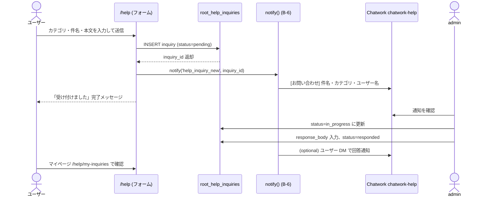

# Root Help: Garden ヘルプモジュール 仕様書

- 対象: Garden 内蔵ヘルプシステム（独立 `/help` + モジュール固有 `/<module>/help` ハイブリッド）
- 見積: **2.5d**（W1〜W8 合計、§14 参照）
- 担当セッション: a-root
- 作成: 2026-04-26（a-root / Phase D-E 先行 spec）
- 根拠: `C:\garden\_shared\decisions\spec-revision-followups-20260426.md` §3.1
- 前提 spec: `docs/specs/2026-04-25-root-phase-b-06-notification-platform.md`（通知基盤 B-6）

---

## 1. 目的とスコープ

### 目的

Garden 全体に KING OF TIME 風のオンラインヘルプを内蔵し、  
従業員・スタッフが操作に迷ったときにアプリ内で即座に解決できる体験を提供する。  
現在は README.md や `docs/operations/` でテキスト代替しているが、  
**Phase D-E の本格実装**でユーザー向けの UX に昇格させる。

### 含める

- 独立モジュール `Garden Help`（パス: `/help`）— 全モジュール横断の総合ヘルプ
- モジュール固有ヘルプ（`/<module>/help`）— 同一テーブルを module 列で絞り込み
- コンテンツ構造 5 カテゴリ（基本ガイド / 機能別ガイド / FAQ / 最新情報 / お問い合わせ）
- 権限連動による可視範囲制御（既存 `has_permission_v2` 流用）
- Postgres FTS（全文検索）+ おすすめキーワード
- マークダウン + リッチテキスト編集 UI + 公開ワークフロー（draft → published）
- 動画マニュアル（Supabase Storage、段階的 R2 移行設計）
- 更新履歴テーブル（誰がいつ何を変えたか）
- お問い合わせフォーム（Chatwork 連携、B-6 通知基盤経由）

### 含めない

- Algolia 等外部全文検索 SaaS（判断保留 §15 参照）
- 多言語（i18n）対応（Phase F 以降）
- ヘルプチャットボット（AI 回答機能、将来拡張）
- 外部公開ヘルプサイト（内部専用、外部共有は別途検討）
- 初期コンテンツの執筆（本 spec 対象外、§16 で確認要）

---

## 2. 既存実装との関係

### 2.1 現状の代替運用

| 代替手段 | 所在 | 内容 |
|---|---|---|
| README.md | リポジトリルート | モジュール概要・セットアップ手順 |
| `docs/operations/` | ドキュメントフォルダ | 運用手順書（現場向け）|
| CLAUDE.md | 各モジュールフォルダ | 開発者向け設計メモ |
| Chatwork チャンネル | 事務局システム | 口頭・チャット質問対応 |

**Phase D 着手まで**この代替運用を継続する。本 spec は設計確定のためのもので、  
Phase D 着手時に本 spec を起点に実装計画を策定する。

### 2.2 Root 既存テーブルとの依存関係

| 依存テーブル | 用途 |
|---|---|
| `auth.users` | 閲覧者・編集者の識別 |
| `root_employees` | 記事編集者の氏名表示、編集権限チェック |
| `root_roles` / `root_user_roles` | `has_permission_v2` によるアクセス制御 |
| `root_notification_channels` | お問い合わせ通知先チャネル（B-6 基盤）|
| `root_notification_subscriptions` | 管理者への inquiry 購読設定 |

### 2.3 B-6 通知基盤との関係

お問い合わせ受信・ステータス変更通知は B-6 (`root_notification_platform`) の  
`notify()` ヘルパー経由で Chatwork 送信する。  
専用 `chatwork-help` チャネルを `root_notification_channels` に登録する前提。

---

## 3. データモデル提案

### 3.1 `root_help_articles`（記事本体）

```sql
CREATE TABLE root_help_articles (
  article_id      bigserial PRIMARY KEY,
  slug            text UNIQUE NOT NULL,
    -- URL パス末尾。例: 'getting-started', 'tree-call-flow'
    -- 全体 /help/[category]/[slug]、モジュール /tree/help/[slug] で共用
  title           text NOT NULL,
  body_md         text NOT NULL DEFAULT '',       -- マークダウン本文
  excerpt         text,                            -- 検索結果プレビュー 200 文字程度
  category        text NOT NULL CHECK (category IN (
    'basic_guide',    -- 基本ガイド
    'feature_guide',  -- 機能別ガイド
    'faq',            -- よくある質問
    'news',           -- 最新情報
    'contact'         -- お問い合わせ（記事形式）
  )),
  module          text,
    -- NULL = 全モジュール共通
    -- 'tree' / 'soil' / 'leaf-kanden' / 'bud' / 'bloom' / 'forest' 等
  visibility      text NOT NULL DEFAULT 'draft'
    CHECK (visibility IN ('draft','review','published','archived')),
  tags            text[] NOT NULL DEFAULT '{}',
  attachments     jsonb NOT NULL DEFAULT '[]',
    -- [{type:'video'/'pdf'/'image', storage_path:text, name:text, size_bytes:int}]
  view_count      int NOT NULL DEFAULT 0,
  sort_order      int NOT NULL DEFAULT 0,          -- カテゴリ内表示順
  is_featured     boolean NOT NULL DEFAULT false,  -- カテゴリトップにピン留め
  published_at    timestamptz,
  created_by      uuid NOT NULL REFERENCES auth.users(id),
  updated_by      uuid NOT NULL REFERENCES auth.users(id),
  created_at      timestamptz NOT NULL DEFAULT now(),
  updated_at      timestamptz NOT NULL DEFAULT now(),

  -- 全文検索インデックス（日本語トークナイザ、pgroonga / pg_bigm 未導入時は簡易版）
  -- Note: 'japanese' は pg_bigm or pgroonga 必要。未導入時は 'simple' に降格。§10 参照
  search_vector   tsvector GENERATED ALWAYS AS (
    to_tsvector('simple',
      coalesce(title, '') || ' ' ||
      coalesce(body_md, '') || ' ' ||
      coalesce(excerpt, '') || ' ' ||
      array_to_string(tags, ' ')
    )
  ) STORED
);

-- 全文検索
CREATE INDEX root_help_articles_search_idx
  ON root_help_articles USING GIN (search_vector);

-- モジュール別 published 一覧（頻繁クエリ）
CREATE INDEX root_help_articles_module_vis_idx
  ON root_help_articles (module, visibility, sort_order)
  WHERE visibility = 'published';

-- カテゴリ別 published 一覧
CREATE INDEX root_help_articles_category_vis_idx
  ON root_help_articles (category, published_at DESC)
  WHERE visibility = 'published';
```

### 3.2 `root_help_articles_logs`（更新履歴）

```sql
CREATE TABLE root_help_articles_logs (
  log_id          bigserial PRIMARY KEY,
  article_id      bigint NOT NULL REFERENCES root_help_articles(article_id),
  changed_by      uuid NOT NULL REFERENCES auth.users(id),
  changed_at      timestamptz NOT NULL DEFAULT now(),
  change_type     text NOT NULL CHECK (change_type IN (
    'created', 'updated', 'published', 'archived', 'restored'
  )),
  before_content  jsonb,   -- {title, body_md, visibility, ...} スナップショット
  after_content   jsonb,   -- 同上
  change_summary  text     -- 「FAQ 追加」「typo 修正」等、編集者入力
);

CREATE INDEX root_help_articles_logs_article_idx
  ON root_help_articles_logs (article_id, changed_at DESC);

-- 履歴は INSERT only（UPDATE / DELETE 禁止、RLS §8 で制御）
```

**Trigger 設計**  
`root_help_articles` の INSERT / UPDATE 時に自動 INSERT。  
`change_type` は `TG_OP` と `NEW.visibility` / `OLD.visibility` の差分で判定。

### 3.3 `root_help_inquiries`（お問い合わせ）

```sql
CREATE TABLE root_help_inquiries (
  inquiry_id      bigserial PRIMARY KEY,
  inquired_by     uuid NOT NULL REFERENCES auth.users(id),
  inquired_at     timestamptz NOT NULL DEFAULT now(),
  module          text,                -- 関連モジュール（NULL = 全般）
  category        text NOT NULL CHECK (category IN (
    'how_to',         -- 使い方
    'bug_report',     -- 不具合報告
    'feature_request',-- 機能要望
    'other'           -- その他
  )),
  subject         text NOT NULL,
  body            text NOT NULL,
  status          text NOT NULL DEFAULT 'pending'
    CHECK (status IN ('pending', 'in_progress', 'responded', 'closed')),
  responded_by    uuid REFERENCES auth.users(id),
  responded_at    timestamptz,
  response_body   text,
  related_article_id bigint REFERENCES root_help_articles(article_id),
  created_at      timestamptz NOT NULL DEFAULT now(),
  updated_at      timestamptz NOT NULL DEFAULT now()
);

CREATE INDEX root_help_inquiries_status_idx
  ON root_help_inquiries (status, inquired_at DESC)
  WHERE status IN ('pending', 'in_progress');
```

### 3.4 `root_help_categories`（カテゴリマスタ・表示順制御）

```sql
CREATE TABLE root_help_categories (
  category_key    text PRIMARY KEY,    -- 'basic_guide' 等（articles.category と一致）
  label_ja        text NOT NULL,       -- '基本ガイド'
  label_en        text,
  icon            text,                -- Lucide icon 名（例: 'BookOpen'）
  sort_order      int NOT NULL DEFAULT 0,
  description_ja  text,
  is_active       boolean NOT NULL DEFAULT true
);

-- 初期データ
INSERT INTO root_help_categories (category_key, label_ja, icon, sort_order) VALUES
  ('basic_guide',   '基本ガイド',     'BookOpen',      10),
  ('feature_guide', '機能別ガイド',   'LayoutGrid',    20),
  ('faq',           'よくある質問',   'HelpCircle',    30),
  ('news',          '最新情報',       'Newspaper',     40),
  ('contact',       'お問い合わせ',   'MessageSquare', 50);
```

### 3.5 `root_help_search_keywords`（検索キーワード集計）

```sql
CREATE TABLE root_help_search_keywords (
  keyword_id      bigserial PRIMARY KEY,
  keyword         text NOT NULL,
  searched_at     timestamptz NOT NULL DEFAULT now(),
  searched_by     uuid REFERENCES auth.users(id),
  module_context  text,                -- 検索時の現在モジュール（ /tree/help で検索 → 'tree'）
  result_count    int NOT NULL DEFAULT 0
);

CREATE INDEX root_help_search_keywords_keyword_idx
  ON root_help_search_keywords (keyword, searched_at DESC);

-- おすすめキーワード集計 VIEW（上位 10 件）
CREATE OR REPLACE VIEW root_help_recommended_keywords AS
SELECT
  keyword,
  count(*)           AS search_count,
  max(searched_at)   AS last_searched_at
FROM root_help_search_keywords
WHERE searched_at >= now() - interval '30 days'
GROUP BY keyword
ORDER BY search_count DESC
LIMIT 10;
```

---

## 4. データフロー

```mermaid
flowchart TB
    subgraph 編集フロー
        A[admin / manager が記事作成] --> B[visibility = draft]
        B --> C{承認が必要?}
        C -->|重大変更| D[visibility = review]
        D --> E[admin 承認]
        E --> F[visibility = published]
        C -->|軽微変更 manager| F
        F --> G[published_at 設定]
        G --> H[Trigger: root_help_articles_logs 挿入]
    end

    subgraph 閲覧フロー
        I[ユーザーがヘルプ画面表示] --> J{has_permission_v2?}
        J -->|NG| K[非表示 / 403]
        J -->|OK| L[root_help_articles SELECT\n module + visibility = published]
        L --> M[記事一覧 / 詳細表示]
        M --> N[view_count++ 非同期更新]
    end

    subgraph 検索フロー
        O[キーワード入力] --> P[root_help_search_keywords INSERT]
        P --> Q[FTS: search_vector @@ plainto_tsquery]
        Q --> R[検索結果一覧 + おすすめキーワード表示]
    end

    subgraph お問い合わせフロー
        S[ユーザーがフォーム送信] --> T[root_help_inquiries INSERT]
        T --> U[notify() → Chatwork chatwork-help ルーム]
        U --> V[admin が pending → in_progress → responded]
        V --> W[response_body 入力 → Chatwork DM 返信]
    end
```

---

## 5. ルーティング設計

```
/help                                    総合ヘルプトップ
                                          カテゴリカード + 検索バー + 最新情報
/help/search?q=...                       全文検索結果一覧
/help/[category]                         カテゴリ別記事一覧
                                          例: /help/basic_guide
/help/[category]/[slug]                  個別記事詳細
                                          例: /help/faq/login-failed

--- モジュール固有 ---
/tree/help                               Tree 専用ヘルプ（module='tree' で絞込）
/tree/help/[slug]                        Tree 個別記事
/soil/help                               Soil 専用ヘルプ
/soil/help/[slug]
/leaf/kanden/help                        Leaf 関電専用（module='leaf-kanden'）
/leaf/kanden/help/[slug]
/bud/help                                Bud 専用ヘルプ
/bud/help/[slug]
/bloom/help                              Bloom 専用ヘルプ
/bloom/help/[slug]
/forest/help                             Forest 専用ヘルプ
/forest/help/[slug]

--- 管理 ---
/help/admin                              記事管理一覧（admin / manager）
/help/admin/new                          新規記事作成
/help/admin/[article_id]/edit            記事編集
/help/admin/inquiries                    お問い合わせ管理（admin）
```

**Next.js App Router 対応**

```
src/app/
  (help)/
    help/
      page.tsx                  総合トップ
      search/page.tsx           検索結果
      [category]/
        page.tsx                カテゴリ一覧
        [slug]/page.tsx         記事詳細
      admin/
        page.tsx
        new/page.tsx
        [article_id]/edit/page.tsx
        inquiries/page.tsx
    [module]/
      help/
        page.tsx                モジュール固有トップ（動的ルート）
        [slug]/page.tsx
```

---

## 6. UI 設計（ASCII ワイヤーフレーム）

### 6.1 総合ヘルプトップ `/help`

```
┌─────────────────────────────────────────────────────────┐
│  🌿 Garden ヘルプ                        [admin: 記事管理]│
│                                                           │
│  ┌─────────────────────────────────────────────────────┐ │
│  │  🔍  キーワードで検索...                             │ │
│  └─────────────────────────────────────────────────────┘ │
│  よく検索されるキーワード: [ログイン] [給与明細] [架電] … │
│                                                           │
│  ┌──────────┐ ┌──────────┐ ┌──────────┐ ┌──────────┐   │
│  │📖 基本   │ │🗂 機能別 │ │❓ FAQ   │ │📰 最新  │   │
│  │ガイド    │ │ガイド    │ │         │ │情報     │   │
│  │ 12 記事  │ │ 24 記事  │ │ 18 記事 │ │  8 記事 │   │
│  └──────────┘ └──────────┘ └──────────┘ └──────────┘   │
│                                                           │
│  ✉ お問い合わせ                                          │
│                                                           │
│  ━━ 最新情報 ━━━━━━━━━━━━━━━━━━━━━━━━━━━━━━━━━━━         │
│  🆕 2026-04-25  Tree v2.1 リリースノート                 │
│     2026-04-20  メンテナンス完了のお知らせ               │
└─────────────────────────────────────────────────────────┘
```

### 6.2 記事詳細ページ

```
┌─────────────────────────────────────────────────────────┐
│ ← 戻る    FAQ > ログインできない場合の対処               │
│                                                           │
│  # ログインできない場合の対処                    🆕 NEW  │
│  最終更新: 2026-04-24 by 東海林美琴                      │
│  ─────────────────────────────────────────────────────   │
│  [記事本文 マークダウン描画]                              │
│                                                           │
│  [動画: パスワードリセット手順]                          │
│  ▶ ─────────────────────────────────── 03:24             │
│                                                           │
│  ─────────────────────────────────────────────────────   │
│  この記事は役に立ちましたか?  [👍 はい] [👎 いいえ]      │
│                                                           │
│  ━━ 関連記事 ━━━━━━━━━━━━━━━━━━━━━━━━━━━                  │
│  • 初回ログイン手順                                       │
│  • パスワード変更方法                                     │
└─────────────────────────────────────────────────────────┘
```

### 6.3 記事編集 UI（管理者）

```
┌─────────────────────────────────────────────────────────┐
│  記事編集                 [draft] → [review] → [publish]│
│  ─────────────────────────────────────────────────────   │
│  タイトル: [ログインできない場合の対処              ]    │
│  カテゴリ: [FAQ ▼]  モジュール: [共通 ▼]               │
│  タグ:     [ログイン] [パスワード] [+追加]              │
│                                                           │
│  ┌───────────── エディタ ──────────────────────────────┐ │
│  │ **B** _I_ ~~S~~  H1 H2  リスト  引用  コード  動画  │ │
│  │─────────────────────────────────────────────────────│ │
│  │ ## ログインできない主な原因                         │ │
│  │                                                     │ │
│  │ 1. パスワードが違う                                │ │
│  │ 2. ...                                              │ │
│  └─────────────────────────────────────────────────────┘ │
│                                                           │
│  ┌───────── プレビュー ────────────────────────────────┐ │
│  │ ## ログインできない主な原因                         │ │
│  │ 1. パスワードが違う                                │ │
│  └─────────────────────────────────────────────────────┘ │
│                                                           │
│  変更サマリ: [typo 修正               ]  [下書き保存]    │
│                                            [承認申請]    │
└─────────────────────────────────────────────────────────┘
```

---

## 7. API / Server Action 契約

### 7.1 記事 CRUD

```typescript
// src/app/(help)/actions/articles.ts

getHelpArticles(params: { module?: string|null; category?: string;
  visibility?: string; limit?: number; offset?: number })
  → Promise<{ articles: HelpArticle[]; total: number }>

getHelpArticleBySlug(params: { slug: string; module?: string })
  → Promise<HelpArticle | null>

createHelpArticle(params: { title; body_md; excerpt?; category: HelpCategory;
  module?; tags?; attachments?; visibility?: 'draft'|'review'; sort_order? })
  → Promise<{ article_id: number; slug: string }>

updateHelpArticle(params: { article_id: number;
  patch: Partial<Pick<HelpArticle, 'title'|'body_md'|'excerpt'|'visibility'|
    'tags'|'attachments'|'sort_order'|'is_featured'>>;
  change_summary?: string })
  → Promise<{ updated: boolean }>

publishHelpArticle(params: { article_id: number })
  → Promise<{ published_at: string }>

archiveHelpArticle(params: { article_id: number })
  → Promise<{ archived: boolean }>
```

### 7.2 検索

```typescript
searchHelpArticles(params: { query: string; module?: string;
  category?: string; limit?: number })           // default limit: 20
  → Promise<{ results: Array<{ article_id; slug; title; excerpt; category;
      module: string|null; published_at; rank: number }>;
    total: number }>

getRecommendedKeywords(params?: { module?: string; limit?: number })
  → Promise<Array<{ keyword: string; search_count: number }>>
```

### 7.3 お問い合わせ送信

```typescript
submitHelpInquiry(params: { module?; category: InquiryCategory;
  subject; body; related_article_id?: number })
  → Promise<{ inquiry_id: number; message: string }>

respondToInquiry(params: { inquiry_id: number; response_body: string;
  status: 'responded'|'closed' })
  → Promise<{ updated: boolean }>
```

### 7.4 更新履歴取得

```typescript
getArticleHistory(params: { article_id: number; limit?: number })
  → Promise<Array<{ log_id; changed_by_name; changed_at;
      change_type; change_summary: string|null }>>
```

---

## 8. RLS ポリシー

### 8.1 `root_help_articles`

```sql
ALTER TABLE root_help_articles ENABLE ROW LEVEL SECURITY;

-- SELECT: published は全認証ユーザー。draft/review は作成者 or admin のみ
CREATE POLICY help_articles_select ON root_help_articles FOR SELECT USING (
  auth.uid() IS NOT NULL AND (
    visibility = 'published'
    OR created_by = auth.uid()
    OR has_permission_v2(auth.uid(), 'help', 'update')
  )
);
-- INSERT / UPDATE: admin or module owner（アプリ層でさらに module チェック）
CREATE POLICY help_articles_insert ON root_help_articles
  FOR INSERT WITH CHECK (has_permission_v2(auth.uid(), 'help', 'update'));
CREATE POLICY help_articles_update ON root_help_articles
  FOR UPDATE USING (created_by = auth.uid() OR has_permission_v2(auth.uid(), 'help', 'update'))
  WITH CHECK   (created_by = auth.uid() OR has_permission_v2(auth.uid(), 'help', 'update'));
-- DELETE: admin / super_admin のみ
CREATE POLICY help_articles_delete ON root_help_articles
  FOR DELETE USING (has_permission_v2(auth.uid(), 'help', 'delete'));
```

### 8.2 `root_help_articles_logs`

```sql
ALTER TABLE root_help_articles_logs ENABLE ROW LEVEL SECURITY;
-- SELECT: admin or 自分が変更した行
CREATE POLICY help_logs_select ON root_help_articles_logs FOR SELECT USING (
  has_permission_v2(auth.uid(), 'help', 'update') OR changed_by = auth.uid()
);
-- INSERT: Trigger（SECURITY DEFINER 関数）のみ。一般ユーザーは禁止
CREATE POLICY help_logs_insert ON root_help_articles_logs FOR INSERT WITH CHECK (false);
-- UPDATE / DELETE: 禁止（監査ログ改ざん防止）
```

### 8.3 `root_help_inquiries`

```sql
ALTER TABLE root_help_inquiries ENABLE ROW LEVEL SECURITY;
-- SELECT: 自分の inquiry + admin
CREATE POLICY help_inquiries_select ON root_help_inquiries FOR SELECT USING (
  inquired_by = auth.uid() OR has_permission_v2(auth.uid(), 'help', 'update')
);
-- INSERT: 認証ユーザー全員
CREATE POLICY help_inquiries_insert ON root_help_inquiries
  FOR INSERT WITH CHECK (auth.uid() IS NOT NULL);
-- UPDATE: admin のみ（ステータス変更・回答記入）
CREATE POLICY help_inquiries_update ON root_help_inquiries
  FOR UPDATE USING (has_permission_v2(auth.uid(), 'help', 'update'));
```

### 8.4 モジュール固有権限（アプリ層）

DB の RLS ではモジュール列の権限チェックまで行わず、アプリ層で `has_permission_v2` を呼び出す。

```typescript
// src/lib/help/permission.ts
export async function canViewModuleHelp(
  userId: string,
  module: string | null
): Promise<boolean> {
  if (!module) return true;  // 共通記事は誰でも可
  return await hasPermissionV2(userId, module, 'view');
}

export async function canEditHelp(
  userId: string,
  module: string | null
): Promise<boolean> {
  // admin / super_admin は全モジュール編集可
  if (await hasPermissionV2(userId, 'help', 'update')) return true;
  // module owner（例: tree の manager+）は該当モジュールのみ
  if (module) {
    return await hasPermissionV2(userId, module, 'manage');
  }
  return false;
}
```

**ロール別可視範囲まとめ**

| ロール | 共通記事 | 自モジュール記事 | 他モジュール記事 | 編集 |
|---|---|---|---|---|
| toss | ✅ | Tree のみ | ❌ | ❌ |
| closer | ✅ | Tree のみ | ❌ | ❌ |
| cs | ✅ | Tree / Leaf 等 | ❌（権限外） | ❌ |
| staff | ✅ | アクセス可モジュール | ❌ | ❌ |
| manager | ✅ | 全アクセス可 | ❌ | 自管理モジュールのみ |
| admin | ✅ | 全件 | ✅ | ✅ |
| super_admin | ✅ | 全件 | ✅ | ✅ |
| outsource（槙さん）| ✅ | Leaf 関電のみ | ❌ | Leaf 関電のみ |

---

## 9. 他モジュールとの連携ポイント

### a-tree（Garden Tree）

- **ナビに `/tree/help` リンク追加**: Tree ヘッダナビまたはサイドバーに「ヘルプ」リンク
- **編集権限**: Tree の manager+ は `module='tree'` 記事を編集可
- **推奨コンテンツ**: 架電フロー手順 / トスアップ判定 / コールスクリプト基礎

### a-leaf（Garden Leaf）

- **関電専用**: `/leaf/kanden/help`（`module='leaf-kanden'`）
- **槙さん（outsource + leaf_kanden_module_owner）**: 関電ヘルプを閲覧・編集可
- **推奨コンテンツ**: 案件登録手順 / 関電業務フロー / 入力規則

### a-bud（Garden Bud）

- **経理マニュアルの集約先**: `/bud/help` に振込手順 / 給与計算手順 / CC 明細取込手順
- **admin のみ編集**: 給与・振込は金額影響が大きいため manager 編集不可
- **推奨コンテンツ**: 月次振込フロー / 給与明細の見方 / 年末調整手順

### a-bloom（Garden Bloom）

- **ヘルプ閲覧 KPI**: よく見られる記事・検索ワードを Bloom ダッシュボードで可視化
  - 連携元: `root_help_articles.view_count` / `root_help_recommended_keywords` VIEW
  - Bloom 側で定期 SELECT → ダッシュボード表示（Push 不要、Pull 型）
- **推奨コンテンツ**: 日報入力手順 / KPI の見方 / ダッシュボード操作ガイド

---

## 10. 検索エンジン詳細（Postgres FTS）

### 基本方針

Garden 規模（記事数: 初期 50 件、安定後 200〜500 件）では  
**Postgres FTS で十分対応可能**。コスト・運用コストが最小なため本 spec では推奨とする。

### FTS クエリ設計

```sql
-- 検索実行（Server Action 内）
SELECT
  article_id,
  slug,
  title,
  excerpt,
  category,
  module,
  published_at,
  ts_rank(search_vector, query) AS rank,
  ts_headline('simple', title || ' ' || coalesce(excerpt, ''), query,
    'MaxWords=15, MinWords=8, StartSel=<mark>, StopSel=</mark>'
  ) AS headline
FROM root_help_articles,
     plainto_tsquery('simple', $1) query
WHERE
  search_vector @@ query
  AND visibility = 'published'
  -- モジュール絞込（モジュール固有ヘルプの場合）
  AND ($2::text IS NULL OR module = $2 OR module IS NULL)
ORDER BY rank DESC, published_at DESC
LIMIT $3;
```

### 日本語対応

- **短期（Phase D-E 初期）**: `'simple'` 辞書（単語分割なし、前方一致 `like '%xxx%'` を併用）
- **中期**: `pg_bigm` 拡張 (`2-gram`) を Supabase で有効化し `'pg_bigm'` 辞書に移行
- **長期**: pgroonga（N-gram + 形態素解析）または Algolia（§15 参照）

### おすすめキーワード生成

```sql
-- 定期更新（Vercel Cron 日次 / または View 参照）
REFRESH MATERIALIZED VIEW CONCURRENTLY root_help_recommended_keywords;
```

MV が不要な規模であれば VIEW 直参照でも可（初期は VIEW、記事 200+ 件超で MV 移行）。

---

## 11. 動画マニュアル管理

### Supabase Storage バケット

```
garden-help-videos/
  ├── common/                   共通ガイド動画
  │   ├── login-flow.mp4
  │   └── dashboard-overview.mp4
  ├── tree/                     Tree モジュール動画
  ├── bud/                      Bud モジュール動画
  ├── leaf-kanden/              Leaf 関電動画
  └── ...
```

バケットポリシー:
- **読取**: 認証ユーザー全員（`storage.authenticated` ポリシー）
- **書込**: `has_permission_v2(uid, 'help', 'update')` のみ

### 段階的ホスト方針

| フェーズ | 方針 | 補足 |
|---|---|---|
| Phase D-E 初期 | YouTube 限定公開 URL を attachments に記録 | コスト 0、Storage 不要 |
| Phase 中期 | Supabase Storage 自前ホスト（1GB 以内） | プレイヤー埋め込み `<video>` |
| Phase 後期 | Cloudflare R2 + CDN 配信 | Soil B-05 バックアップ戦略と統合 |

### 動画フォーマット

- コンテナ: MP4（H.264, AAC）
- 解像度: 720p（1280×720）推奨
- ビットレート: 1〜2 Mbps（5 分動画 ≈ 75〜150MB）
- サムネイル: JPEG（storage_path に `_thumb.jpg` サフィックス）

### 記事への埋め込み

編集 UI の「動画挿入」ボタンで Storage URL を自動挿入:

```markdown
<!-- help-video: garden-help-videos/tree/call-flow.mp4 -->
<video controls width="100%" poster="...">
  <source src="[Storage URL]" type="video/mp4" />
</video>
```

---

## 12. お問い合わせフロー



### Chatwork 通知テンプレート（B-6 template_key: `help_inquiry_new`）

```
【Garden ヘルプ お問い合わせ】
カテゴリ: {category_label}
モジュール: {module | '全般'}
件名: {subject}
質問者: {user_name}
---
{body_excerpt}（最大 200 文字）
---
対応画面: {admin_url}
```

---

## 13. 受入基準

1. ✅ `/help` が表示され、5 カテゴリカードと検索バーが機能する
2. ✅ `root_help_articles` へ記事を INSERT し、`/help/[category]/[slug]` で閲覧できる
3. ✅ visibility が `published` の記事のみ一般ユーザーに表示される（draft/review は非表示）
4. ✅ FTS 検索でキーワード入力 → 関連記事が表示される（0 件の場合は「見つかりませんでした」）
5. ✅ `root_help_search_keywords` にキーワードが記録される
6. ✅ おすすめキーワード上位 10 件が検索バー下部に表示される
7. ✅ `/tree/help` が Tree ユーザーにのみ表示される（toss は Tree のみ、admin は全件）
8. ✅ Tree の manager が `module='tree'` 記事を編集・公開できる
9. ✅ admin が全モジュール記事を作成・編集・公開・アーカイブできる
10. ✅ 記事更新時に `root_help_articles_logs` へ Trigger 経由で履歴が記録される
11. ✅ 記事詳細ページ下部に「最終更新: YYYY-MM-DD by ○○」が表示される
12. ✅ 公開後 7 日以内の記事に 🆕 マーカーが表示される
13. ✅ お問い合わせフォームを送信すると `root_help_inquiries` に INSERT され、Chatwork に通知が届く
14. ✅ admin が inquiry のステータスを pending → responded に変更できる
15. ✅ RLS: draft 記事は作成者と admin 以外に SELECT されない

---

## 14. 想定工数（内訳）

| # | 作業 | 工数 |
|---|---|---|
| W1 | 5 テーブル + index + RLS + FTS GIN migration（§3.1〜3.5 + §8） | 0.25d |
| W2 | ルーティング + 記事一覧 / 詳細ページ（/help + /[module]/help） | 0.5d |
| W3 | マークダウンエディタ + プレビュー（@uiw/react-md-editor 等）| 0.5d |
| W4 | Postgres FTS 検索 UI + おすすめキーワード表示 | 0.25d |
| W5 | お問い合わせフォーム + Chatwork 通知（B-6 連携）| 0.25d |
| W6 | 動画 Storage バケット + 埋め込み UI | 0.25d |
| W7 | 更新履歴 Trigger + 履歴表示 UI | 0.25d |
| W8 | モジュール固有 `/<module>/help` ルート展開（Tree / Soil / Leaf 等）| 0.25d |
| **合計** | | **2.5d** |

> W2・W3 が最重量。マークダウンエディタライブラリの選定（§15 判2）で 0.25〜0.5d 変動あり。

---

## 15. 判断保留

| # | 論点 | 暫定スタンス |
|---|---|---|
| 判1 | 検索エンジン最終選定（Postgres FTS vs Algolia） | **Postgres FTS で Go**（Garden 規模、コスト・運用◎）。記事 1000+ 件超になったら Algolia 再評価 |
| 判2 | マークダウンエディタ選定（@uiw/react-md-editor / Lexical / TipTap） | **@uiw/react-md-editor**（最小依存、Garden 既存 npm 増やさない方針に沿う）。リッチ機能必要なら TipTap |
| 判3 | 動画ホスト（Supabase Storage 一択 vs YouTube 限定公開併用） | **Phase D-E 初期は YouTube 限定公開**で負荷ゼロ。Storage 移行は Phase 後期 |
| 判4 | 編集権限の granularity（記事ごと / カテゴリごと / モジュールごと） | **モジュールごと**（B-5 権限設計の粒度に合わせる）。記事ごとの細粒度は Phase F 以降 |
| 判5 | 多言語対応（i18n） | **Phase F 以降**。現状は日本語のみ |
| 判6 | FTS 日本語辞書（'simple' / pg_bigm / pgroonga） | **Phase D-E 初期は 'simple'**、pg_bigm は Supabase の拡張有効化を確認後（§10 参照）|
| 判7 | 閲覧フィードバック（役に立った? ボタン）のデータ活用方法 | デザインは入れるが集計・KPI 活用は Phase F 以降 |

---

## 16. 未確認事項（東海林さん要ヒアリング）

| # | 未確認事項 |
|---|---|
| U1 | 初期コンテンツの提供元（誰が書く、いつまでに、優先モジュール順は？）|
| U2 | 「お問い合わせ」の対応 SLA（営業時間内 4h 返信等）|
| U3 | 動画マニュアルの想定本数（Phase D-E 初期、モジュール別でも可）|
| U4 | 法律基礎知識（労働法等）の出典・更新ポリシー（KoT 参考）|
| U5 | 「chatwork-help」Chatwork ルーム ID（既存 or 新設？）|
| U6 | `pg_bigm` または `pgroonga` の Supabase プロジェクトへの追加可否（FTS 日本語精度に影響）|

---

## フェーズ感

- **実装は Phase D-E** で本格着手予定（§18 Garden 構築優先順位参照）
- **当面は README.md / `docs/operations/` で代替**（§2.1 参照）
- Phase B 期間中は本 spec のみで先行確定
- **Phase D 着手時**、本 spec を起点に実装計画（工数内訳 W1〜W8）を策定

— end of Root Help Module spec —
