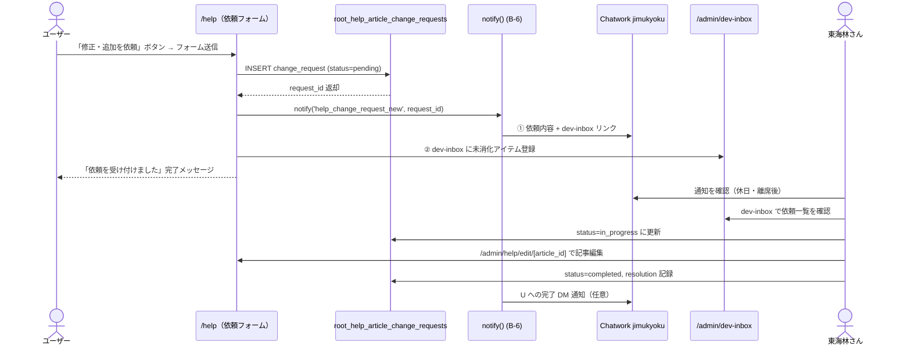

# Root Help: Garden ヘルプモジュール 仕様書

- 対象: Garden 内蔵ヘルプシステム（独立 `/help` + モジュール固有 `/<module>/help` ハイブリッド）
- 見積: **3.0d**（W1〜W9 合計、§14 参照）
- 担当セッション: a-root
- 作成: 2026-04-26（a-root / Phase D-E 先行 spec）
- 根拠: `C:\garden\_shared\decisions\spec-revision-followups-20260426.md` §3.1
- 前提 spec: `docs/specs/2026-04-25-root-phase-b-06-notification-platform.md`（通知基盤 B-6）
- **改訂: 2026-04-26** — `decisions-pending-batch-20260426.md` Cat 2 全 7 件反映（#10 編集禁止化・#14 dev-inbox 拡張）

---

## 0. 確定事項（2026-04-26 a-main 007 東海林承認済 - Cat 2 ヘルプモジュール 7 件）

本 spec は `C:\garden\_shared\decisions\decisions-pending-batch-20260426.md` の **Cat 2** 確定事項を反映する。

### Cat 2 確定 7 件（#10 修正 + #14 拡張 + 5 件 OK）

| # | 確定 | 内容 | 反映先 |
|---|---|---|---|
| 9 | C | ヘルプ配置 = ハイブリッド（独立 `/help` + 各モジュール `/<module>/help`）| §1 / §5 ルーティング（既存通り） |
| **10** | **修正** | ヘルプ編集権限 = **誰も直接編集しない**（admin / manager / super_admin 含む）。責任者以上は **コメント追加レベル** のみ。編集は **「開発者依頼ボタン」経由で東海林さんに集約** | §1 / §3 / §6 / §7 / §8 / §13 大幅変更 |
| 11 | A | 検索 = Postgres FTS（外部サービス不要、Algolia 不採用）| §10 |
| 12 | A | 動画 = Supabase Storage | §11 |
| 13 | A | 多言語 = 当面日本語、将来 i18n 構造のみ準備 | §15 判断保留解消（判5） |
| **14** | **拡張** | 問い合わせ送信先 = Chatwork 通知（休日・離席時用）+ **Garden 内 開発者ページに一覧集約**（消化型） | §12 お問い合わせフロー 拡張 |
| 15 | A | ヘルプ閲覧 = 権限と完全連動（has_permission_v2 流用、既定維持）| §3 / §8 RLS（既存通り） |

### 重要修正（#10）の趣旨

- 通常運用：ヘルプ記事は **誰も直接編集しない**（admin / manager / super_admin 含む）
- 責任者以上（manager / admin / super_admin）：**コメント追加** のみ可
- 改善・修正提案：**「開発者依頼ボタン」をクリック → 東海林さんへ集約**
- 理由：ヘルプ品質の管理が分散すると東海林さんが追えなくなるのを避ける

### 重要拡張（#14）の趣旨

```
社員がヘルプから「分からない」「修正してほしい」を送信
   ↓ ① Chatwork 事務局ルームに通知（休日・離席時用、即時把握）
   ↓ ② Garden 内 開発者ページに「未消化リスト」として登録
   ↓
東海林さんが作業時、開発者ページの一覧で 1 件ずつ消化
```

---

## 1. 目的とスコープ

### 目的

Garden 全体に KING OF TIME 風のオンラインヘルプを内蔵し、  
従業員・スタッフが操作に迷ったときにアプリ内で即座に解決できる体験を提供する。  
現在は README.md や `docs/operations/` でテキスト代替しているが、  
**Phase D-E の本格実装**でユーザー向けの UX に昇格させる。

### 含める

- 独立モジュール `Garden Help`（パス: `/help`）— 全モジュール横断の総合ヘルプ
- モジュール固有ヘルプ（`/<module>/help`）— 同一テーブルを module 列で絞り込み
- コンテンツ構造 5 カテゴリ（基本ガイド / 機能別ガイド / FAQ / 最新情報 / お問い合わせ）
- 権限連動による可視範囲制御（既存 `has_permission_v2` 流用）
- Postgres FTS（全文検索）+ おすすめキーワード
- **コメント追加機能**（責任者以上 = manager / admin / super_admin が記事にコメントを追加可）
- **「開発者依頼ボタン」**（全ユーザーが記事への修正・追加依頼を東海林さんに送信可）
- 公開ワークフロー（draft → published）— **東海林さん専任** で実施
- 動画マニュアル（Supabase Storage、段階的 R2 移行設計）
- 更新履歴テーブル（誰がいつ何を変えたか）
- お問い合わせフォーム（Chatwork 通知 + Garden 内開発者ページへの 2 経路同時通知）

### 含めない

- Algolia 等外部全文検索 SaaS（#11 により Postgres FTS で確定）
- 多言語（i18n）対応（#13 により当面日本語のみ、将来構造のみ準備）
- ヘルプチャットボット（AI 回答機能、将来拡張）
- 外部公開ヘルプサイト（内部専用、外部共有は別途検討）
- 初期コンテンツの執筆（本 spec 対象外、§16 で確認要）
- **リッチテキストエディタによる直接編集**（#10 により不採用 — admin / manager 含め誰も直接編集しない）

---

## 2. 既存実装との関係

### 2.1 現状の代替運用

| 代替手段 | 所在 | 内容 |
|---|---|---|
| README.md | リポジトリルート | モジュール概要・セットアップ手順 |
| `docs/operations/` | ドキュメントフォルダ | 運用手順書（現場向け）|
| CLAUDE.md | 各モジュールフォルダ | 開発者向け設計メモ |
| Chatwork チャンネル | 事務局システム | 口頭・チャット質問対応 |

**Phase D 着手まで**この代替運用を継続する。本 spec は設計確定のためのもので、  
Phase D 着手時に本 spec を起点に実装計画を策定する。

### 2.2 Root 既存テーブルとの依存関係

| 依存テーブル | 用途 |
|---|---|
| `auth.users` | 閲覧者・コメント者の識別 |
| `root_employees` | 記事コメント者の氏名表示、権限チェック |
| `root_roles` / `root_user_roles` | `has_permission_v2` によるアクセス制御 |
| `root_notification_channels` | お問い合わせ通知先チャネル（B-6 基盤）|
| `root_notification_subscriptions` | 管理者への inquiry 購読設定 |

### 2.3 B-6 通知基盤との関係

お問い合わせ受信・ステータス変更通知は B-6 (`root_notification_platform`) の  
`notify()` ヘルパー経由で Chatwork 送信する。  
専用 `chatwork-jimukyoku`（事務局ルーム）チャネルを `root_notification_channels` に登録する前提。

---

## 3. データモデル提案

### 3.1 `root_help_articles`（記事本体）

```sql
CREATE TABLE root_help_articles (
  article_id      bigserial PRIMARY KEY,
  slug            text UNIQUE NOT NULL,
    -- URL パス末尾。例: 'getting-started', 'tree-call-flow'
    -- 全体 /help/[category]/[slug]、モジュール /tree/help/[slug] で共用
  title           text NOT NULL,
  body_md         text NOT NULL DEFAULT '',       -- マークダウン本文
  excerpt         text,                            -- 検索結果プレビュー 200 文字程度
  category        text NOT NULL CHECK (category IN (
    'basic_guide',    -- 基本ガイド
    'feature_guide',  -- 機能別ガイド
    'faq',            -- よくある質問
    'news',           -- 最新情報
    'contact'         -- お問い合わせ（記事形式）
  )),
  module          text,
    -- NULL = 全モジュール共通
    -- 'tree' / 'soil' / 'leaf-kanden' / 'bud' / 'bloom' / 'forest' 等
  visibility      text NOT NULL DEFAULT 'draft'
    CHECK (visibility IN ('draft','review','published','archived')),
  tags            text[] NOT NULL DEFAULT '{}',
  attachments     jsonb NOT NULL DEFAULT '[]',
    -- [{type:'video'/'pdf'/'image', storage_path:text, name:text, size_bytes:int}]
  view_count      int NOT NULL DEFAULT 0,
  sort_order      int NOT NULL DEFAULT 0,          -- カテゴリ内表示順
  is_featured     boolean NOT NULL DEFAULT false,  -- カテゴリトップにピン留め
  published_at    timestamptz,
  created_by      uuid NOT NULL REFERENCES auth.users(id),
  updated_by      uuid NOT NULL REFERENCES auth.users(id),
  created_at      timestamptz NOT NULL DEFAULT now(),
  updated_at      timestamptz NOT NULL DEFAULT now(),

  -- 全文検索インデックス（日本語トークナイザ、pgroonga / pg_bigm 未導入時は簡易版）
  -- Note: 'japanese' は pg_bigm or pgroonga 必要。未導入時は 'simple' に降格。§10 参照
  search_vector   tsvector GENERATED ALWAYS AS (
    to_tsvector('simple',
      coalesce(title, '') || ' ' ||
      coalesce(body_md, '') || ' ' ||
      coalesce(excerpt, '') || ' ' ||
      array_to_string(tags, ' ')
    )
  ) STORED
);

-- 全文検索
CREATE INDEX root_help_articles_search_idx
  ON root_help_articles USING GIN (search_vector);

-- モジュール別 published 一覧（頻繁クエリ）
CREATE INDEX root_help_articles_module_vis_idx
  ON root_help_articles (module, visibility, sort_order)
  WHERE visibility = 'published';

-- カテゴリ別 published 一覧
CREATE INDEX root_help_articles_category_vis_idx
  ON root_help_articles (category, published_at DESC)
  WHERE visibility = 'published';
```

> **編集権限（#10 確定）**: INSERT / UPDATE / DELETE は **super_admin（東海林さん本人）のみ**。  
> admin / manager 含め他ロールは直接編集不可。コメント追加（§3.3）・依頼送信（§3.4）のみ可。

### 3.2 `root_help_articles_logs`（更新履歴）

```sql
CREATE TABLE root_help_articles_logs (
  log_id          bigserial PRIMARY KEY,
  article_id      bigint NOT NULL REFERENCES root_help_articles(article_id),
  changed_by      uuid NOT NULL REFERENCES auth.users(id),
  changed_at      timestamptz NOT NULL DEFAULT now(),
  change_type     text NOT NULL CHECK (change_type IN (
    'created', 'updated', 'published', 'archived', 'restored'
  )),
  before_content  jsonb,   -- {title, body_md, visibility, ...} スナップショット
  after_content   jsonb,   -- 同上
  change_summary  text     -- 「FAQ 追加」「typo 修正」等、東海林さんが入力
);

CREATE INDEX root_help_articles_logs_article_idx
  ON root_help_articles_logs (article_id, changed_at DESC);

-- 履歴は INSERT only（UPDATE / DELETE 禁止、RLS §8 で制御）
```

**Trigger 設計**  
`root_help_articles` の INSERT / UPDATE 時に自動 INSERT。  
`change_type` は `TG_OP` と `NEW.visibility` / `OLD.visibility` の差分で判定。

### 3.3 `root_help_article_comments`（コメント・内部メモ）

**#10 確定により新設**。manager / admin / super_admin が記事に対してコメントを追加できる。  
直接編集の代替として「改善提案メモ」「内容確認依頼」を記録する用途を想定。

```sql
CREATE TABLE root_help_article_comments (
  comment_id      bigserial PRIMARY KEY,
  article_id      bigint NOT NULL REFERENCES root_help_articles(article_id),
  commented_by    uuid NOT NULL REFERENCES auth.users(id),
  body_md         text NOT NULL,
  is_internal     boolean NOT NULL DEFAULT true,
    -- true = 編集者向けメモ（東海林さんのみ閲覧）
    -- false = 公開コメント（visibility に応じたロールが閲覧可）
  visibility      text NOT NULL DEFAULT 'manager_plus'
    CHECK (visibility IN ('public', 'manager_plus', 'admin_plus', 'super_admin_only')),
  created_at      timestamptz NOT NULL DEFAULT now(),
  updated_at      timestamptz NOT NULL DEFAULT now()
);

CREATE INDEX root_help_article_comments_article_idx
  ON root_help_article_comments (article_id, created_at DESC);
```

### 3.4 `root_help_article_change_requests`（開発者依頼）

**#10 確定により新設**。全ユーザーが「開発者依頼ボタン」経由で東海林さんに修正・追加依頼を送信する。  
依頼は §12 の 2 経路（Chatwork 通知 + Garden 内開発者ページ）に同時通知される。

```sql
CREATE TABLE root_help_article_change_requests (
  request_id      bigserial PRIMARY KEY,
  article_id      bigint REFERENCES root_help_articles(article_id),
    -- 既存記事への依頼時に設定。新記事依頼時は NULL
  target_slug     text,
    -- 新記事依頼時のパス候補（任意入力）
  requested_by    uuid NOT NULL REFERENCES auth.users(id),
  request_type    text NOT NULL CHECK (request_type IN (
    'typo_fix',       -- 誤字・脱字修正
    'content_update', -- 内容更新
    'new_article',    -- 新規記事追加
    'video_request',  -- 動画追加
    'other'           -- その他
  )),
  summary         text NOT NULL,         -- 依頼概要（1〜2 行）
  body_md         text,                  -- 詳細説明（任意）
  priority        text DEFAULT 'normal'
    CHECK (priority IN ('low', 'normal', 'high', 'urgent')),
  status          text NOT NULL DEFAULT 'pending'
    CHECK (status IN ('pending', 'reviewing', 'in_progress', 'completed', 'rejected')),
  assigned_to     uuid REFERENCES auth.users(id),
    -- 既定は東海林さん（super_admin）
  resolution      text,                  -- 完了時・却下時の対応内容メモ
  completed_at    timestamptz,
  created_at      timestamptz NOT NULL DEFAULT now(),
  updated_at      timestamptz NOT NULL DEFAULT now()
);

CREATE INDEX root_help_article_change_requests_status_idx
  ON root_help_article_change_requests (status, created_at DESC)
  WHERE status IN ('pending', 'reviewing', 'in_progress');

CREATE INDEX root_help_article_change_requests_article_idx
  ON root_help_article_change_requests (article_id, created_at DESC);
```

### 3.5 `root_help_inquiries`（一般お問い合わせ）

```sql
CREATE TABLE root_help_inquiries (
  inquiry_id      bigserial PRIMARY KEY,
  inquired_by     uuid NOT NULL REFERENCES auth.users(id),
  inquired_at     timestamptz NOT NULL DEFAULT now(),
  module          text,                -- 関連モジュール（NULL = 全般）
  category        text NOT NULL CHECK (category IN (
    'how_to',         -- 使い方
    'bug_report',     -- 不具合報告
    'feature_request',-- 機能要望
    'other'           -- その他
  )),
  subject         text NOT NULL,
  body            text NOT NULL,
  status          text NOT NULL DEFAULT 'pending'
    CHECK (status IN ('pending', 'in_progress', 'responded', 'closed')),
  responded_by    uuid REFERENCES auth.users(id),
  responded_at    timestamptz,
  response_body   text,
  related_article_id bigint REFERENCES root_help_articles(article_id),
  created_at      timestamptz NOT NULL DEFAULT now(),
  updated_at      timestamptz NOT NULL DEFAULT now()
);

CREATE INDEX root_help_inquiries_status_idx
  ON root_help_inquiries (status, inquired_at DESC)
  WHERE status IN ('pending', 'in_progress');
```

> **#14 確定**：問い合わせ送信時は Chatwork 事務局ルームへの通知 + Garden 内開発者ページへの登録を  
> 同時実施する。詳細は §12 参照。

### 3.6 `root_help_categories`（カテゴリマスタ・表示順制御）

```sql
CREATE TABLE root_help_categories (
  category_key    text PRIMARY KEY,    -- 'basic_guide' 等（articles.category と一致）
  label_ja        text NOT NULL,       -- '基本ガイド'
  label_en        text,
  icon            text,                -- Lucide icon 名（例: 'BookOpen'）
  sort_order      int NOT NULL DEFAULT 0,
  description_ja  text,
  is_active       boolean NOT NULL DEFAULT true
);

-- 初期データ
INSERT INTO root_help_categories (category_key, label_ja, icon, sort_order) VALUES
  ('basic_guide',   '基本ガイド',     'BookOpen',      10),
  ('feature_guide', '機能別ガイド',   'LayoutGrid',    20),
  ('faq',           'よくある質問',   'HelpCircle',    30),
  ('news',          '最新情報',       'Newspaper',     40),
  ('contact',       'お問い合わせ',   'MessageSquare', 50);
```

### 3.7 `root_help_search_keywords`（検索キーワード集計）

```sql
CREATE TABLE root_help_search_keywords (
  keyword_id      bigserial PRIMARY KEY,
  keyword         text NOT NULL,
  searched_at     timestamptz NOT NULL DEFAULT now(),
  searched_by     uuid REFERENCES auth.users(id),
  module_context  text,                -- 検索時の現在モジュール（ /tree/help で検索 → 'tree'）
  result_count    int NOT NULL DEFAULT 0
);

CREATE INDEX root_help_search_keywords_keyword_idx
  ON root_help_search_keywords (keyword, searched_at DESC);

-- おすすめキーワード集計 VIEW（上位 10 件）
CREATE OR REPLACE VIEW root_help_recommended_keywords AS
SELECT
  keyword,
  count(*)           AS search_count,
  max(searched_at)   AS last_searched_at
FROM root_help_search_keywords
WHERE searched_at >= now() - interval '30 days'
GROUP BY keyword
ORDER BY search_count DESC
LIMIT 10;
```

---

## 4. データフロー

```mermaid
flowchart TB
    subgraph 編集フロー（東海林さん専任）
        A[東海林さんが記事作成] --> B[visibility = draft]
        B --> C{公開準備完了?}
        C -->|作業中| B
        C -->|公開| F[visibility = published]
        F --> G[published_at 設定]
        G --> H[Trigger: root_help_articles_logs 挿入]
    end

    subgraph コメント・依頼フロー（manager+ / 全員）
        I[manager+ がコメント追加ボタン] --> J[root_help_article_comments INSERT]
        K[誰でも：開発者依頼ボタン] --> L[root_help_article_change_requests INSERT]
        L --> M[① Chatwork 事務局ルームに通知]
        L --> N[② Garden 内 /admin/dev-inbox に登録]
    end

    subgraph 閲覧フロー
        O[ユーザーがヘルプ画面表示] --> P{has_permission_v2?}
        P -->|NG| Q[非表示 / 403]
        P -->|OK| R[root_help_articles SELECT\n module + visibility = published]
        R --> S[記事一覧 / 詳細表示]
        S --> T[view_count++ 非同期更新]
    end

    subgraph 検索フロー
        U[キーワード入力] --> V[root_help_search_keywords INSERT]
        V --> W[FTS: search_vector @@ plainto_tsquery]
        W --> X[検索結果一覧 + おすすめキーワード表示]
    end

    subgraph お問い合わせフロー
        Y[ユーザーがフォーム送信] --> Z[root_help_inquiries INSERT]
        Z --> AA[notify() → Chatwork chatwork-jimukyoku ルーム]
        Z --> AB[/admin/dev-inbox に登録]
        AA --> AC[東海林さんが pending → in_progress → responded]
        AC --> AD[response_body 入力 → Chatwork DM 返信]
    end
```

---

## 5. ルーティング設計

```
/help                                    総合ヘルプトップ
                                          カテゴリカード + 検索バー + 最新情報
/help/search?q=...                       全文検索結果一覧
/help/[category]                         カテゴリ別記事一覧
                                          例: /help/basic_guide
/help/[category]/[slug]                  個別記事詳細

--- モジュール固有 ---
/tree/help                               Tree 専用ヘルプ（module='tree' で絞込）
/tree/help/[slug]                        Tree 個別記事
/soil/help                               Soil 専用ヘルプ
/soil/help/[slug]
/leaf/kanden/help                        Leaf 関電専用（module='leaf-kanden'）
/leaf/kanden/help/[slug]
/bud/help                                Bud 専用ヘルプ
/bud/help/[slug]
/bloom/help                              Bloom 専用ヘルプ
/bloom/help/[slug]
/forest/help                             Forest 専用ヘルプ
/forest/help/[slug]

--- 管理（東海林さん専用） ---
/admin/help                              記事管理一覧（super_admin のみ）
/admin/help/new                          新規記事作成（super_admin のみ）
/admin/help/edit/[article_id]            記事編集（super_admin のみ）
/admin/help/change-requests              依頼一覧（super_admin のみ。/admin/dev-inbox と連携）
/admin/dev-inbox                         Garden 内開発者ページ（別 spec 参照）
```

**Next.js App Router 対応**

```
src/app/
  (help)/
    help/
      page.tsx                  総合トップ
      search/page.tsx           検索結果
      [category]/
        page.tsx                カテゴリ一覧
        [slug]/page.tsx         記事詳細（コメント欄 + 依頼ボタン付き）
    [module]/
      help/
        page.tsx                モジュール固有トップ（動的ルート）
        [slug]/page.tsx
  admin/
    help/
      page.tsx                  記事管理（super_admin only）
      new/page.tsx
      edit/[article_id]/page.tsx
      change-requests/page.tsx
    dev-inbox/
      page.tsx                  開発者ページ（別 spec 参照）
```

---

## 6. UI 設計（ASCII ワイヤーフレーム）

### 6.1 総合ヘルプトップ `/help`

```
┌─────────────────────────────────────────────────────────┐
│  🌿 Garden ヘルプ                [管理: 東海林さん専用]  │
│                                                           │
│  ┌─────────────────────────────────────────────────────┐ │
│  │  🔍  キーワードで検索...                             │ │
│  └─────────────────────────────────────────────────────┘ │
│  よく検索されるキーワード: [ログイン] [給与明細] [架電] … │
│                                                           │
│  ┌──────────┐ ┌──────────┐ ┌──────────┐ ┌──────────┐   │
│  │📖 基本   │ │🗂 機能別 │ │❓ FAQ   │ │📰 最新  │   │
│  │ガイド    │ │ガイド    │ │         │ │情報     │   │
│  │ 12 記事  │ │ 24 記事  │ │ 18 記事 │ │  8 記事 │   │
│  └──────────┘ └──────────┘ └──────────┘ └──────────┘   │
│                                                           │
│  ✉ お問い合わせ                                          │
│                                                           │
│  ━━ 最新情報 ━━━━━━━━━━━━━━━━━━━━━━━━━━━━━━━━━━━         │
│  🆕 2026-04-25  Tree v2.1 リリースノート                 │
│     2026-04-20  メンテナンス完了のお知らせ               │
└─────────────────────────────────────────────────────────┘
```

### 6.2 記事詳細ページ（#10 改訂版）

記事本文下部に **「コメント追加」ボタン**（manager+）と **「修正・追加を依頼」ボタン**（全ユーザー）を配置。  
**直接編集ボタンは表示しない**（super_admin の編集は /admin/help/edit/[article_id] の専用画面のみ）。

```
┌─────────────────────────────────────────────────────────┐
│ ← 戻る    FAQ > ログインできない場合の対処               │
│                                                           │
│  # ログインできない場合の対処                    🆕 NEW  │
│  最終更新: 2026-04-24 by 東海林美琴                      │
│  ─────────────────────────────────────────────────────   │
│  [記事本文 マークダウン描画]                              │
│                                                           │
│  [動画: パスワードリセット手順]                          │
│  ▶ ─────────────────────────────────── 03:24             │
│                                                           │
│  ─────────────────────────────────────────────────────   │
│  この記事は役に立ちましたか?  [👍 はい] [👎 いいえ]      │
│                                                           │
│  ─────────────────────────────────────────────────────   │
│  [💬 コメントを追加]（manager 以上のみ表示）             │
│  [🔧 修正・追加を依頼]（全ユーザーに表示）              │
│                                                           │
│  ━━ 関連記事 ━━━━━━━━━━━━━━━━━━━━━━━━━━━                  │
│  • 初回ログイン手順                                       │
│  • パスワード変更方法                                     │
└─────────────────────────────────────────────────────────┘
```

### 6.3 記事編集 UI（東海林さん専用 `/admin/help/edit/[article_id]`）

**super_admin のみアクセス可**。他ロールへの導線は一切表示しない。

```
┌─────────────────────────────────────────────────────────┐
│  記事編集（東海林さん専用）       [draft] → [published] │
│  ─────────────────────────────────────────────────────   │
│  タイトル: [ログインできない場合の対処              ]    │
│  カテゴリ: [FAQ ▼]  モジュール: [共通 ▼]               │
│  タグ:     [ログイン] [パスワード] [+追加]              │
│                                                           │
│  ┌───────────── エディタ ──────────────────────────────┐ │
│  │ **B** _I_ ~~S~~  H1 H2  リスト  引用  コード  動画  │ │
│  │─────────────────────────────────────────────────────│ │
│  │ ## ログインできない主な原因                         │ │
│  │                                                     │ │
│  │ 1. パスワードが違う                                │ │
│  │ 2. ...                                              │ │
│  └─────────────────────────────────────────────────────┘ │
│                                                           │
│  ┌───────── プレビュー ────────────────────────────────┐ │
│  │ ## ログインできない主な原因                         │ │
│  │ 1. パスワードが違う                                │ │
│  └─────────────────────────────────────────────────────┘ │
│                                                           │
│  変更サマリ: [typo 修正               ]  [下書き保存]    │
│                                            [公開する]    │
│  ─────────────────────────────────────────────────────   │
│  ━━ 受信した依頼コメント ━━━━━━━━━━━━━━━━━━━━━━━━━━━━━━━   │
│  [鈴木] 2026-04-25: ステップ3 のスクショが古いです       │
│  [request_id: 42] typo_fix: 「ステップ3」→「ステップ 3」│
└─────────────────────────────────────────────────────────┘
```

### 6.4 「修正・追加を依頼」フォーム（モーダル）

全ユーザー向け。送信後 Chatwork + dev-inbox の両方に通知。

```
┌─────────────────────────────────────────────────────────┐
│  🔧 修正・追加を依頼                                 ✕  │
│  ─────────────────────────────────────────────────────   │
│  対象記事: ログインできない場合の対処（FAQ）             │
│                                                           │
│  依頼種別: ○ 誤字・脱字修正   ○ 内容更新   ○ 動画追加   │
│           ○ 新規記事追加     ● その他                   │
│                                                           │
│  概要（必須）: [スクショが 2025 年版で古い             ] │
│                                                           │
│  詳細（任意）:                                           │
│  [ステップ3 の画面が古いバージョンです。                 │
│   現行バージョンでは「設定」ボタンの位置が...           ]│
│                                                           │
│  優先度: ○ 低  ● 通常  ○ 高  ○ 急ぎ                    │
│                                                           │
│           [キャンセル]  [依頼を送信]                     │
└─────────────────────────────────────────────────────────┘
```

---

## 7. API / Server Action 契約

### 7.1 記事 CRUD（super_admin のみ）

```typescript
// src/app/(help)/actions/articles.ts

getHelpArticles(params: { module?: string|null; category?: string;
  visibility?: string; limit?: number; offset?: number })
  → Promise<{ articles: HelpArticle[]; total: number }>

getHelpArticleBySlug(params: { slug: string; module?: string })
  → Promise<HelpArticle | null>

// 以下は super_admin のみ実行可（アプリ層 + RLS 二重チェック）
createHelpArticle(params: { title; body_md; excerpt?; category: HelpCategory;
  module?; tags?; attachments?; visibility?: 'draft'|'review'; sort_order? })
  → Promise<{ article_id: number; slug: string }>

updateHelpArticle(params: { article_id: number;
  patch: Partial<Pick<HelpArticle, 'title'|'body_md'|'excerpt'|'visibility'|
    'tags'|'attachments'|'sort_order'|'is_featured'>>;
  change_summary?: string })
  → Promise<{ updated: boolean }>

publishHelpArticle(params: { article_id: number })
  → Promise<{ published_at: string }>

archiveHelpArticle(params: { article_id: number })
  → Promise<{ archived: boolean }>
```

### 7.2 検索

```typescript
searchHelpArticles(params: { query: string; module?: string;
  category?: string; limit?: number })           // default limit: 20
  → Promise<{ results: Array<{ article_id; slug; title; excerpt; category;
      module: string|null; published_at; rank: number }>;
    total: number }>

getRecommendedKeywords(params?: { module?: string; limit?: number })
  → Promise<Array<{ keyword: string; search_count: number }>>
```

### 7.3 コメント追加（manager+ のみ）

```typescript
// #10 確定により新設
addArticleComment(params: {
  article_id: number;
  body_md: string;
  visibility?: 'public' | 'manager_plus' | 'admin_plus' | 'super_admin_only';
  // default: 'manager_plus'
})
  → Promise<{ comment_id: number }>

getArticleComments(params: { article_id: number })
  → Promise<Array<{ comment_id; commented_by_name; body_md;
      visibility; is_internal; created_at }>>
```

### 7.4 開発者依頼送信（全ユーザー）

```typescript
// #10 確定により新設
submitChangeRequest(params: {
  article_id?: number;          // 既存記事への依頼（任意）
  target_slug?: string;          // 新記事の依頼時のパス候補（任意）
  request_type: ChangeRequestType;
  summary: string;
  body_md?: string;
  priority?: 'low' | 'normal' | 'high' | 'urgent';
})
  → Promise<{ request_id: number; message: string }>
  // 送信後、自動で Chatwork 通知 + dev-inbox 登録を実行

// super_admin（東海林さん）が依頼を消化
updateChangeRequestStatus(params: {
  request_id: number;
  status: 'reviewing' | 'in_progress' | 'completed' | 'rejected';
  resolution?: string;
})
  → Promise<{ updated: boolean }>
```

### 7.5 お問い合わせ送信

```typescript
submitHelpInquiry(params: { module?; category: InquiryCategory;
  subject; body; related_article_id?: number })
  → Promise<{ inquiry_id: number; message: string }>
  // 送信後、自動で Chatwork 通知 + dev-inbox 登録を実行

respondToInquiry(params: { inquiry_id: number; response_body: string;
  status: 'responded'|'closed' })
  → Promise<{ updated: boolean }>
```

### 7.6 更新履歴取得

```typescript
getArticleHistory(params: { article_id: number; limit?: number })
  → Promise<Array<{ log_id; changed_by_name; changed_at;
      change_type; change_summary: string|null }>>
```

---

## 8. RLS ポリシー

### 8.1 `root_help_articles`

```sql
ALTER TABLE root_help_articles ENABLE ROW LEVEL SECURITY;

-- SELECT: published は全認証ユーザー。draft/review は作成者 or super_admin のみ
CREATE POLICY help_articles_select ON root_help_articles FOR SELECT USING (
  auth.uid() IS NOT NULL AND (
    visibility = 'published'
    OR created_by = auth.uid()
    OR has_permission_v2(auth.uid(), 'help', 'super_manage')  -- super_admin のみ
  )
);

-- INSERT / UPDATE / DELETE: super_admin（東海林さん）のみ
-- #10 確定: admin / manager の直接編集を禁止
CREATE POLICY help_articles_insert ON root_help_articles
  FOR INSERT WITH CHECK (has_permission_v2(auth.uid(), 'help', 'super_manage'));
CREATE POLICY help_articles_update ON root_help_articles
  FOR UPDATE USING   (has_permission_v2(auth.uid(), 'help', 'super_manage'))
  WITH CHECK         (has_permission_v2(auth.uid(), 'help', 'super_manage'));
CREATE POLICY help_articles_delete ON root_help_articles
  FOR DELETE USING   (has_permission_v2(auth.uid(), 'help', 'super_manage'));
```

### 8.2 `root_help_articles_logs`

```sql
ALTER TABLE root_help_articles_logs ENABLE ROW LEVEL SECURITY;
-- SELECT: super_admin または自分が変更した行
CREATE POLICY help_logs_select ON root_help_articles_logs FOR SELECT USING (
  has_permission_v2(auth.uid(), 'help', 'super_manage') OR changed_by = auth.uid()
);
-- INSERT: Trigger（SECURITY DEFINER 関数）のみ。一般ユーザーは禁止
CREATE POLICY help_logs_insert ON root_help_articles_logs FOR INSERT WITH CHECK (false);
-- UPDATE / DELETE: 禁止（監査ログ改ざん防止）
```

### 8.3 `root_help_article_comments`（#10 新設）

```sql
ALTER TABLE root_help_article_comments ENABLE ROW LEVEL SECURITY;

-- SELECT: visibility に応じてフィルタ
CREATE POLICY help_comments_select ON root_help_article_comments FOR SELECT USING (
  auth.uid() IS NOT NULL AND (
    has_permission_v2(auth.uid(), 'help', 'super_manage')   -- super_admin: 全件
    OR (visibility = 'admin_plus'
        AND has_permission_v2(auth.uid(), 'help', 'admin'))
    OR (visibility = 'manager_plus'
        AND has_permission_v2(auth.uid(), 'help', 'manage'))
    OR (visibility = 'public')
    OR commented_by = auth.uid()
  )
);

-- INSERT: manager 以上
CREATE POLICY help_comments_insert ON root_help_article_comments
  FOR INSERT WITH CHECK (has_permission_v2(auth.uid(), 'help', 'manage'));

-- UPDATE / DELETE: 自分のコメントのみ（super_admin は全件）
CREATE POLICY help_comments_update ON root_help_article_comments
  FOR UPDATE USING (
    commented_by = auth.uid()
    OR has_permission_v2(auth.uid(), 'help', 'super_manage')
  );
```

### 8.4 `root_help_article_change_requests`（#10 新設）

```sql
ALTER TABLE root_help_article_change_requests ENABLE ROW LEVEL SECURITY;

-- INSERT: 全認証ユーザー
CREATE POLICY help_change_requests_insert ON root_help_article_change_requests
  FOR INSERT WITH CHECK (auth.uid() IS NOT NULL);

-- SELECT: 自分の依頼 + super_admin（担当者含む）
CREATE POLICY help_change_requests_select ON root_help_article_change_requests
  FOR SELECT USING (
    requested_by = auth.uid()
    OR assigned_to = auth.uid()
    OR has_permission_v2(auth.uid(), 'help', 'super_manage')
  );

-- UPDATE: super_admin（東海林さん）が消化処理
CREATE POLICY help_change_requests_update ON root_help_article_change_requests
  FOR UPDATE USING (has_permission_v2(auth.uid(), 'help', 'super_manage'));
```

### 8.5 `root_help_inquiries`

```sql
ALTER TABLE root_help_inquiries ENABLE ROW LEVEL SECURITY;
-- SELECT: 自分の inquiry + super_admin
CREATE POLICY help_inquiries_select ON root_help_inquiries FOR SELECT USING (
  inquired_by = auth.uid() OR has_permission_v2(auth.uid(), 'help', 'super_manage')
);
-- INSERT: 認証ユーザー全員
CREATE POLICY help_inquiries_insert ON root_help_inquiries
  FOR INSERT WITH CHECK (auth.uid() IS NOT NULL);
-- UPDATE: super_admin のみ（ステータス変更・回答記入）
CREATE POLICY help_inquiries_update ON root_help_inquiries
  FOR UPDATE USING (has_permission_v2(auth.uid(), 'help', 'super_manage'));
```

### 8.6 モジュール固有権限（アプリ層）

DB の RLS ではモジュール列の権限チェックまで行わず、アプリ層で `has_permission_v2` を呼び出す。

```typescript
// src/lib/help/permission.ts
export async function canViewModuleHelp(
  userId: string,
  module: string | null
): Promise<boolean> {
  if (!module) return true;  // 共通記事は誰でも可
  return await hasPermissionV2(userId, module, 'view');
}

// #10 確定: 記事編集は super_admin のみ
export async function canEditHelp(userId: string): Promise<boolean> {
  return await hasPermissionV2(userId, 'help', 'super_manage');
}

// #10 確定: コメント追加は manager 以上
export async function canCommentHelp(userId: string): Promise<boolean> {
  return await hasPermissionV2(userId, 'help', 'manage');
}
```

**ロール別権限まとめ（#10 確定版）**

| ロール | 共通記事閲覧 | モジュール記事閲覧 | 記事直接編集 | コメント追加 | 依頼送信 |
|---|---|---|---|---|---|
| toss | ✅ | Tree のみ | ❌ | ❌ | ✅ |
| closer | ✅ | Tree のみ | ❌ | ❌ | ✅ |
| cs | ✅ | Tree / Leaf 等 | ❌ | ❌ | ✅ |
| staff | ✅ | アクセス可モジュール | ❌ | ❌ | ✅ |
| manager | ✅ | 全アクセス可 | ❌ | ✅ | ✅ |
| admin | ✅ | 全件 | ❌ | ✅ | ✅ |
| super_admin（東海林さん）| ✅ | 全件 | ✅ | ✅ | ✅ |
| outsource（槙さん）| ✅ | Leaf 関電のみ | ❌ | ❌ | ✅ |

---

## 9. 他モジュールとの連携ポイント

### a-tree（Garden Tree）

- **ナビに `/tree/help` リンク追加**: Tree ヘッダナビまたはサイドバーに「ヘルプ」リンク
- **コメント権限**: Tree の manager+ は `module='tree'` 記事にコメント追加可
- **推奨コンテンツ**: 架電フロー手順 / トスアップ判定 / コールスクリプト基礎

### a-leaf（Garden Leaf）

- **関電専用**: `/leaf/kanden/help`（`module='leaf-kanden'`）
- **槙さん（outsource + leaf_kanden_module_owner）**: 関電ヘルプを閲覧・依頼送信可（直接編集不可）
- **推奨コンテンツ**: 案件登録手順 / 関電業務フロー / 入力規則

### a-bud（Garden Bud）

- **経理マニュアルの集約先**: `/bud/help` に振込手順 / 給与計算手順 / CC 明細取込手順
- **編集権限**: super_admin（東海林さん）のみ。金額影響が大きいため manager も編集不可
- **推奨コンテンツ**: 月次振込フロー / 給与明細の見方 / 年末調整手順

### a-bloom（Garden Bloom）

- **ヘルプ閲覧 KPI**: よく見られる記事・検索ワードを Bloom ダッシュボードで可視化
  - 連携元: `root_help_articles.view_count` / `root_help_recommended_keywords` VIEW
  - Bloom 側で定期 SELECT → ダッシュボード表示（Push 不要、Pull 型）
- **推奨コンテンツ**: 日報入力手順 / KPI の見方 / ダッシュボード操作ガイド

---

## 10. 検索エンジン詳細（Postgres FTS）

### 基本方針（#11 確定）

Garden 規模（記事数: 初期 50 件、安定後 200〜500 件）では  
**Postgres FTS で十分対応可能**。コスト・運用コストが最小。Algolia は不採用。

### FTS クエリ設計

```sql
-- 検索実行（Server Action 内）
SELECT
  article_id,
  slug,
  title,
  excerpt,
  category,
  module,
  published_at,
  ts_rank(search_vector, query) AS rank,
  ts_headline('simple', title || ' ' || coalesce(excerpt, ''), query,
    'MaxWords=15, MinWords=8, StartSel=<mark>, StopSel=</mark>'
  ) AS headline
FROM root_help_articles,
     plainto_tsquery('simple', $1) query
WHERE
  search_vector @@ query
  AND visibility = 'published'
  -- モジュール絞込（モジュール固有ヘルプの場合）
  AND ($2::text IS NULL OR module = $2 OR module IS NULL)
ORDER BY rank DESC, published_at DESC
LIMIT $3;
```

### 日本語対応

- **短期（Phase D-E 初期）**: `'simple'` 辞書（単語分割なし、前方一致 `like '%xxx%'` を併用）
- **中期**: `pg_bigm` 拡張 (`2-gram`) を Supabase で有効化し `'pg_bigm'` 辞書に移行
- **長期**: pgroonga（N-gram + 形態素解析）

### おすすめキーワード生成

```sql
-- 定期更新（Vercel Cron 日次 / または View 参照）
REFRESH MATERIALIZED VIEW CONCURRENTLY root_help_recommended_keywords;
```

MV が不要な規模であれば VIEW 直参照でも可（初期は VIEW、記事 200+ 件超で MV 移行）。

---

## 11. 動画マニュアル管理

### Supabase Storage バケット（#12 確定）

```
garden-help-videos/
  ├── common/                   共通ガイド動画
  │   ├── login-flow.mp4
  │   └── dashboard-overview.mp4
  ├── tree/                     Tree モジュール動画
  ├── bud/                      Bud モジュール動画
  ├── leaf-kanden/              Leaf 関電動画
  └── ...
```

バケットポリシー:
- **読取**: 認証ユーザー全員（`storage.authenticated` ポリシー）
- **書込**: `has_permission_v2(uid, 'help', 'super_manage')` のみ（東海林さん専任）

### 段階的ホスト方針

| フェーズ | 方針 | 補足 |
|---|---|---|
| Phase D-E 初期 | YouTube 限定公開 URL を attachments に記録 | コスト 0、Storage 不要 |
| Phase 中期 | Supabase Storage 自前ホスト（1GB 以内） | プレイヤー埋め込み `<video>` |
| Phase 後期 | Cloudflare R2 + CDN 配信 | Soil B-05 バックアップ戦略と統合 |

### 動画フォーマット

- コンテナ: MP4（H.264, AAC）
- 解像度: 720p（1280×720）推奨
- ビットレート: 1〜2 Mbps（5 分動画 ≈ 75〜150MB）
- サムネイル: JPEG（storage_path に `_thumb.jpg` サフィックス）

### 記事への埋め込み

東海林さんの編集 UI（`/admin/help/edit/[article_id]`）の「動画挿入」ボタンで Storage URL を自動挿入:

```markdown
<!-- help-video: garden-help-videos/tree/call-flow.mp4 -->
<video controls width="100%" poster="...">
  <source src="[Storage URL]" type="video/mp4" />
</video>
```

---

## 12. お問い合わせ・修正依頼フロー（#14 拡張）

ヘルプの問い合わせ・修正依頼は以下の **2 経路同時通知** で実施する。

### 12.1 経路 ① Chatwork 通知（即時把握用）

- 用途: 休日・離席時に東海林さんが即時把握できるようにする
- ルーム: `chatwork-jimukyoku`（事務局ルーム、Phase B-6 通知基盤の subscription 経由）
- 通知タイミング: 質問送信 / 修正依頼送信 と同時
- メッセージ例（B-6 template_key: `help_change_request_new`）:

```
[Garden Help 新規依頼] from {user_name}({employee_id})
種別: {request_type_label}
対象: {article_slug | '新規記事'}
概要: {summary}

→ Garden 内開発者ページで詳細確認:
  https://garden.example.com/admin/dev-inbox/{request_id}
```

### 12.2 経路 ② Garden 内 開発者ページ（消化型）

- 配置: `/admin/dev-inbox`（別途新規 spec `2026-04-26-root-developer-inbox.md` を起草）
- 用途: 東海林さんが作業時、未消化の問い合わせ・依頼を 1 件ずつ消化
- 機能:
  - 未消化リスト（status='pending' / 'reviewing' / 'in_progress'）
  - フィルタ（モジュール別、種別別、優先度別、依頼者別、日付範囲）
  - 詳細ページ（依頼内容、関連 article、添付、コメント追加、ステータス更新）
  - 消化済みアーカイブ
- 詳細仕様: 別 spec `2026-04-26-root-developer-inbox.md` 参照

### 12.3 問い合わせの分類と流れ先

旧 `root_help_inquiries` テーブルは段階的に以下に分離:

| 種別 | 内容 | 流れ先テーブル |
|---|---|---|
| ヘルプの「修正してほしい」 | 誤字・内容変更・動画追加 等 | `root_help_article_change_requests`（§3.4） |
| ヘルプの「分からない / 操作問い合わせ」 | 一般的な質問・操作不明 | `root_help_inquiries`（§3.5）|
| ヘルプ以外の「システム不具合・機能要望」 | バグ報告・機能追加 | `root_developer_inbox_items`（dev-inbox spec で定義）|

### 12.4 消化フロー

```
社員がヘルプから「分からない」「修正してほしい」を送信
   ↓ ① Chatwork 事務局ルームに通知（休日・離席時用、即時把握）
   ↓ ② Garden 内 /admin/dev-inbox に「未消化リスト」として登録
   ↓
東海林さんが作業時、開発者ページの一覧で 1 件ずつ消化
   - status を pending → reviewing → in_progress → completed へ進める
   - 必要に応じて /admin/help/edit/[article_id] で記事編集
   - 完了時、依頼者に Chatwork DM で通知
```



---

## 13. 受入基準

1. ✅ `/help` が表示され、5 カテゴリカードと検索バーが機能する
2. ✅ `root_help_articles` へ記事を INSERT し、`/help/[category]/[slug]` で閲覧できる
3. ✅ visibility が `published` の記事のみ一般ユーザーに表示される（draft/review は非表示）
4. ✅ FTS 検索でキーワード入力 → 関連記事が表示される（0 件の場合は「見つかりませんでした」）
5. ✅ `root_help_search_keywords` にキーワードが記録される
6. ✅ おすすめキーワード上位 10 件が検索バー下部に表示される
7. ✅ `/tree/help` が Tree ユーザーにのみ表示される（toss は Tree のみ、admin は全件）
8. ✅ **【#10 確定】** admin / manager が記事を直接編集しようとしても、編集画面へのアクセスが拒否される（RLS + アプリ層二重チェック）
9. ✅ **【#10 確定】** super_admin（東海林さん）は `/admin/help/edit/[article_id]` で記事を作成・編集・公開・アーカイブできる
10. ✅ **【#10 確定】** manager / admin が記事詳細ページで「コメントを追加」ボタンを使い、`root_help_article_comments` に登録できる
11. ✅ **【#10 確定】** 全ユーザーが「修正・追加を依頼」ボタンからフォームを送信でき、`root_help_article_change_requests` に登録される
12. ✅ **【#14 確定】** 依頼送信後、Chatwork 事務局ルームに通知が届く
13. ✅ **【#14 確定】** 依頼送信後、`/admin/dev-inbox` の未消化リストに表示される
14. ✅ 記事更新時に `root_help_articles_logs` へ Trigger 経由で履歴が記録される
15. ✅ 記事詳細ページ下部に「最終更新: YYYY-MM-DD by 東海林美琴」が表示される
16. ✅ 公開後 7 日以内の記事に 🆕 マーカーが表示される
17. ✅ お問い合わせフォームを送信すると `root_help_inquiries` に INSERT され、Chatwork に通知が届く
18. ✅ super_admin が inquiry のステータスを pending → responded に変更できる
19. ✅ **【#10 確定】** RLS: draft 記事は super_admin 以外に SELECT されない

---

## 14. 想定工数（内訳）

| # | 作業 | 工数 |
|---|---|---|
| W1 | 7 テーブル + index + RLS + FTS GIN migration（§3.1〜3.7 + §8） | 0.25d |
| W2 | ルーティング + 記事一覧 / 詳細ページ（/help + /[module]/help） | 0.5d |
| W3 | 東海林さん専用編集 UI（/admin/help 系）— super_admin only | 0.5d |
| W4 | Postgres FTS 検索 UI + おすすめキーワード表示 | 0.25d |
| W5 | お問い合わせフォーム + Chatwork 通知（B-6 連携）| 0.25d |
| W6 | 動画 Storage バケット + 埋め込み UI | 0.25d |
| W7 | 更新履歴 Trigger + 履歴表示 UI | 0.25d |
| W8 | モジュール固有 `/<module>/help` ルート展開（Tree / Soil / Leaf 等）| 0.25d |
| **W9** | **【#10 追加】コメント機能 + 開発者依頼フォーム + dev-inbox 連携** | **0.5d** |
| **合計** | | **3.0d**（旧 2.5d から +0.5d） |

> W3 が最重量。マークダウンエディタライブラリの選定（§15 判2）で 0.25〜0.5d 変動あり。  
> W9 は dev-inbox spec（別 spec）の実装と並行して進めること。

---

## 15. 判断保留

| # | 論点 | 状態 | 備考 |
|---|---|---|---|
| 判1 | 検索エンジン最終選定（Postgres FTS vs Algolia） | **✅ 確定（#11）** | Postgres FTS で確定。Algolia 不採用 |
| 判2 | マークダウンエディタ選定（@uiw/react-md-editor / Lexical / TipTap） | 保留 | **@uiw/react-md-editor** が暫定推奨。Garden 既存 npm 増やさない方針に沿う |
| 判3 | 動画ホスト（Supabase Storage 一択 vs YouTube 限定公開併用） | **✅ 確定（#12）** | Phase D-E 初期は YouTube 限定公開で負荷ゼロ。Storage 移行は Phase 後期 |
| 判4 | 編集権限の granularity（記事ごと / カテゴリごと / モジュールごと） | **✅ 確定（#10）** | 直接編集は super_admin のみ。記事・モジュール粒度は不問（全員不可） |
| 判5 | 多言語対応（i18n） | **✅ 確定（#13）** | 当面日本語。将来 i18n 構造のみ準備（Phase F 以降に実装） |
| 判6 | FTS 日本語辞書（'simple' / pg_bigm / pgroonga） | 保留 | **Phase D-E 初期は 'simple'**、pg_bigm は Supabase の拡張有効化を確認後 |
| 判7 | 閲覧フィードバック（役に立った? ボタン）のデータ活用方法 | 保留 | デザインは入れるが集計・KPI 活用は Phase F 以降 |

> 判断保留 5 件（判1 / 判3 / 判4 / 判5 / 当初保留 `Algolia`）が Cat 2 確定により **全件解消**。  
> 残保留 3 件（判2 / 判6 / 判7）は次フェーズで個別判断。

---

## 16. 未確認事項（東海林さん要ヒアリング）

| # | 未確認事項 |
|---|---|
| U1 | 初期コンテンツの提供元（誰が書く、いつまでに、優先モジュール順は？）|
| U2 | 「お問い合わせ」の対応 SLA（営業時間内 4h 返信等）|
| U3 | 動画マニュアルの想定本数（Phase D-E 初期、モジュール別でも可）|
| U4 | 法律基礎知識（労働法等）の出典・更新ポリシー（KoT 参考）|
| U5 | 「chatwork-jimukyoku」Chatwork ルーム ID（既存 or 新設？）|
| U6 | `pg_bigm` または `pgroonga` の Supabase プロジェクトへの追加可否（FTS 日本語精度に影響）|

---

## フェーズ感

- **実装は Phase D-E** で本格着手予定（§18 Garden 構築優先順位参照）
- **当面は README.md / `docs/operations/` で代替**（§2.1 参照）
- Phase B 期間中は本 spec のみで先行確定
- **Phase D 着手時**、本 spec を起点に実装計画（工数内訳 W1〜W9）を策定
- **dev-inbox spec**（`2026-04-26-root-developer-inbox.md`）と同時着手推奨

— end of Root Help Module spec —
