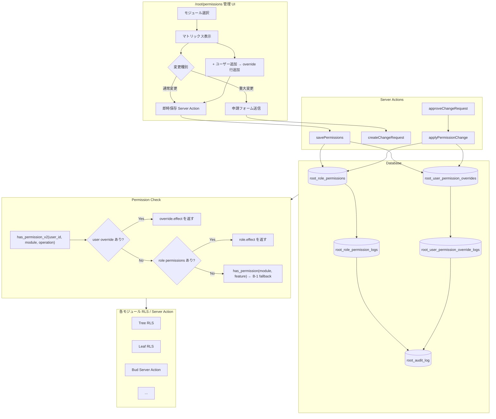

# Root Permissions Management UI: Kintone 風権限管理画面 仕様書

- 対象: Garden-Root の権限管理画面（root_role_permissions + root_user_permission_overrides + 管理 UI）
- 見積: **2.25d**（内訳は §12 参照）
- 担当セッション: a-root
- 作成: 2026-04-26（a-root / Phase B 新規 spec）
- 根拠: `C:\garden\_shared\decisions\spec-revision-followups-20260426.md` §3.2
- 前提 spec:
  - Phase B-1 spec: `docs/specs/2026-04-25-root-phase-b-01-permissions-matrix.md`
  - Phase 1 認証スキーマ: `scripts/root-auth-schema.sql`
  - Phase A-3-g outsource 拡張

---

## 1. 目的とスコープ

### 目的

Kintone の権限管理画面のように、**ロール単位の権限マトリックスと個人単位の例外 override を UI から直感的に操作できる管理基盤**を整備する。Phase B-1（`root_settings` = backend helper）は「どのロールが何を許可されているか」の論理設定を担うが、本 spec はその上に立ち、**運用者が実際に触れる管理 UI + 個別ユーザーへの例外付与 + 申請承認フロー**を設計する。

特に以下の課題を解決する:
- admin が「この人だけ特別に leaf-kanden を見られるようにしたい」を GUI 操作で即時設定できない
- 削除権限（論理/物理）を誰でも変更できてしまうリスク
- 重大権限変更の証跡・承認プロセスがない
- モジュール横断の権限状況を一覧できる画面がない

### Phase B-1 との住み分け（最重要）

| 観点 | Phase B-1（root_settings） | 本 spec（権限管理 UI） |
|---|---|---|
| **位置付け** | Backend helper / 論理基盤 | UI 駆動の運用基盤 |
| **対象** | `(module, feature, role)` 三項 PK で機能単位の on/off | `(role, module, operation)` 四軸 + ユーザー個別 override |
| **粒度** | feature_key ベース（`transfer_approve`, `case_edit` 等） | 操作種別ベース（view / create / update / soft_delete / hard_delete 等 8 値） |
| **変更方法** | `has_permission(module, feature)` を RLS から呼ぶ | UI マトリックス + override 行追加 |
| **実装時期** | Phase B（先行着手） | Phase D-E（B-1 完了後） |
| **関係** | 本 spec の `has_permission_v2()` は B-1 の `has_permission()` を fallback として呼ぶ |

**二重実装防止の設計原則**:
- `root_settings` は feature_key の粒度で継続稼働。廃止・置換しない
- `root_role_permissions` は operation 粒度（CRUD + ファイル + 管理）を管理
- `has_permission_v2()` の解決順序: ① user override → ② role permissions → ③ root_settings（B-1 fallback）
- Phase B-1 で登録済みの `settings_edit` / `master_edit` 等と本 spec の `app_admin` / `update` は**別軸の概念**として共存する

### 含める

- `root_role_permissions` テーブル設計（4 軸マトリックス）
- `root_user_permission_overrides` テーブル設計（個別 override）
- 変更履歴テーブル 2 本（role / user 別）
- `root_permission_change_requests` テーブル（申請承認）
- `has_permission_v2()` helper 関数（B-1 の `has_permission()` を override 対応で拡張）
- 管理 UI `/root/permissions`（Kintone 風マトリックス + 個別 override 表）
- 削除列ロック制約（super_admin のみ変更可）
- モジュール別編集権限（Tree のみ manager+ 編集可）
- 申請承認フロー（重大変更は admin 承認必須）

### 含めない

- Phase B-1 `root_settings` の変更・廃止
- 既存 RLS ポリシーの一括書き換え（各モジュール担当）
- 2FA / IP 制限等の認証強度変更（B-5 spec に委ねる）
- 監査ログ UI の詳細（B-2 spec 参照、本 spec では trigger による自動記録のみ）
- ロール自体の追加・削除（garden_role CHECK 制約は別 migration）

### フェーズ感

- **実装は Phase D-E で本格着手予定**
- **当面は spec のみ**
- **本 spec の実装着手前に Phase B-1 (`root_settings`) の完了が前提**

---

## 2. 既存実装との関係

### 2.1 Phase 1 整備済み（scripts/root-auth-schema.sql）

| 対象 | 内容 |
|---|---|
| `root_employees.garden_role` | text, 8 値 CHECK（toss/closer/cs/staff/outsource/manager/admin/super_admin）|
| `current_garden_role()` | 現ログインユーザーの role を返す SECURITY DEFINER 関数 |
| `root_is_super_admin()` | super_admin か否か |
| `root_audit_log` | 監査ログテーブル（actor / action / target / payload）|

### 2.2 Phase B-1 整備予定（先行実装）

| 対象 | 内容 |
|---|---|
| `root_settings` | `(module, feature, role)` → permission の三項関係テーブル |
| `has_permission(module, feature)` | ① root_settings 検索 → ② 従来関数 fallback の 2 段階 helper |
| RLS ポリシー | root_settings 自体の SELECT (manager+) / INSERT/UPDATE/DELETE (super_admin) |

### 2.3 8 ロールの確定値（Phase A-3-g より）

```
toss → closer → cs → staff → outsource → manager → admin → super_admin
```

### 2.4 本 spec が解決する追加課題

| 課題 | 現状（B-1 後） | 本 spec 後 |
|---|---|---|
| ユーザー個別例外 | 不可 | `root_user_permission_overrides` で対応 |
| 削除権限の誤変更リスク | root_settings の write = super_admin のみだが UI なし | 削除列専用ロック関数 + UI ロックアイコン |
| 重大変更の承認プロセス | なし | `root_permission_change_requests` + 申請承認フロー |
| operation 粒度の管理 | feature_key 粒度（B-1） | view / create / update / soft_delete / hard_delete / file_read / file_write / app_admin の 8 値 |

---

## 3. データモデル提案

### 3.1 `root_role_permissions` テーブル（4 軸マトリックス）

```sql
CREATE TABLE root_role_permissions (
  permission_id   bigserial       PRIMARY KEY,
  role            text            NOT NULL
    CHECK (role IN (
      'toss', 'closer', 'cs', 'staff', 'outsource',
      'manager', 'admin', 'super_admin'
    )),
  module          text            NOT NULL
    CHECK (module IN (
      'root', 'tree', 'soil', 'leaf', 'leaf-kanden', 'bud', 'bloom',
      'forest', 'rill', 'seed'
    )),
  operation       text            NOT NULL
    CHECK (operation IN (
      'view',         -- 閲覧
      'create',       -- 追加
      'update',       -- 編集
      'soft_delete',  -- 論理削除（deleted_at = now()、復元可）
      'hard_delete',  -- 物理削除（DB から完全消去、復元不可）
      'file_read',    -- ファイル読込（添付・PDF・画像のダウンロード）
      'file_write',   -- ファイル書出し（CSV エクスポート等）
      'app_admin'     -- アプリ管理（権限編集自体含む）
    )),
  effect          text            NOT NULL CHECK (effect IN ('allow', 'deny')),
  note            text,           -- 変更理由・管理者メモ
  updated_by      uuid            REFERENCES auth.users(id) ON DELETE SET NULL,
  created_at      timestamptz     NOT NULL DEFAULT now(),
  updated_at      timestamptz     NOT NULL DEFAULT now(),

  CONSTRAINT uq_role_module_op UNIQUE (role, module, operation)
);

COMMENT ON TABLE root_role_permissions IS
  'Kintone 風権限マトリックス。(role, module, operation) → effect の 4 軸関係。'
  'operation は CRUD + ファイル + 管理の 8 種。Phase B-1 の root_settings（feature_key 粒度）とは別軸で共存。';

-- インデックス
CREATE INDEX root_role_perm_role_module_idx ON root_role_permissions (role, module);
CREATE INDEX root_role_perm_module_op_idx   ON root_role_permissions (module, operation);
CREATE INDEX root_role_perm_updated_at_idx  ON root_role_permissions (updated_at DESC);
```

### 3.2 `root_user_permission_overrides` テーブル（個別 override）

```sql
CREATE TABLE root_user_permission_overrides (
  override_id     bigserial       PRIMARY KEY,
  user_id         uuid            NOT NULL REFERENCES auth.users(id) ON DELETE CASCADE,
  module          text            NOT NULL
    CHECK (module IN (
      'root', 'tree', 'soil', 'leaf', 'leaf-kanden', 'bud', 'bloom',
      'forest', 'rill', 'seed'
    )),
  operation       text            NOT NULL
    CHECK (operation IN (
      'view', 'create', 'update', 'soft_delete', 'hard_delete',
      'file_read', 'file_write', 'app_admin'
    )),
  effect          text            NOT NULL CHECK (effect IN ('allow', 'deny')),
  reason          text,           -- 例: '槙さん例外: leaf-kanden の閲覧'
  expires_at      timestamptz,    -- 有効期限（NULL = 無期限）
  created_by      uuid            REFERENCES auth.users(id) ON DELETE SET NULL,
  created_at      timestamptz     NOT NULL DEFAULT now(),
  updated_at      timestamptz     NOT NULL DEFAULT now(),

  CONSTRAINT uq_user_module_op UNIQUE (user_id, module, operation)
);

COMMENT ON TABLE root_user_permission_overrides IS
  'Kintone 風ユーザー個別 override。ロール権限より優先適用される。'
  '有効期限付き override で一時的な権限付与も可能（例: 外注先への期限付き閲覧権）。';

-- インデックス
CREATE INDEX root_user_perm_user_module_idx   ON root_user_permission_overrides (user_id, module);
CREATE INDEX root_user_perm_expires_at_idx    ON root_user_permission_overrides (expires_at)
  WHERE expires_at IS NOT NULL;
CREATE INDEX root_user_perm_created_by_idx    ON root_user_permission_overrides (created_by)
  WHERE created_by IS NOT NULL;
```

**Kintone 風「ユーザー / 組織 / グループ」の Garden での対応**:
- ユーザー個別: `user_id`（auth.users.id）ベース = 本テーブル
- 組織 / グループ相当: role（`root_employees.garden_role`）でカバー = `root_role_permissions`
- 将来拡張: `group_id` カラム追加でチーム単位 override も可能な設計余地を確保

### 3.3 `root_role_permission_logs` テーブル（ロール権限変更履歴）

```sql
CREATE TABLE root_role_permission_logs (
  log_id          bigserial       PRIMARY KEY,
  changed_by      uuid            REFERENCES auth.users(id) ON DELETE SET NULL,
  changed_at      timestamptz     NOT NULL DEFAULT now(),
  target_type     text            NOT NULL DEFAULT 'role',
  target_role     text            NOT NULL,
  module          text            NOT NULL,
  operation       text            NOT NULL,
  old_effect      text,           -- NULL = 新規追加
  new_effect      text,           -- NULL = 削除
  reason          text,
  request_id      bigint          REFERENCES root_permission_change_requests(request_id) ON DELETE SET NULL
);

COMMENT ON TABLE root_role_permission_logs IS
  'root_role_permissions の変更履歴。AFTER trigger で自動記録。';

CREATE INDEX root_role_perm_log_changed_at_idx ON root_role_permission_logs (changed_at DESC);
CREATE INDEX root_role_perm_log_module_idx     ON root_role_permission_logs (module, operation);
```

### 3.4 `root_user_permission_override_logs` テーブル（個別 override 変更履歴）

```sql
CREATE TABLE root_user_permission_override_logs (
  log_id          bigserial       PRIMARY KEY,
  changed_by      uuid            REFERENCES auth.users(id) ON DELETE SET NULL,
  changed_at      timestamptz     NOT NULL DEFAULT now(),
  target_type     text            NOT NULL DEFAULT 'user',
  target_user_id  uuid            REFERENCES auth.users(id) ON DELETE SET NULL,
  module          text            NOT NULL,
  operation       text            NOT NULL,
  old_effect      text,
  new_effect      text,
  reason          text,
  request_id      bigint          REFERENCES root_permission_change_requests(request_id) ON DELETE SET NULL
);

COMMENT ON TABLE root_user_permission_override_logs IS
  'root_user_permission_overrides の変更履歴。AFTER trigger で自動記録。';

CREATE INDEX root_user_perm_log_changed_at_idx ON root_user_permission_override_logs (changed_at DESC);
CREATE INDEX root_user_perm_log_user_idx       ON root_user_permission_override_logs (target_user_id);
```

### 3.5 `root_permission_change_requests` テーブル（申請承認）

```sql
CREATE TABLE root_permission_change_requests (
  request_id      bigserial       PRIMARY KEY,
  requested_by    uuid            NOT NULL REFERENCES auth.users(id) ON DELETE CASCADE,
  requested_at    timestamptz     NOT NULL DEFAULT now(),
  target_type     text            NOT NULL CHECK (target_type IN ('role', 'user')),
  target_role     text,           -- target_type = 'role' 時
  target_user_id  uuid            REFERENCES auth.users(id) ON DELETE CASCADE,  -- target_type = 'user' 時
  module          text            NOT NULL,
  operation       text            NOT NULL,
  requested_effect text           NOT NULL CHECK (requested_effect IN ('allow', 'deny')),
  reason          text            NOT NULL,  -- 申請理由（必須）
  severity        text            NOT NULL CHECK (severity IN ('critical', 'normal'))
    DEFAULT 'normal',
  status          text            NOT NULL DEFAULT 'pending'
    CHECK (status IN ('pending', 'approved', 'rejected', 'applied')),
  reviewed_by     uuid            REFERENCES auth.users(id) ON DELETE SET NULL,
  reviewed_at     timestamptz,
  review_comment  text,
  applied_at      timestamptz,    -- approved → applied 実行時刻
  expires_at      timestamptz,    -- override に有効期限を設ける場合
  created_at      timestamptz     NOT NULL DEFAULT now(),
  updated_at      timestamptz     NOT NULL DEFAULT now()
);

COMMENT ON TABLE root_permission_change_requests IS
  '権限変更の申請承認テーブル。重大変更（hard_delete 付与 / super_admin 昇格等）は admin 承認必須。'
  'approved → applied の自動適用は Server Action で実施。';

CREATE INDEX root_perm_req_status_idx      ON root_permission_change_requests (status, requested_at DESC);
CREATE INDEX root_perm_req_requested_by_idx ON root_permission_change_requests (requested_by);
```

### 3.6 `root_employees` 拡張（module_owner_flags）

```sql
-- Tree のみ manager+ が権限編集可にする設計
ALTER TABLE root_employees
  ADD COLUMN IF NOT EXISTS module_owner_flags jsonb DEFAULT '{}'::jsonb;

COMMENT ON COLUMN root_employees.module_owner_flags IS
  '例: {"tree": "owner"} で Tree モジュールの権限編集を manager+ に委譲。'
  '現状は tree のみ対象。将来は leaf-kanden, bud 等へ拡張可能。';

-- インデックス（JSON 検索）
CREATE INDEX root_employees_module_owner_idx
  ON root_employees USING gin(module_owner_flags);
```

---

## 4. データフロー



---

## 5. UI 設計

### 5.1 ページ構成

**URL**: `/root/permissions`（アクセス権限: `app_admin` 保有者 = 基本 super_admin、Tree のみ manager+）

#### 上部: モジュール選択 + ページヘッダ

```
┌─────────────────────────────────────────────────────────────────────────────────┐
│  権限管理                                                  [変更履歴] [?ヘルプ] │
│  モジュール: [Tree ▼]   編集者: super_admin のみ          [保存]                │
└─────────────────────────────────────────────────────────────────────────────────┘
```

モジュールドロップダウン選択肢:
`Root / Tree / Soil / Leaf（全体）/ Leaf-関電 / Bud / Bloom / Forest / Rill / Seed`

### 5.2 メイン: Kintone 風ロール × 操作 マトリックス

```
┌──────────────────────────────────────────────────────────────────────────────────────────┐
│  [Tree] ロール権限マトリックス                                                            │
│  このモジュールの編集権限: manager 以上（module_owner_flags による特例）                  │
├────────────┬──────┬──────┬──────┬────────────┬────────────┬──────────┬──────────┬────────┤
│ ロール     │ 閲覧 │ 追加 │ 編集 │ 削除(論理) │ 削除(物理) │ファイル読│ファイル書│ 管理   │
│            │ view │create│update│ soft_delete│ hard_delete│ file_read│file_write│app_adm │
├────────────┼──────┼──────┼──────┼────────────┼────────────┼──────────┼──────────┼────────┤
│ toss       │  ☑  │  ☑  │  ☐  │     ☐      │   🔒 ☐   │   ☑    │   ☐    │   ☐   │
│ closer     │  ☑  │  ☑  │  ☑  │     ☐      │   🔒 ☐   │   ☑    │   ☐    │   ☐   │
│ cs         │  ☑  │  ☐  │  ☑  │     ☐      │   🔒 ☐   │   ☑    │   ☐    │   ☐   │
│ staff      │  ☑  │  ☐  │  ☑  │     ☐      │   🔒 ☐   │   ☑    │   ☑    │   ☐   │
│ outsource  │  ☑  │  ☐  │  ☐  │     ☐      │   🔒 ☐   │   ☑    │   ☐    │   ☐   │
│ manager    │  ☑  │  ☑  │  ☑  │     ☑      │   🔒 ☐   │   ☑    │   ☑    │   ☑   │
│ admin      │  ☑  │  ☑  │  ☑  │     ☑      │   🔒 ☐   │   ☑    │   ☑    │   ☑   │
│ super_admin│  ☑  │  ☑  │  ☑  │     ☑      │   🔒 ☑   │   ☑    │   ☑    │   ☑   │
└────────────┴──────┴──────┴──────┴────────────┴────────────┴──────────┴──────────┴────────┘

  🔒 削除(論理) / 削除(物理) 列: super_admin のみ変更可
     他ロールはチェックボックスが非活性（クリック不可）、ホバー時に「変更には super_admin 権限が必要」ツールチップ
```

#### 凡例とインタラクション

- チェックボックス ON = `effect: 'allow'`、OFF = `effect: 'deny'`
- 変更したセルは背景色変更（変更前との差分を視覚化）
- 削除列（🔒）: super_admin のみ活性、他は disabled + 🔒 アイコン
- 重大変更（hard_delete を allow に変更）: 保存時に申請フロー起動

### 5.3 個別 override セクション

```
┌──────────────────────────────────────────────────────────────────────────────────────────┐
│  個別ユーザー override                                       [+ ユーザーを追加]           │
├──────────────────────────────────────────────────────────────────────────────────────────┤
│ ユーザー      │ロール    │ 閲覧 │ 追加 │ 編集 │ 削除(論理)│ 削除(物理)│ファイル│管理│有効期限│
├───────────────┼──────────┼──────┼──────┼──────┼───────────┼───────────┼────────┼────┼────────┤
│ 槙 友彦       │ outsource│  ☑  │  ☐  │  ☐  │    ☐     │  🔒 ☐   │   ☑   │ ☐ │ 無期限 │
│ (理由: 関電業 │          │      │      │      │           │           │        │    │        │
│  委託担当)    │          │      │      │      │           │           │        │    │        │
├───────────────┴──────────┴──────┴──────┴──────┴───────────┴───────────┴────────┴────┴────────┤
│  ＋ ユーザー検索（名前 / メール）                                                            │
│  [                               ] [検索]                                                    │
└──────────────────────────────────────────────────────────────────────────────────────────────┘
```

- 「+ ユーザーを追加」クリック → 検索モーダル（名前・メールアドレスで絞り込み）
- override 行にはロール（参照のみ）+ 各 operation チェック + 有効期限 + 理由テキスト
- 理由テキストは必須（空で保存不可）

### 5.4 変更履歴パネル

「変更履歴」ボタンクリックで右スライドパネル表示:

```
┌───────────────────────────────────────────────────┐
│  変更履歴 [Tree]                          [×閉じる]│
├───────────────────────────────────────────────────┤
│ 2026-04-26 14:32  東海林 美琴 (super_admin)       │
│   closer / soft_delete  deny → allow              │
│   理由: CS チームの削除権限を manager に開放       │
│                                                    │
│ 2026-04-25 10:15  東海林 美琴 (super_admin)       │
│   USER: 槙 友彦 / view  (新規追加)                │
│   理由: leaf-kanden 業務委託担当として閲覧権付与   │
│                                                    │
│   [さらに表示...]                                  │
└───────────────────────────────────────────────────┘
```

### 5.5 保存フロー（差分検出）

```
[保存] クリック
  ↓
変更差分を抽出（変更前後の比較）
  ↓
重大変更チェック（hard_delete の allow付与 / super_admin 昇格 / audit_log 権限変更）
  ↓
 通常変更のみ → 確認ダイアログ → 即時保存
 重大変更含む → 申請フォームを表示
               (理由必須入力 → admin に Chatwork 通知 → pending 状態で保留)
```

---

## 6. API / Server Action 契約

### 6.1 権限マトリックス読み取り

```typescript
// src/app/root/_actions/permissionsV2.ts

export type GardenOperation =
  'view' | 'create' | 'update' | 'soft_delete' | 'hard_delete' |
  'file_read' | 'file_write' | 'app_admin';

export type GardenModuleV2 =
  'root' | 'tree' | 'soil' | 'leaf' | 'leaf-kanden' | 'bud' |
  'bloom' | 'forest' | 'rill' | 'seed';

export type PermissionEffect = 'allow' | 'deny';

export interface RolePermissionRow {
  permissionId: number;
  role: GardenRole;
  module: GardenModuleV2;
  operation: GardenOperation;
  effect: PermissionEffect;
  note?: string;
  updatedAt: string;
}

export interface UserOverrideRow {
  overrideId: number;
  userId: string;
  userName: string;         // JOIN から
  userRole: GardenRole;     // JOIN から
  module: GardenModuleV2;
  operation: GardenOperation;
  effect: PermissionEffect;
  reason?: string;
  expiresAt?: string;
  createdBy?: string;
}

// モジュールの全ロール権限を取得（マトリックス UI 初期表示）
export async function getRolePermissions(
  module: GardenModuleV2
): Promise<RolePermissionRow[]>;

// モジュールの個別 override 一覧を取得
export async function getUserOverrides(
  module: GardenModuleV2
): Promise<UserOverrideRow[]>;

// 現ユーザーが対象 (module, operation) を実行可能か判定
export async function checkPermissionV2(
  module: GardenModuleV2,
  operation: GardenOperation
): Promise<boolean>;
```

### 6.2 一括保存（差分のみ INSERT/UPDATE）

```typescript
export async function saveRolePermissions(params: {
  module: GardenModuleV2;
  changes: Array<{
    role: GardenRole;
    operation: GardenOperation;
    effect: PermissionEffect;
    note?: string;
  }>;
}): Promise<{
  success: boolean;
  updatedCount: number;
  skippedAsCritical: Array<{ role: GardenRole; operation: GardenOperation }>;
  error?: string;
}>;
// - 重大変更（hard_delete allow / super_admin app_admin 等）は保存せず skippedAsCritical に返却
// - 差分のみ処理（既存と同じ effect は skip）
// - 失敗時は全件ロールバック
```

### 6.3 個別 override 追加 / 更新 / 削除

```typescript
export async function upsertUserOverride(params: {
  userId: string;
  module: GardenModuleV2;
  operation: GardenOperation;
  effect: PermissionEffect;
  reason: string;           // 必須
  expiresAt?: string;       // ISO 8601
}): Promise<{ success: boolean; overrideId?: number; error?: string }>;

export async function deleteUserOverride(params: {
  overrideId: number;
  reason: string;           // 削除理由（監査ログ用）
}): Promise<{ success: boolean; error?: string }>;
```

### 6.4 申請承認フロー

```typescript
// 申請作成（重大変更を申請者が提出）
export async function createChangeRequest(params: {
  targetType: 'role' | 'user';
  targetRole?: GardenRole;
  targetUserId?: string;
  module: GardenModuleV2;
  operation: GardenOperation;
  requestedEffect: PermissionEffect;
  reason: string;
  expiresAt?: string;
}): Promise<{ success: boolean; requestId?: number; error?: string }>;

// 申請一覧取得（admin 向け）
export async function getChangeRequests(params: {
  status?: 'pending' | 'approved' | 'rejected' | 'applied';
}): Promise<ChangeRequest[]>;

// 承認 / 却下（admin+ 専用）
export async function reviewChangeRequest(params: {
  requestId: number;
  action: 'approve' | 'reject';
  comment?: string;
}): Promise<{ success: boolean; error?: string }>;

// 承認後の自動適用（approve の直後に自動呼び出し）
export async function applyApprovedRequest(params: {
  requestId: number;
}): Promise<{ success: boolean; error?: string }>;
```

---

## 7. RLS ポリシー

### 7.1 `root_role_permissions` の RLS

```sql
ALTER TABLE root_role_permissions ENABLE ROW LEVEL SECURITY;

-- SELECT: manager 以上
CREATE POLICY rrp_select ON root_role_permissions FOR SELECT USING (root_can_access());

-- WRITE: super_admin + Tree 限定 manager+（module_owner_flags = {"tree": "owner"}）
-- NOTE: §7.4 の削除列ロック関数追加後、rrp_write ポリシーは再定義される
CREATE POLICY rrp_write ON root_role_permissions
  FOR ALL
  USING (
    root_is_super_admin()
    OR (module = 'tree' AND EXISTS (
      SELECT 1 FROM root_employees e
      WHERE e.auth_user_id = auth.uid()
        AND (e.garden_role)::text IN ('manager', 'admin', 'super_admin')
        AND (e.module_owner_flags->>'tree') = 'owner'
    ))
  )
  WITH CHECK (
    root_is_super_admin()
    OR (module = 'tree' AND EXISTS (
      SELECT 1 FROM root_employees e
      WHERE e.auth_user_id = auth.uid()
        AND (e.garden_role)::text IN ('manager', 'admin', 'super_admin')
        AND (e.module_owner_flags->>'tree') = 'owner'
    ))
  );
```

### 7.2 `root_user_permission_overrides` の RLS

```sql
ALTER TABLE root_user_permission_overrides ENABLE ROW LEVEL SECURITY;
-- SELECT: manager 以上
CREATE POLICY rupo_select ON root_user_permission_overrides FOR SELECT USING (root_can_access());
-- WRITE: admin 以上（override 付与は admin+ の操作）
CREATE POLICY rupo_write ON root_user_permission_overrides
  FOR ALL
  USING   (EXISTS (SELECT 1 FROM root_employees e WHERE e.auth_user_id = auth.uid() AND (e.garden_role)::text IN ('admin', 'super_admin')))
  WITH CHECK (EXISTS (SELECT 1 FROM root_employees e WHERE e.auth_user_id = auth.uid() AND (e.garden_role)::text IN ('admin', 'super_admin')));
```

### 7.3 `root_permission_change_requests` の RLS

```sql
ALTER TABLE root_permission_change_requests ENABLE ROW LEVEL SECURITY;
-- SELECT: 申請者本人 + admin 以上
CREATE POLICY rpcr_select ON root_permission_change_requests FOR SELECT
  USING (requested_by = auth.uid() OR EXISTS (SELECT 1 FROM root_employees e WHERE e.auth_user_id = auth.uid() AND (e.garden_role)::text IN ('admin', 'super_admin')));
-- INSERT: manager 以上が申請可
CREATE POLICY rpcr_insert ON root_permission_change_requests FOR INSERT WITH CHECK (root_can_access());
-- UPDATE（承認/却下）: admin 以上
CREATE POLICY rpcr_update ON root_permission_change_requests FOR UPDATE
  USING (EXISTS (SELECT 1 FROM root_employees e WHERE e.auth_user_id = auth.uid() AND (e.garden_role)::text IN ('admin', 'super_admin')));
```

### 7.4 削除列ロック制約関数

`operation IN ('soft_delete', 'hard_delete')` の行を変更できるのは super_admin のみ。
RLS ポリシー内に組み込むことで DB レベルで強制する:

```sql
-- 削除列ロック専用ポリシー（rrp_write より厳格なチェックを WITH CHECK で追加）
CREATE OR REPLACE FUNCTION is_delete_operation_change_allowed(p_operation text)
RETURNS boolean
LANGUAGE sql
STABLE
SECURITY DEFINER
AS $$
  SELECT CASE
    WHEN p_operation IN ('soft_delete', 'hard_delete') THEN root_is_super_admin()
    ELSE true  -- 削除以外は通常ポリシーで判定
  END;
$$;

COMMENT ON FUNCTION is_delete_operation_change_allowed(text) IS
  '削除系 operation（soft_delete / hard_delete）の権限変更を super_admin のみに制限。'
  'rrp_write ポリシーの WITH CHECK 内で呼び出す。';

-- rrp_write ポリシーを再定義（削除列ロック追加）
DROP POLICY IF EXISTS rrp_write ON root_role_permissions;
CREATE POLICY rrp_write ON root_role_permissions
  FOR ALL
  USING (
    root_is_super_admin()
    OR (
      module = 'tree'
      AND EXISTS (
        SELECT 1 FROM root_employees e
        WHERE e.auth_user_id = auth.uid()
          AND (e.garden_role)::text IN ('manager', 'admin', 'super_admin')
          AND (e.module_owner_flags->>'tree') = 'owner'
      )
    )
  )
  WITH CHECK (
    is_delete_operation_change_allowed(operation)
    AND (
      root_is_super_admin()
      OR (
        module = 'tree'
        AND EXISTS (
          SELECT 1 FROM root_employees e
          WHERE e.auth_user_id = auth.uid()
            AND (e.garden_role)::text IN ('manager', 'admin', 'super_admin')
            AND (e.module_owner_flags->>'tree') = 'owner'
        )
      )
    )
  );
```

### 7.5 履歴テーブルの RLS

```sql
ALTER TABLE root_role_permission_logs ENABLE ROW LEVEL SECURITY;
CREATE POLICY rrpl_select ON root_role_permission_logs
  FOR SELECT USING (root_can_access());
-- INSERT は AFTER trigger による SECURITY DEFINER のみ
-- ユーザーからの直接 INSERT は不可

ALTER TABLE root_user_permission_override_logs ENABLE ROW LEVEL SECURITY;
CREATE POLICY rupl_select ON root_user_permission_override_logs
  FOR SELECT USING (root_can_access());
```

### 7.6 updated_by 自動設定トリガー

```sql
CREATE OR REPLACE FUNCTION root_role_perm_set_updated_by()
RETURNS trigger LANGUAGE plpgsql SECURITY DEFINER AS $$
BEGIN
  NEW.updated_by := auth.uid();
  NEW.updated_at := now();
  RETURN NEW;
END;
$$;

CREATE TRIGGER root_role_perm_before_upsert
  BEFORE INSERT OR UPDATE ON root_role_permissions
  FOR EACH ROW EXECUTE FUNCTION root_role_perm_set_updated_by();

-- 同様のトリガーを root_user_permission_overrides にも適用
```

---

## 8. has_permission_v2() helper

Phase B-1 の `has_permission(module, feature)` を override 対応で拡張。
`has_permission()` は **廃止せず**、v2 の fallback として継続動作する。

```sql
CREATE OR REPLACE FUNCTION has_permission_v2(
  p_user_id  uuid,
  p_module   text,
  p_operation text
)
RETURNS boolean
LANGUAGE sql
STABLE
SECURITY DEFINER
AS $$
  WITH
  -- 1. 個別 override を優先チェック（有効期限切れは無視）
  user_override AS (
    SELECT effect
    FROM root_user_permission_overrides
    WHERE user_id   = p_user_id
      AND module    = p_module
      AND operation = p_operation
      AND (expires_at IS NULL OR expires_at > now())
    LIMIT 1
  ),
  -- 2. ロール権限を fallback
  role_perm AS (
    SELECT rp.effect
    FROM root_role_permissions rp
    JOIN root_employees e
      ON e.garden_role = rp.role
      AND e.auth_user_id = p_user_id
    WHERE rp.module    = p_module
      AND rp.operation = p_operation
      AND is_user_active(p_user_id)  -- 退職・外注契約終了を考慮
    LIMIT 1
  )
  SELECT
    CASE
      -- 1. override が存在すれば優先
      WHEN (SELECT effect FROM user_override) IS NOT NULL
        THEN (SELECT effect FROM user_override) = 'allow'
      -- 2. role 権限が存在すれば使用
      WHEN (SELECT effect FROM role_perm) IS NOT NULL
        THEN (SELECT effect FROM role_perm) = 'allow'
      -- 3. root_settings（Phase B-1）への fallback
      --    feature_key を operation から推測するマッピングを使用
      ELSE has_permission(p_module, _operation_to_feature(p_module, p_operation))
    END;
$$;

COMMENT ON FUNCTION has_permission_v2(uuid, text, text) IS
  'Phase B-1 の has_permission() を override 対応で拡張。解決順序: '
  '① user_permission_overrides（有効期限チェック含む）'
  '② root_role_permissions（role + is_user_active チェック）'
  '③ root_settings の has_permission()（B-1 fallback）';
```

**helper 関数の補助: operation → feature_key マッピング**

```sql
CREATE OR REPLACE FUNCTION _operation_to_feature(
  p_module text, p_operation text
)
RETURNS text
LANGUAGE sql
IMMUTABLE
AS $$
  -- operation → B-1 の feature_key への参照変換
  -- 例: ('bud', 'update') → 'meisai_edit'  
  -- 例: ('tree', 'view') → 'call_confirm_view' 等
  -- NOTE: Phase B-1 と B-2 の完了後に実際のマッピングを詰める（§13 判断保留 #判2）
  SELECT
    CASE p_module || ':' || p_operation
      WHEN 'root:view'       THEN 'master_view'
      WHEN 'root:update'     THEN 'master_edit'
      WHEN 'root:app_admin'  THEN 'settings_edit'
      WHEN 'bud:view'        THEN 'meisai_view'
      WHEN 'bud:update'      THEN 'meisai_edit'
      WHEN 'bud:app_admin'   THEN 'salary_revision'
      WHEN 'tree:view'       THEN 'call_confirm_view'
      WHEN 'tree:create'     THEN 'call_start'
      WHEN 'tree:app_admin'  THEN 'kpi_all_view'
      ELSE p_operation       -- fallback: operation そのままを feature_key として試行
    END;
$$;
```

---

## 9. a-bud / a-leaf / a-tree との連携ポイント

### 9.1 a-tree: Tree のみ manager+ 編集可

**設定**: 対象従業員の `module_owner_flags = '{"tree": "owner"}'` を admin が付与

**連携フロー**:
1. admin が `/root/employees/<id>` で従業員詳細を開き `module_owner_flags` を編集
2. `{"tree": "owner"}` を設定 → RLS ポリシー `rrp_write` が自動的に Tree 編集権を付与
3. manager は `/root/permissions` で Tree を選択 → マトリックスを編集可能

**a-tree への影響**:
- Tree RLS: `has_permission_v2(auth.uid(), 'tree', 'view')` に移行（Phase D-E 着手時）
- KPI / コール確認等の操作は operation 単位で個別設定可能

### 9.2 a-leaf: 槙さん override 例

**ユースケース**: 槙 友彦さん（outsource ロール）に `leaf-kanden / view` を個別付与

```sql
INSERT INTO root_user_permission_overrides
  (user_id, module, operation, effect, reason, created_by)
VALUES
  ('<maki-user-id>', 'leaf-kanden', 'view', 'allow',
   '槙さん例外: 関電業務委託担当として leaf-kanden 全件閲覧が必要',
   auth.uid());
```

**Soil B-06 spec との連動**:
- Soil B-06 で確定した「outsource + leaf_kanden_module_owner フラグ」設計との整合性を Phase D-E 実装時に確認
- `leaf_kanden_module_owner` フラグは `root_employees.module_owner_flags` の `{"leaf-kanden": "owner"}` として表現

### 9.3 a-bud: 振込承認・給与改定で has_permission_v2() 呼び出し

**振込承認**（Bud A-05 spec 参照）:
- 現在: `root_can_write()` 相当（admin 以上）でハードコード
- Phase D-E 後: `has_permission_v2(auth.uid(), 'bud', 'app_admin')` に移行
- manager への委譲が必要になった場合: `root_role_permissions` の `bud / app_admin / manager` 行を `allow` に変更で即反映

**給与改定**（Bud D-01 spec 参照）:
- `has_permission_v2(auth.uid(), 'bud', 'update')` で admin+ を確認
- 給与明細の閲覧: `has_permission_v2(auth.uid(), 'bud', 'view')` = 全員が自分の明細のみ（RLS owner check と組み合わせ）

---

## 10. 申請承認フロー

`project_garden_change_request_pattern` memory 準拠。

### 10.1 重大変更の定義

| 変更内容 | severity | 承認者 |
|---|---|---|
| `hard_delete` を `allow` に変更 | critical | super_admin |
| `app_admin` を admin 以下のロールに付与 | critical | super_admin |
| `audit_log_view` 権限の変更 | critical | super_admin |
| ロールを `admin` / `super_admin` に昇格 | critical | super_admin |
| `soft_delete` を `allow` に変更（manager 以下） | critical | admin+ |
| その他の `allow` 付与 | normal | admin+ |
| `deny` への変更（権限剥奪） | normal | admin+ |

### 10.2 申請フロー図

```
申請者（manager+）が「保存」クリック
  ↓
重大変更チェック
  ↓ critical / normal それぞれ
申請フォーム表示（理由必須）
  ↓
root_permission_change_requests に pending で INSERT
  ↓
admin へ Chatwork 通知
  「【権限変更申請】<申請者> が <module>/<operation> を <effect> に変更を申請しました。
   理由: <reason>   承認: /root/permissions/requests/<id>」
  ↓
admin / super_admin が承認 or 却下
  ↓
approved の場合 → applyApprovedRequest() が自動実行
  → root_role_permissions / root_user_permission_overrides を更新
  → status = 'applied' に更新
  → 変更履歴ログに request_id を記録
  ↓
申請者に Chatwork 通知（承認 / 却下）
```

### 10.3 申請一覧画面

URL: `/root/permissions/requests`

```
┌──────────────────────────────────────────────────────────────────────────────┐
│  権限変更申請一覧                                              [フィルタ ▼]   │
├────┬──────────────────┬──────────┬──────────┬──────┬──────────┬──────────────┤
│ ID │ 申請日時         │ 申請者   │ 変更内容 │ 重大 │ 状態     │ アクション   │
├────┼──────────────────┼──────────┼──────────┼──────┼──────────┼──────────────┤
│  5 │ 2026-04-26 14:20 │ 田中 一郎│ tree/    │ 🔴   │ pending  │ [承認][却下] │
│    │                  │(manager) │ hard_del │      │          │              │
│  4 │ 2026-04-25 09:15 │ 佐藤 花子│ bud/view │ 🟡   │ approved │ 詳細         │
└────┴──────────────────┴──────────┴──────────┴──────┴──────────┴──────────────┘
```

---

## 11. 受入基準

| # | チェック項目 |
|---|---|
| AC-01 | `root_role_permissions` が `(role, module, operation)` の UNIQUE 制約で作成されている |
| AC-02 | `root_user_permission_overrides` が `(user_id, module, operation)` の UNIQUE 制約で作成されている |
| AC-03 | `has_permission_v2()` が user override を role 権限より優先して返す（vitest 検証）|
| AC-04 | `has_permission_v2()` が override / role 権限いずれも未登録の場合、`has_permission()` を fallback として呼ぶ |
| AC-05 | 有効期限切れ override が `has_permission_v2()` で無視される（expires_at < now() の行が除外）|
| AC-06 | `soft_delete` / `hard_delete` 列のチェックボックスが super_admin 以外では非活性（UI テスト）|
| AC-07 | `is_delete_operation_change_allowed()` が super_admin 以外の `soft_delete` 変更を DB レベルで拒否（RLS テスト）|
| AC-08 | Tree モジュールで `module_owner_flags = '{"tree": "owner"}'` を持つ manager が権限変更できる（RLS テスト）|
| AC-09 | `root_role_permissions` の変更が `root_role_permission_logs` に AFTER trigger で自動記録される |
| AC-10 | `root_user_permission_overrides` の変更が `root_user_permission_override_logs` に AFTER trigger で自動記録される |
| AC-11 | 両ログの変更が `root_audit_log` にも併記される |
| AC-12 | `hard_delete` を allow に変更しようとすると、保存前に申請フォームが起動する（UI テスト）|
| AC-13 | admin が申請を approve すると `applyApprovedRequest()` が自動実行され `status = 'applied'` になる |
| AC-14 | override の `expires_at` 設定が正しく機能し、期限後は `has_permission_v2()` が deny 相当の挙動をする |
| AC-15 | 一括保存（`saveRolePermissions`）が失敗時に全件ロールバックされる |
| AC-16 | `/root/permissions` ページが super_admin でログイン時にアクセス可、cs 以下でアクセス不可 |

---

## 12. 想定工数（内訳）

| # | 作業 | 工数 |
|---|---|---|
| W1 | 5 テーブル migration（root_role_permissions / root_user_permission_overrides / root_role_permission_logs / root_user_permission_override_logs / root_permission_change_requests）+ index + updated_by trigger | 0.25d |
| W2 | `root_employees.module_owner_flags` カラム追加 migration + has_permission_v2() helper + _operation_to_feature() helper | 0.25d |
| W3 | UI コンポーネント（マトリックス表 + 個別 override 表 + モジュール切替 + 変更差分ハイライト）| 0.50d |
| W4 | 一括保存 + 差分検出 Server Action（saveRolePermissions / upsertUserOverride）| 0.25d |
| W5 | 変更履歴 AFTER trigger（root_role_permission_logs / root_user_permission_override_logs → root_audit_log 転記）+ 変更履歴 UI パネル | 0.25d |
| W6 | 申請承認フロー（root_permission_change_requests CRUD + 申請一覧画面 + Chatwork 通知）| 0.25d |
| W7 | 削除列ロック制約関数（is_delete_operation_change_allowed + RLS ポリシー統合）| 0.25d |
| W8 | テスト（vitest: has_permission_v2 / saveRolePermissions / override 有効期限; RLS: soft_delete ロック / Tree manager 編集可）| 0.25d |
| **合計** | | **2.25d** |

---

## 13. 判断保留

| # | 論点 | 現時点のスタンス |
|---|---|---|
| 判1 | `root_role_permissions` の初期データ（全モジュール × 全ロール × 全 operation）の値 | Phase B-1 の root_settings マトリックス（§4）を operation 粒度に変換して seed を作成する予定。具体値は Phase D-E 着手時にユーザー確認 |
| 判2 | `_operation_to_feature()` マッピングの完全版 | Phase B-1 の feature_key 体系が確定後（§5 で命名規則決定後）に詰める。現 spec では代表的なマッピングのみ記載 |
| 判3 | `module_owner_flags` の拡張タイミング | 初版は Tree のみ。leaf-kanden / bud への拡張は Leaf / Bud の実装フェーズで要件確認後 |
| 判4 | override の `expires_at` UI 設計 | 日付ピッカー（無期限 / 1 ヶ月 / 3 ヶ月 / カスタム）の選択肢を UI で提供する方針だが、デフォルト値は未確認 |
| 判5 | 申請承認フローのエスカレーション | critical 申請が 24h 以内に承認されない場合の自動リマインダ送信要否（Chatwork 通知、毎日 9:00 に pending 一覧再通知案）|
| 判6 | `has_permission_v2()` のパフォーマンス | RLS 内から呼ぶと毎クエリ実行。Phase B-1 の `has_permission()` と同様に STABLE 宣言でトランザクション内はキャッシュされるが、クライアント SWR キャッシュ TTL は別途決定必要 |
| 判7 | B-1 の `root_settings` と本 spec の `root_role_permissions` の併存期間 | Phase B-1 完了 → Phase D-E で本 spec 実装 → Phase E 安定後に root_settings を非推奨化、最終的に削除。削除タイミングはユーザーに確認 |
| 判8 | 変更履歴の保持期間 | 現状は無制限保持。ストレージコストや GDPR 相当対応が必要になった場合にアーカイブ/削除ポリシーを検討 |

---

## 14. 未確認事項（東海林さん要ヒアリング）

| # | 未確認事項 |
|---|---|
| U1 | `root_role_permissions` の初期値マトリックス確認。B-1 の feature_key 粒度の設定を operation 粒度に変換する際の解釈（例: `transfer_approve` → `app_admin` or `update`?）|
| U2 | 申請承認フローの承認者設定。現設計では「normal = admin+、critical = super_admin」だが、業務上は東海林さん（super_admin）が常に承認者になるか確認 |
| U3 | Tree の `module_owner_flags` 設定を誰に付与するか（例: 現場マネージャー X さん）。付与 UI は admin のみが操作可か |
| U4 | 槙さん（outsource）override の有効期限設定有無。業務委託契約終了に合わせて `expires_at = contract_end_on` とリンクするか、手動管理か |
| U5 | `soft_delete` 列のロックを super_admin 限定にすることへの確認。現設計では manager が論理削除権を付与するのも super_admin 承認が必要 → 業務上問題ないか |
| U6 | 個別 override の付与権限を「admin+」のみにしていいか、manager も付与可にするか |

---

— end of Root Permissions Management UI spec —
