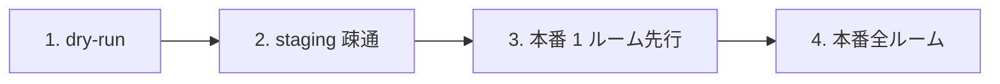

# Cross-Cutting Spec: Chatwork API 連携 統一ガイド

- 優先度: **🟡 中**
- 見積: **0.5d**
- 作成: 2026-04-24（a-auto / Batch 7 Garden 横断 #4）
- 前提: Bloom `src/lib/chatwork/` 既存実装、Bud / Forest も通知要件あり

---

## 1. 背景と目的

### 1.1 現状

モジュール別に通知要件が既に散在：

| モジュール | 通知シーン |
|---|---|
| Bloom | 日次/週次/月次 Workboard サマリ |
| Bud | 振込承認・差戻し・給与明細発行 |
| Forest | 決算書 DL / 進行期更新 |
| Root | KoT 同期結果 / マスタ変更 critical |
| 横断 | 監査 critical アラート（本 spec #2） |

### 1.2 本 spec のゴール

- **`src/lib/chatwork/` の使用方針を統一**（Bloom の実装を正本として展開）
- 誤共有・漏洩事故防止のガイドライン
- ルーム ID の環境変数化ルール
- 送信前プレビュー（dry-run）のチェック体制
- `feedback_external_integration_staging.md` 準拠の**段階リリース**手順

---

## 2. `src/lib/chatwork/` の構成

### 2.1 既存（Bloom で実装済）

```
src/lib/chatwork/
  ├── client.ts          # ChatworkClient クラス（sendMessage / uploadFile 等）
  ├── types.ts           # API 型
  ├── templates/
  │    ├── daily.ts      # Bloom 日次
  │    ├── weekly.ts     # 週次
  │    ├── monthly.ts    # 月次
  │    └── alert.ts      # 重要アラート
  ├── webhook.ts         # Webhook 検証
  └── secrets.ts         # トークン読込
```

### 2.2 本 spec で追加提案

```
src/lib/chatwork/
  ├── templates/
  │    ├── bud-approval.ts       # [new] Bud 振込承認通知
  │    ├── bud-rejection.ts      # [new] Bud 差戻し
  │    ├── bud-salary.ts         # [new] 給与明細発行
  │    ├── forest-download.ts    # [new] Forest 決算書 DL
  │    ├── root-kot-sync.ts      # [new] KoT 同期結果
  │    └── audit-critical.ts     # [new] 監査 critical アラート
  ├── rooms.ts                   # [new] ルーム ID 定義（env から読込）
  └── preview.ts                 # [new] 送信前プレビュー（dry-run）
```

---

## 3. ルーム ID 環境変数化

### 3.1 必須環境変数

```bash
# .env.local / Vercel env
CHATWORK_API_TOKEN=...                  # 全社共通 API トークン（Bot アカウント想定）

# モジュール別ルーム
CHATWORK_ROOM_BLOOM_DAILY=12345678      # Bloom 日次/週次/月次
CHATWORK_ROOM_BUD_TRANSFERS=12345679    # Bud 振込
CHATWORK_ROOM_FOREST_DECISIONS=12345680 # Forest 決算
CHATWORK_ROOM_AUDIT_CRITICAL=12345681   # 監査 critical（admin 限定ルーム）

# 個人 DM（Chatwork 側で事前設定、動的解決）
# 本人宛 DM は root_employees.chatwork_account_id から解決
```

### 3.2 rooms.ts 実装例

```typescript
// src/lib/chatwork/rooms.ts
function requireEnv(key: string): string {
  const v = process.env[key];
  if (!v) throw new Error(`Missing env var: ${key}`);
  return v;
}

export const CHATWORK_ROOMS = {
  bloomDaily: () => requireEnv('CHATWORK_ROOM_BLOOM_DAILY'),
  budTransfers: () => requireEnv('CHATWORK_ROOM_BUD_TRANSFERS'),
  forestDecisions: () => requireEnv('CHATWORK_ROOM_FOREST_DECISIONS'),
  auditCritical: () => requireEnv('CHATWORK_ROOM_AUDIT_CRITICAL'),
} as const;

export async function resolveDmRoomForEmployee(
  supabase: SupabaseClient,
  employeeId: string,
): Promise<string | null> {
  const { data } = await supabase
    .from('root_employees')
    .select('chatwork_account_id, chatwork_dm_room_id')
    .eq('employee_id', employeeId)
    .maybeSingle();
  return data?.chatwork_dm_room_id ?? null;
}
```

### 3.3 ハードコード禁止

```typescript
// ❌ NG
await client.sendMessage('12345678', 'メッセージ');

// ✅ OK
await client.sendMessage(CHATWORK_ROOMS.bloomDaily(), 'メッセージ');
```

---

## 4. 誤共有防止ガイドライン

### 4.1 機密情報を含む通知は **必ず DM**

給与・賞与・マスタ変更・監査 critical は**公開チャネル NG**。

```typescript
// Bud 給与明細発行時（B-03 §8.2 準拠）
const dmRoom = await resolveDmRoomForEmployee(supabase, employeeId);
if (!dmRoom) {
  // 本人 DM ルーム未登録 → 発行せず warning
  return { success: false, error: 'CHATWORK_DM_NOT_REGISTERED' };
}
await client.sendMessage(dmRoom, template);
```

### 4.2 DM ルーム検証関数

```typescript
// src/lib/chatwork/preview.ts
export function isDmRoom(room: ChatworkRoomInfo): boolean {
  return room.type === 'direct';
}

export async function assertDmRoom(client: ChatworkClient, roomId: string): Promise<void> {
  const room = await client.getRoom(roomId);
  if (!isDmRoom(room)) {
    throw new Error(`[chatwork] expected DM but got ${room.type} for room ${roomId}`);
  }
}
```

### 4.3 運用ルール

- **本番 DM アカウントは admin 個別承認で登録**（自己申請 NG）
- Chatwork ルーム名に `[ Garden-Bud 振込 ]` 等のプレフィックス推奨（UI 側で誤投稿防止）
- Bot アカウントは **公開チャネル参加を最小限に**

---

## 5. 送信前プレビュー（dry-run）

### 5.1 開発・ステージング環境での強制 dry-run

```typescript
// src/lib/chatwork/client.ts（新メソッド追加）
export class ChatworkClient {
  constructor(
    private apiToken: string,
    private options: { dryRun?: boolean } = {},
  ) {}

  async sendMessage(roomId: string, body: string, opts?: { selfUnread?: boolean }) {
    if (this.options.dryRun) {
      console.log(`[chatwork:dry-run] room=${roomId}`);
      console.log(`[chatwork:dry-run] body=${body.slice(0, 200)}${body.length > 200 ? '...' : ''}`);
      return { message_id: `dry-run-${Date.now()}` };
    }
    return this.request(...);
  }
}

// ファクトリ
export function createChatworkClient(): ChatworkClient {
  const token = process.env.CHATWORK_API_TOKEN;
  if (!token) throw new Error('CHATWORK_API_TOKEN not set');
  return new ChatworkClient(token, {
    dryRun: process.env.CHATWORK_DRY_RUN === 'true',
  });
}
```

### 5.2 環境別の設定

| 環境 | CHATWORK_DRY_RUN | 送信先 |
|---|---|---|
| local dev | `true` | Console ログのみ |
| preview（Vercel）| `true` | Console ログのみ |
| staging | `false` | **テスト用ルーム**（プレフィックス `[TEST]`）|
| production | `false` | 本番ルーム |

### 5.3 `feedback_external_integration_staging.md` 準拠の段階リリース

外部 API 連携の解放は以下の段階で進める：



#### 段階 1: dry-run
- Console ログのみ、実送信なし
- テンプレ文面レビュー

#### 段階 2: staging 疎通
- Chatwork 側に **Garden テストルーム**作成
- staging 環境から実送信 → 東海林さん目視確認
- 1-2 日の疎通テスト

#### 段階 3: 本番 1 ルーム先行
- 本番 Chatwork に**監査 critical ルーム**だけ先行投入
- 7 日間観測、誤送信・頻度異常なしを確認

#### 段階 4: 本番全ルーム
- 全モジュール通知を本番適用
- 各モジュール Phase のリリースタイミングで順次

---

## 6. テンプレート設計ガイドライン

### 6.1 基本原則

- **情報密度 > 見栄え**: Chatwork 記法（`[info]`, `[title]`, `[hr]` 等）を最小限
- **リンク必須**: 詳細確認画面への URL を必ず含める
- **アクション可能性**: 「次に何すべきか」を明示

### 6.2 標準テンプレ構造

```
[info][title]📅 {icon} {module} {通知種別}[/title]
{key 1}: {value 1}
{key 2}: {value 2}

{本文 2-3 行}

🔗 {詳細 URL}
[/info]
```

### 6.3 severity 別の icon

| severity | icon | 用途 |
|---|---|---|
| info | 📅 / 📊 / ✓ | 通常の進捗 |
| warn | ⚠️ / 📌 | 要確認（即緊急ではない）|
| critical | 🚨 / 🔥 | 即時対応必須 |

### 6.4 具体例: Bud 振込承認（B-04 連携）

```
[info][title]✓ 振込承認[/title]
対象: FK-20260424-0001（¥1,250,000）
取引先: 株式会社タイニー
承認者: 上田基人
承認時刻: 2026-04-24 09:30

次: 東海林さんが CSV 出力へ

🔗 https://garden.app/bud/transfers/FK-20260424-0001
[/info]
```

---

## 7. レート制限対策

### 7.1 Chatwork API 制限

- **300 req / 5 分**（認証済ユーザー）
- 超過時 429 Too Many Requests

### 7.2 対策

```typescript
// src/lib/chatwork/client.ts に rate-limit backoff 組込
import PQueue from 'p-queue';

export class ChatworkClient {
  private queue = new PQueue({ concurrency: 2, interval: 1000, intervalCap: 1 });

  async sendMessage(roomId: string, body: string) {
    return this.queue.add(() => this._sendMessage(roomId, body));
  }

  private async _sendMessage(roomId: string, body: string, retries = 3): Promise<any> {
    try {
      return await this.request(/* ... */);
    } catch (e: any) {
      if (e.status === 429 && retries > 0) {
        const wait = Math.pow(2, 4 - retries) * 1000;
        console.warn(`[chatwork] rate limited, retrying after ${wait}ms`);
        await new Promise(r => setTimeout(r, wait));
        return this._sendMessage(roomId, body, retries - 1);
      }
      throw e;
    }
  }
}
```

### 7.3 大量送信時の対応

- **ブロードキャスト**（20 名以上への一括 DM）は **30 秒間隔**で分割送信
- 月次ダイジェスト発行は Cron で日付分散
- バッチは `p-queue` で concurrency=1 に制限

---

## 8. Webhook 受信（将来）

### 8.1 既存 `webhook.ts`（Bloom 実装）

署名検証のみ実装済。受信したイベントに対するハンドラは未実装。

### 8.2 将来的な活用

- Chatwork → Garden の双方向連携（例: Chatwork で承認ボタン → Bud に反映）
- Phase D 以降で検討

---

## 9. 監査ログとの連携

### 9.1 送信ログの記録

Chatwork 送信は `root_audit_log` に記録（監査 spec #2 準拠）：

```typescript
// src/lib/chatwork/client.ts
async sendMessage(roomId: string, body: string) {
  const result = await this._send(roomId, body);
  await writeAuditLog(supabase, {
    module: 'system',
    action: 'chatwork_send',
    entityType: 'chatwork_message',
    entityId: result.message_id,
    notes: `room=${roomId} length=${body.length}`,
    severity: 'info',
  });
  return result;
}
```

### 9.2 送信失敗の追跡

- 429 リトライ後も失敗 → severity='warn' で記録、admin アラート
- Chatwork API 401 / 403 → severity='critical'、即 admin DM

---

## 10. 実装ステップ

### W1: rooms.ts + preview.ts 整備（0.1d）
- [ ] `src/lib/chatwork/rooms.ts` 新設、環境変数定義
- [ ] `src/lib/chatwork/preview.ts` 新設（isDmRoom / assertDmRoom）
- [ ] Vercel env に room ID を投入（staging + production 両方）

### W2: Client 拡張（0.1d）
- [ ] `ChatworkClient` に dry-run モード追加
- [ ] `PQueue` でレート制限対策
- [ ] 429 リトライ実装

### W3: 各モジュールテンプレ（0.15d）
- [ ] Bud 振込承認・差戻し・給与明細発行（B-03 / B-04 spec 連携）
- [ ] Forest 決算書 DL / 進行期更新
- [ ] Root KoT 同期結果
- [ ] 監査 critical アラート

### W4: 段階リリース（0.1d、運用面）
- [ ] staging で疎通テスト（1-2 日）
- [ ] 本番 1 ルーム先行投入（7 日観測）
- [ ] 本番全ルーム展開（各モジュール Phase 対応）

### W5: ドキュメント（0.05d）
- [ ] 本 spec を `docs/specs/cross-cutting/` に配置
- [ ] `known-pitfalls.md` §4.2 に「Chatwork 公開チャネル投稿 NG」明記

---

## 11. 判断保留

| # | 論点 | a-auto スタンス |
|---|---|---|
| 判1 | Chatwork Bot アカウント vs 個人 API トークン | **Bot アカウント推奨**（人事異動の影響なし）、現状は東海林さん個人 Token |
| 判2 | DM ルーム ID の事前登録時期 | **全社員の Tree マイページ連携時**（Phase D 相当）、それまでは admin 手動登録 |
| 判3 | 公開ルームでの「金額情報」の扱い | 合計のみ（明細なし）までは OK、個別金額は DM |
| 判4 | 海外 Chatwork（カンペキオーナーズ等）の対応 | Phase A 外、日本版のみ |
| 判5 | Chatwork 停止時のフォールバック | **Slack / メール** の代替送信、Phase C |
| 判6 | メッセージの多言語対応 | Phase A 日本語のみ |
| 判7 | 送信ログの容量 | 1 日 500 件程度まで許容（root_audit_log に吸収）|

---

## 12. 次アクション

1. Chatwork ルーム構成の設計 + 作成（東海林さん）
2. staging 環境への投入（a-main 経由で Vercel env 設定）
3. Bloom 既存実装との整合確認
4. 本 spec を PR 化して develop マージ
