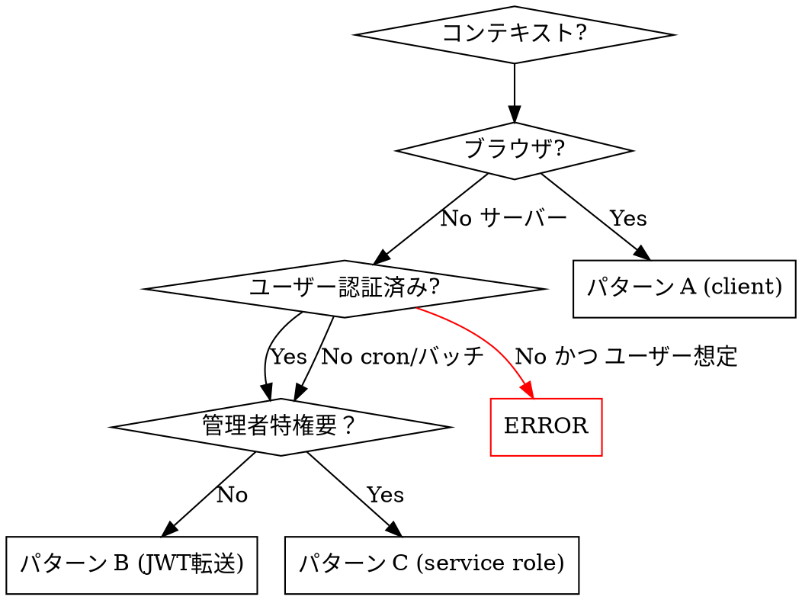

# Cross-Cutting Spec: RLS ポリシー統一 + サーバ/クライアント境界監査

- 優先度: **🔴 最高**
- 見積（全モジュール監査 + 修正）: **1.5d**
- 作成: 2026-04-24（a-auto / Batch 7 Garden 横断 #1）
- 前提: Bloom PDF 事件（PR #17）の再発防止、全モジュール着手時の統一ガイドライン

---

## 1. 背景と目的

### 1.1 Bloom PDF 事件（PR #17、A2 案）

**発生事象**:
- `/api/bloom/monthly-digest/[month]/export/route.ts` で月次ダイジェスト PDF を生成する際、**サーバー側で `auth.uid()` が NULL** となり RLS がブロック
- 結果: データ存在にも関わらず 404 "monthly digest not found"
- 原因: Route Handler が **ブラウザ用 anon supabase singleton**（`src/lib/supabase/client.ts`）を流用

**修正方針（A2 案、0.5d）**:
- `src/lib/supabase/server.ts` 新設：`Authorization: Bearer <jwt>` から SupabaseClient を構築するファクトリ
- 既存呼出は無修正、Route Handler 側のみ JWT 転送で置換

### 1.2 根本原因の一般則

1. **Supabase の RLS は JWT を必要とする**（`auth.uid()` の解決源）
2. **anon key だけのクライアントは `auth.uid()` = NULL** → RLS ポリシーが無限に block
3. Route Handler / Server Component は **HTTP リクエストコンテキスト** を持つため、ブラウザ singleton とは分離必須
4. Service Role Key は **RLS をバイパス** できるが、セキュリティ監査対象は大幅に増える

### 1.3 本 spec のゴール
- 全モジュール横断で **Supabase クライアント使用パターンを 3 種に規格化**
- Route Handler / Server Component / Client Component の**使い分けルール**を明文化
- 既存モジュールの**監査リスト**（Bloom PDF 型の再発リスク）を洗出
- リファレンス実装として `src/lib/supabase/server.ts` の使用例を全モジュールで統一

---

## 2. Supabase クライアント 3 パターン（標準化）

### パターン A: **ブラウザ用**（Client Component）

```typescript
// src/lib/supabase/client.ts
import { createClient } from '@supabase/supabase-js';

export const supabase = createClient(
  process.env.NEXT_PUBLIC_SUPABASE_URL!,
  process.env.NEXT_PUBLIC_SUPABASE_ANON_KEY!,
);
// Auth state は onAuthStateChange で追跡、RLS は自動適用
```

**用途**: ブラウザで実行される `'use client'` コンポーネント内のデータ取得・書込

### パターン B: **JWT 転送型**（Route Handler / Server Component）— **Bloom fix 標準**

```typescript
// src/lib/supabase/server.ts（新設、全モジュール共通）
import { createClient } from '@supabase/supabase-js';

export function createAuthenticatedSupabase(req: Request) {
  const authHeader = req.headers.get('authorization') ?? '';
  const token = authHeader.replace(/^Bearer\s+/i, '');

  return createClient(
    process.env.NEXT_PUBLIC_SUPABASE_URL!,
    process.env.NEXT_PUBLIC_SUPABASE_ANON_KEY!,
    {
      global: { headers: { Authorization: `Bearer ${token}` } },
      auth: { persistSession: false, autoRefreshToken: false },
    },
  );
}
```

**用途**:
- Route Handler (`src/app/api/**/route.ts`) で**ユーザー権限で**データアクセス
- Server Action でユーザーが実行したリクエスト処理
- RLS が `auth.uid()` を正しく解決可能

### パターン C: **Service Role 型**（管理者操作・Cron・バッチ）

```typescript
// src/lib/supabase/admin.ts（既存、PR #17 後整備）
import { createClient } from '@supabase/supabase-js';

export function createAdminSupabase() {
  if (!process.env.SUPABASE_SERVICE_ROLE_KEY) {
    throw new Error('SUPABASE_SERVICE_ROLE_KEY not set');
  }
  return createClient(
    process.env.NEXT_PUBLIC_SUPABASE_URL!,
    process.env.SUPABASE_SERVICE_ROLE_KEY!,
    { auth: { persistSession: false, autoRefreshToken: false } },
  );
}
```

**用途**:
- Cron ジョブ（`src/app/api/**/cron/**/route.ts`）
- PDF 生成・ZIP 生成の Edge Function
- 管理者操作（Storage upload in Bloom upload UI 等）
- **データ移送バッチ**（T-F6-02 等）

---

## 3. 使用パターン決定フローチャート



### 🚫 NG パターン（Bloom PDF 事件型）

```typescript
// ❌ Route Handler でブラウザ用 singleton 使用
import { supabase } from '@/lib/supabase/client';

export async function POST(request: Request) {
  const { data } = await supabase.from('xxx').select('*');   // auth.uid() = NULL → RLS で 404
}
```

---

## 4. 全モジュール監査リスト

2026-04-24 時点のモジュール別リスク評価。

### 4.1 Bloom（PR #17 で A2 適用済）

| Route / コンポーネント | 使用パターン | リスク | 状態 |
|---|---|---|---|
| `/api/bloom/monthly-digest/[month]/export/route.ts` | B（JWT 転送）| **解消済** | ✅ PR #17 |
| `/api/bloom/cron/*` | C（service role）| — | ✅ T9 実装時点で正 |
| Workboard UI | A（browser）| — | ✅ |

### 4.2 Forest

| Route / コンポーネント | 使用パターン | リスク | 状態 |
|---|---|---|---|
| `/api/forest/parse-pdf` | B（JWT 転送）| 要監査 | ⚠️ 要確認 |
| `/api/forest/download-zip`（Batch 2 spec 予定）| C + B（JWT 認可 → Service Role で Storage 操作）| 設計通り | 🟢 spec 段階 |
| Dashboard UI | A | — | ✅ |

**監査推奨**: `/api/forest/parse-pdf` の実装を PR #17 方針で点検。

### 4.3 Bud

| Route / コンポーネント | 使用パターン | リスク | 状態 |
|---|---|---|---|
| `src/app/bud/_lib/transfer-mutations.ts` | A（browser 経由 Server Action 想定）| 低 | ✅ |
| 給与振込 API（Phase B spec）| B 予定 | 🟢 | 🟢 spec 段階 |
| 給与明細 PDF 生成（B-03 spec）| B + C（JWT 検証 → service_role で Storage upload）| 🟢 | 🟢 spec 段階 |

### 4.4 Root

| Route / コンポーネント | 使用パターン | リスク | 状態 |
|---|---|---|---|
| `/api/root/kot/sync`（Cron）| C（service role）| — | ✅ PR #15 |
| マスタ CRUD Server Action | B（JWT 転送）想定 | 要監査 | ⚠️ |
| 認証画面 | A | — | ✅ |

**監査推奨**: Root マスタの CRUD Server Action が A を使っていないか確認。

### 4.5 Leaf / Tree / Soil / Rill / Seed

未実装または Phase 0。新規実装時に本 spec を必読とする。

---

## 5. 監査チェックリスト（CI/コードレビューで使用）

```markdown
## Supabase クライアント使用の監査

### Route Handler (`src/app/api/**/route.ts`)
- [ ] ブラウザ用 `@/lib/supabase/client` を import していない
- [ ] `createAuthenticatedSupabase(req)` または `createAdminSupabase()` を使用
- [ ] JWT 検証コメント（`// パターン B: ユーザー権限` 等）で意図を明示

### Server Action（`'use server'`）
- [ ] Supabase 利用時は `createServerActionClient` または Bearer 経由

### Server Component
- [ ] RLS 制限付きデータ取得時は `createAuthenticatedSupabase` を使用
- [ ] 公開データのみ取得する場合はコメントで明示

### Cron / Edge Function
- [ ] `SUPABASE_SERVICE_ROLE_KEY` を環境変数から取得
- [ ] `createAdminSupabase()` を使用
- [ ] Service Role Key が Client バンドルに含まれない（`server-only` パッケージ推奨）
```

---

## 6. RLS ポリシー設計の原則

### 6.1 テーブル設計時のチェックリスト

1. **機密度分類**
   - 公開（companies 等）
   - ユーザー個別（bud_salary_records など）
   - 管理者限定（root_audit_log 等）

2. **ポリシー粒度**
   - SELECT / INSERT / UPDATE / DELETE を別々に記述
   - USING（読取条件）と WITH CHECK（書込条件）を混同しない

3. **ヘルパー関数の活用**（命名規則 v2、2026-05-11 改訂、dispatch main- No. 233 Q1 候補 A 採用）
   - **global 名空間採用**: `auth_employee_number()` / `has_role_at_least(role_min text)` /
     `is_same_department(target_employee_id uuid)` 等の cross-cutting 関数は
     module prefix なしの global 名空間で実装する
   - **既存 module 別 helper は維持**: `bloom_has_access` / `forest_is_admin` /
     `bud_is_user` / `root_can_access` / `root_can_write` 等は破壊的変更を避け維持、
     段階的置換は別 PR で実施（急務でない）
   - **実装場所**: `supabase/migrations/20260511000001_cross_rls_helpers.sql`
     （auth_employee_number / has_role_at_least を実装、is_same_department は縮退）
   - 旧 命名規則「各モジュールで `<module>_has_role(role_min text)` を統一」は **廃止**
   - 旧 「Phase C で `garden_has_role` 抽出」予定は **本 migration で前倒し完了**
     （`has_role_at_least` として実装、`garden_` prefix 不採用）

4. **auth.uid() は必ずチェック**
   ```sql
   USING (user_id = auth.uid())   -- 本人限定
   USING (
     (SELECT garden_role FROM root_employees WHERE user_id = auth.uid())
     IN ('admin', 'super_admin')
   )
   ```

### 6.2 RLS と Service Role の関係

| 操作主体 | RLS の効き方 | 注意 |
|---|---|---|
| Client / JWT 転送 | ✅ 適用 | ユーザー権限で read/write |
| Service Role | ❌ バイパス | **必ず WHERE 句で自分で絞込** |

Service Role 利用時は常に **「ユーザー ID を WHERE 句で明示的に制限」** を守る。

---

## 7. リファレンス実装（Bloom PR #17 準拠）

### 7.1 Route Handler パターン

```typescript
// src/app/api/<module>/<action>/route.ts
import { NextRequest, NextResponse } from 'next/server';
import { createAuthenticatedSupabase } from '@/lib/supabase/server';

export const runtime = 'nodejs';

export async function POST(req: NextRequest) {
  // 1. JWT 検証（optional、RLS に任せるなら省略可）
  const authHeader = req.headers.get('authorization');
  if (!authHeader?.startsWith('Bearer ')) {
    return NextResponse.json({ error: 'Unauthorized' }, { status: 401 });
  }

  // 2. JWT 転送で Supabase Client 構築
  const supabase = createAuthenticatedSupabase(req);

  // 3. auth.getUser() でユーザー特定（RLS 用）
  const { data: { user }, error: authErr } = await supabase.auth.getUser();
  if (authErr || !user) {
    return NextResponse.json({ error: 'Invalid token' }, { status: 401 });
  }

  // 4. データ取得（RLS 自動適用）
  const { data, error } = await supabase.from('table').select('*');
  if (error) return NextResponse.json({ error: error.message }, { status: 500 });

  return NextResponse.json({ data });
}
```

### 7.2 Service Role パターン（Cron 等）

```typescript
// src/app/api/<module>/cron/<name>/route.ts
import { NextRequest, NextResponse } from 'next/server';
import { createAdminSupabase } from '@/lib/supabase/admin';

export const runtime = 'nodejs';

export async function POST(req: NextRequest) {
  // Vercel Cron は CRON_SECRET で検証
  if (req.headers.get('authorization') !== `Bearer ${process.env.CRON_SECRET}`) {
    return NextResponse.json({ error: 'Forbidden' }, { status: 403 });
  }

  const admin = createAdminSupabase();
  // RLS バイパスできるが、明示的な WHERE 句で自ら絞込
  const { data } = await admin.from('table').select('*').eq('status', 'pending');

  return NextResponse.json({ processed: data?.length ?? 0 });
}
```

---

## 8. 実装ステップ

### W1: インフラ整備（0.25d）
- [ ] `src/lib/supabase/server.ts` 新設（Bloom A2 から共通化）
- [ ] `src/lib/supabase/admin.ts` の整備（命名規則 `createAdminSupabase`）
- [ ] `src/lib/supabase/client.ts` 既存に JSDoc で**「ブラウザ専用」**と明示
- [ ] `server-only` パッケージを `supabase/server.ts` と `supabase/admin.ts` に適用

### W2: 全モジュール監査（0.5d）
- [ ] Bloom: PR #17 の適用状況確認（完了済）
- [ ] Forest: `/api/forest/parse-pdf` の点検 + 修正
- [ ] Root: マスタ CRUD Server Action の点検
- [ ] Bud: Phase 0 振込系の点検
- [ ] `docs/supabase-client-usage-audit.md` に結果集約

### W3: ドキュメント整備（0.25d）
- [ ] 本 spec を `docs/specs/cross-cutting/spec-cross-rls-audit.md` に配置（本ファイル）
- [ ] `known-pitfalls.md` §1.1 に「auth.uid() = NULL 事件」を追記
- [ ] PR テンプレートに「Supabase クライアント使用パターン選択」チェック追加

### W4: CI チェック（0.5d、Phase C）
- [ ] ESLint rule: Route Handler で `@/lib/supabase/client` import を禁止
- [ ] GitHub Actions: `rg "from.*supabase/client" src/app/api/` で grep 警告
- [ ] PR ラベル「RLS 影響あり」の自動付与

---

## 9. 判断保留

| # | 論点 | a-auto スタンス |
|---|---|---|
| 判1 | `server-only` パッケージ導入時期 | **Phase B-1 内で導入**（Bud 給与の Service Role 境界を守るため）|
| 判2 | Route Handler 認証を middleware で共通化 | **Phase C**（現状は各 Route で JWT 検証でも許容、middleware はボイラープレート減）|
| 判3 | RLS ヘルパー関数の共通化 | **解消（2026-05-11 dispatch main- No. 233 Q1/Q3 確定）**: global 名空間（`auth_employee_number` / `has_role_at_least` / `is_same_department`）採用、`supabase/migrations/20260511000001_cross_rls_helpers.sql` で実装。`is_same_department` は Q2 縮退で本 migration から除外、Phase B-4 / B-08 で department 列追加時に再着手。`garden_*` prefix 案は不採用 |
| 判4 | Service Role Key のローテーション頻度 | **3 ヶ月毎**推奨、自動化は Phase D |
| 判5 | Edge Runtime での JWT 検証 | Node 推奨（jsonwebtoken 互換性）|
| 判6 | Server Component での使用パターン | 原則 B（JWT 転送）、Next.js App Router の cookies() からの取得は別検証 |

---

## 10. 次アクション

- **CI への組込** → Phase B-1 完了後
- **`known-pitfalls.md` への追記** → 本 spec マージ直後
- **a-forest / a-bud / a-root の実装時点でセルフチェック** → 即時
